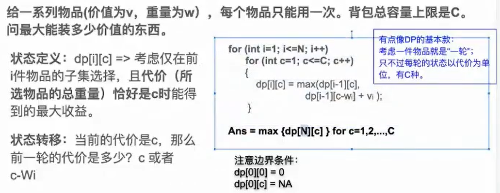

# DP问题

## DP的适用前提

- 无后效性：这个状态只和上一种状态有关
- 最优子结构：大问题的最优解可以用若干个小问题的最优解推出（max，min，sum）


## DP套路1：第一类基本型（”时间序列“型）


### lc198 house robebr


```java
class Solution {
    //dp[i][j]表示 第i轮，不同j状态抢到的最大数目的money
    //状态2种，0:这轮抢的最大收益，1:这轮不抢的最大收益。
    //抢：dp[i][0] = dp[i-1][1] + value[i];
    //不抢：dp[i][1] = Math.max(dp[i-1][0],dp[i-1][0]);
    public int rob(int[] nums) {
        int n = nums.length;
        int[][] dp = new int[n + 1][2];
        for(int i = 1; i <= n; i++){
            dp[i][0] = dp[i - 1][1] + nums[i - 1];
            dp[i][1] = Math.max(dp[i - 1][0],dp[i - 1][1]);
        }
        return Math.max(dp[n][0],dp[n][1]);
    }
}
```

### lc213 house rober

有环，可以不考虑首位或末尾，去掉环，。。

```java
class Solution {
    //环，把环干掉，
    //1.不考虑首位
    //2不考虑末尾
    //3不考虑首位和末尾，但是1.中末尾可能也会不考虑，所以只用 ，1，3即可。。
    public int rob(int[] nums) {
        int n=  nums.length;
        int[][] dp = new int[n + 1][2];
        if(nums.length == 1){
            return nums[0];
        }
        for(int i = 1; i < n; i++){
            dp[i][0] = dp[i - 1][1] + nums[i - 1];
            dp[i][1] = Math.max(dp[i - 1][0], dp[i - 1][1]);
        }
        int a =  Math.max(dp[n - 1][0],dp[n - 1][1]);
        dp[1][0] = 0;
        dp[1][1] = 0;
        for(int i = 2; i <= n; i++){
            dp[i][0] = dp[i - 1][1] + nums[i - 1];
            dp[i][1] = Math.max(dp[i - 1][0], dp[i - 1][1]);
        }
        int b =  Math.max(dp[n][0],dp[n][1]);
        return Math.max(a,b);
    }
}
```

### lc123 Best Time to Buy and Sell Stock III

dp【i】【j】:i表示第i天，j为 [0 - 3】 五个状态，dp【i】【j】表示第i天状态j所剩最大现金。

注意初始化：

第0天，持有1股：-prices[0]

​			卖出1股：0

​			持有2股：-prices[0]

​			卖出2股：0


```java
class Solution {
    public int maxProfit(int[] prices) {
        int n = prices.length;
        int dp[][] = new int[n + 1][4];
        dp[0][0] = -prices[0];
        dp[0][1] = 0;
        dp[0][2] = -prices[0];
        dp[0][3] = 0;
        for(int i = 1; i <= n; i++){
            dp[i][0] = Math.max(dp[i - 1][0],- prices[i - 1]);
            dp[i][1] = Math.max(dp[i - 1][0] + prices[i - 1],dp[i - 1][1]);
            dp[i][2] = Math.max(dp[i - 1][1] - prices[i - 1],dp[i - 1][2]);
            dp[i][3] = Math.max(dp[i - 1][2] + prices[i - 1],dp[i - 1][3]);
        }
        return Math.max(dp[n][1],dp[n][3]);
    }
}
```

### lc309 最佳买卖股票的时机含冷冻时期

这道题注意分析的状态是持有股票，持有股票意味着你的利润随时随刻都在变化的。

此类题目，状态一定要选对。。


```java
f[i][0]=max(f[i-1][0],f[i-1][2]-prices[i]);
f[i][1]=f[i-1][0]+prices[i];
f[i][2]=max(f[i-1][1],f[i-1][2]);
```

```java
class Solution {
    public int maxProfit(int[] prices) {
        int n = prices.length;
        if(n == 1){
            return 0;
        }
        int[][] dp = new int[n + 1][3];
        //init
        dp[0][0] = -prices[0];
        dp[0][1] = 0;
        dp[0][1] = 0;
        for(int i = 1; i <= n; i++){
            dp[i][0] = Math.max(dp[i - 1][0],dp[i - 1][2] - prices[i - 1]);
            dp[i][1] = dp[i - 1][0] + prices[i - 1];
            dp[i][2] = Math.max(dp[i - 1][1],dp[i - 1][2]);
        }
        return Math.max(dp[n][2],dp[n][1]);
    }
}
```

### lc376 摆动序列

**状态一定要准确**

**自己要验证一遍**

。。状态要想全


```java
 /**
     * 输入：nums = [1,17,5,10,13,15,10,5,16,8]
     *          1, 17,  5, 10, 13, 15, 10,  5, 16,  8
     *             升   降  升  升  升   降   降  升  降
     *  降序结尾 0  0   2   2   2   2   4    4   4   6
     *  升序结尾 0  1   1   3   3   3   3    5   5   5
     *  if 升 {
     *     dp[i][降] = dp[i-1][降]
     *     dp[i][升] = dp[i-1][降]+1
     *  }
     *  if 降{
     *      dp[i][降] = dp[i-1][升]+1
     *      dp[i][升] = dp[i-1][升]
     *  }
     *
     * @param nums
     * @return
     */
class Solution {
    public int wiggleMaxLength(int[] nums) {
        int n = nums.length;
        if(n == 1){
            return 1;
        }
        int[][] dp = new int[n][2];
        dp[0][0] = 1; 
        dp[0][1] = 1; 
        for(int i = 1; i < n; i++){
            if(nums[i] > nums[i - 1]){
                dp[i][1] = dp[i -1][1];
                dp[i][0] = dp[i - 1][1] + 1;
            }else if(nums[i] < nums[i -1]){
                 dp[i][0] = dp[i -1][0];
                dp[i][1] = dp[i - 1][0] + 1;
            }else{
                 dp[i][1] = dp[i -1][1];
                 dp[i][0] = dp[i -1][0];
            }
        }
        return Math.max(dp[n - 1][0],dp[n - 1][1]);
    }
}
```

#### 我的错误：直接写代码，状态转移方程还没想好，初始化什么的都没想好。

**思考：残酷哥给的只是求状态转移的方法，自己在dp5部曲还是得操点心。。**

### lc1289 没做


### lc1186 删除一次得到子数组的最大和


```java
ans = max(d[0][0],d[0][1]);解
for(i in [1,N-1]){
    d[i][0] = max(d[i-1][0] + A[i],A[i]);
    d[i][1] = max(d[i-1][1] + A[i],d[i-1][0]);
    ans =max(ans,max(d[i][0],d[i][1]));
}
```

**思考：i初始化后，为什么从1到n-1呢？**

**因为下面是从1开始的，你A[I]加上的也必须不能超过n-1**

**初始化+递推公式+范围   需要考虑清楚呀**

```java
class Solution {
    public int maximumSum(int[] arr) {
        int n = arr.length;
        int max = 0;
        int[][] dp = new int[n + 1][2];
        //初始化
        dp[0][0] = arr[0];
        max = arr[0];
        //
        for(int i = 1; i < n; i++){
            dp[i][0] = Math.max(dp[i - 1][0] + arr[i],arr[i]);
            dp[i][1] = Math.max(dp[i - 1][1] + arr[i],dp[i - 1][0]);
            max = Math.max(max,Math.max(dp[i][1],dp[i][0]));
        }
        return max;
    }
```


## DP套路2：第二类基本型（“时间序列”加强版）


### lc300 最长递增子序列(优化：二分)


```java
class Solution {
    public int lengthOfLIS(int[] nums) {
        int n = nums.length;
        int[] dp = new int[n];
        int max = 1;
        dp[0] = 1;
        for(int i = 1; i < n; i++){
            if(dp[i] == 0){
                dp[i] = 1;
            }
            for(int j = 0; j < i; j++){
                if(nums[i] > nums[j]){
                    dp[i] = Math.max(dp[i],dp[j] + 1);
                }
            }
            max = Math.max(dp[i],max);
        }
        return max;
    }
}	
```

### lc673 未作

### lc368 最大整除子集

1.要求整除子集：那么首先应该想到排序，排完序以后，就少了一种判定条件。

只需要后面的除以前面的来判断是否需要将该数添加到子集。

2.状态判定：s[1 - i]表示以i为结尾的最大整除子集。 只需要i -1 和 i 可以整除，便可以把i 添加到i - 1 后面的子集中。

3.此类DP属于第二种时间序列型。和前面的某种状态有关。

4.此题要返回的不是max，min，sum。。。。而是确切的子集。但是和max是有关系的，

下面的这种解法真的是太好了，运用dp套路2 的完美显现！！！

[368. 最大整除子集 - DP - 时间复杂度O(N^2), 空间复杂度O(N^2) - 最大整除子集 - 力扣（LeetCode） (leetcode-cn.com)](https://leetcode-cn.com/problems/largest-divisible-subset/solution/368-zui-da-zheng-chu-zi-ji-dp-shi-jian-fu-za-du-on/)

上面link 有 优化

```java
class Solution {
    public List<Integer> largestDivisibleSubset(int[] nums) {
        Arrays.sort(nums);
        int n = nums.length;
        if(n == 0) return new ArrayList();
        List[] dp = new List[n];
        //dp初始化：加入数组的第一个
        dp[0] = new ArrayList();
        dp[0].add(nums[0]);
        //答案默认是第一个
        List<Integer> ans = dp[0];
        //for循环从1开始
        for(int i = 1; i < n; i++){
            dp[i] = new ArrayList();
            dp[i].add(nums[i]);
            //dp[i] 和 历届dp[i]前面的元素比较是否满足题意    
            for(int j = 0; j < i; j++){
                if(nums[i] % nums[j] == 0){
                    //满足整除条件并且可以改变dp[i]的最大值的话
                    if(dp[i].size() < dp[j].size() + 1){
                        //把这个元素加进去,注意这里的new 一个arraylist要把dp【j]搞到手，再向后面添加nums[i]即可
                        dp[i] = new ArrayList(dp[j]);
                        dp[i].add(nums[i]);
                    }
                }
            }
            //加完以后，判断结果集是否处于最大，更新结果集
            if(ans.size() < dp[i].size())   ans = dp[i];
        }
        return ans;
    }
}

```

### lc1105 填充书架

问题转换：


要找7的最小，从前n个状态开始找 ，可以是6，5，4，3.。。。。。。

目的是找到最高的并且再一层里面，可能有多个比如6，5，4，3都符合，取最小的就可以了

```java
for(int i =1; i < N,i++){
	//搜素上一个数组的最大高度。
	for(int j = i - 1; j >= 1; j--){
		//如果上一层的宽度是符合条件的
		if(width(j + 1 : i) <= W){
			//就选择+上一层数组的最大值然后选择最小值
			dp[i] = min(dp[i],dp[j] + maxHeight[j + 1 : i]);
		}else
			break
	}
}
```

```java
class Solution {
    public int minHeightShelves(int[][] books, int shelfWidth) {
        int n = books.length;
        int[] dp = new int[n + 1];
        //初始化
        Arrays.fill(dp,Integer.MAX_VALUE);
        //需要有第一个元素来确定dp[j - 1] 不是最小值
        dp[0] = 0;
        for(int i = 1; i <= n; i++){
            int maxHeight = 0;
            int totalWidth  = 0;
            //从i -1 种搜索最优的j,需要让i加到它后面呀
            for(int j = i; j >= 1; j--){
                //更新最高的东西，用来计算dp[i]
                maxHeight = Math.max(maxHeight,books[j - 1][1]);
                //计算宽度的限制
                totalWidth += books[j - 1][0];
                if(totalWidth > shelfWidth) break;
                dp[i] = Math.min(dp[i],dp[j - 1] + maxHeight);
            }
        }
        return dp[n];     
    }
}
```

启发：从结尾看，递归的思想。

## DP套路3：双序列型


### lc1143 最长共功子序列

text1：xxxxxi

text2：xxxj

千方百计的往dp{i - 1][j - 1]/dp[..去转移

如果i和j相等，那么最长公共子序列就可以加1了，也就是dp【i-1】【j-1】+1

如果不等，那么可能2种情况

- i前面的与j和前面的相等dp[i - 1、【j】
- j前面的与i和前面的相等dp[i}【j - 1】

那么，就等于max(dp[i - 1、【j】,dp[i}【j - 1】)


```java
class Solution {
    public int longestCommonSubsequence(String text1, String text2) {
        int m = text1.length();
        int n = text2.length();
        int[][] dp = new int[m+1][n+1];
        /**
         text1 xxxxj
         text2 yyyi   
        
         */
        for(int i = 1; i <= m; i++){
            for(int j = 1; j <= n; j++){
                if(text1.charAt(i - 1) == text2.charAt(j -1)){
                    dp[i][j] = dp[i - 1][j - 1] + 1;
                }else{
                    dp[i][j] = Math.max(dp[i - 1][j],dp[i][j - 1]);
                }
            }
        }
        return dp[m][n];
    }
}


而如果s1[i] != s2[j]，我们就没有必要再去观察dp[i - 1][j - 1]了，因为在dp[i - 1][j - 1]之后再判断s1[i]，s2[j]加在dp[i - 1][j - 1]代表的最长子序列后，我们只需要判断s1[0 : i - 1]，s2[0 : j]或者是s1[0 : i]，s2[o : j - 1]谁最大，因为这两个值一定是大于等于dp[i - 1][j - 1]的，所以就完全没有必要再去观察dp[i - 1][j - 1]
```

### lc93 交错字符串

模板有了

重要的是找准状态转移方程

这个题目：dp【i】【j】照抄：s1从【1：i】和s2从【1：j】能否交错构成s3。

看dp【i-1】【j】和dp【i】【j-1】这两个状态。

交错完字符串，无非就是i+j的最后一个是s1的最后或者是s2.

那么dpij的状态就和dpi-1 j 还有dp i j-1有关 了他们只要是true，那么dp i j就是true

```java
class Solution {
    public boolean isInterleave(String s1, String s2, String s3) {
        int m = s1.length();
        int n = s2.length();
        boolean[][] dp = new boolean[m+1][n+1];
        dp[0][0] = true;
        for(int i = 1; i<=m;i++){
            if(s1.substring(0,i).equals(s3.substring(0,i)))
                dp[i][0] = true;
        }
        for(int i = 1; i<=n;i++){
            if(s2.substring(0,i).equals(s3.substring(0,i)))
                dp[0][i] = true;
        }
        for(int i = 1;i<=m;i++){
            for(int j=1;j<=n;j++){
                //重要的代码
                  dp[i][j] = (dp[i - 1][j] && s3.charAt(i + j - 1) == s1.charAt(i - 1))
                    || (dp[i][j - 1] && s3.charAt(i + j - 1) == s2.charAt(j - 1));
            }
        }
        return dp[m][n];
    }
}
```

### lc72编辑距离

这个题是对模板的基础应用了。

三个操作：增加 、删除 、 替换 

分别代表  dp i -1 j    dp i j-1  dp i j 

aim: min operatation

所以if(s[i] == s[j]){

min(三个操作。)

}

```java
class Solution {
    public int minDistance(String word1, String word2) {
        int m = word1.length();
        int n = word2.length();
        int[][] dp = new int[m+1][n+1];
        //init
        for(int i = 0; i <= n; i++){
            dp[0][i] = i;
        }
        for(int i = 0; i <= m; i++){
            dp[i][0] = i;
        }
        for(int i = 1; i <= m; i++){
            for(int j = 1; j <= n; j++){
                int k=0;
                if(word1.charAt(i - 1) != word2.charAt(j - 1)){
                    k=1;
                }
                dp[i][j] = Math.min(dp[i - 1][j]+1,Math.min(dp[i][j - 1]+1,dp[i -1][j - 1]+k));
            }
        }
        return dp[m][n];
    }
}
```

### lc115 不同的子序列

为啥状态方程是： s[i] == t[j] 时 dp[i 】[j] = dp[i-1】[j-1] + dp[i-1】[j]

s[i] != t[j] 时 dp[i】[j] = dp[i-1】[j]

先看s[i] == t[j] 时，以s = "rara" t = "ra" 为例，当i = 3, j = 1时，s[i] == t[j]。

此时分为2种情况，s串用最后一位的a + 不用最后一位的a。

如果用s串最后一位的a,那么t串最后一位的a也被消耗掉，此时的子序列其实=dp[i-1】[j-1]

如果不用s串最后一位的a，那就得看"rar"里面是否有"ra"子序列的了，就是dp[i-1】[j]

所以 dp[i][j] = dp[i-1】[j-1] + dp[i-1】[j]

再看s[i] != t[j] 比如 s = "rarb" t = "ra" 还是当i = 3, j = 1时，s[i] != t[j]

此时显然最后的b想用也用不上啊。所以只能指望前面的"rar"里面是否有能匹配"ra"的

所以此时dp[i】[j] = dp[i-1】[j]

```java
class Solution {
    public int numDistinct(String s, String t) {
        //dp[i][j] 从s:[1:i] t[1:j] s的子序列中t出现的个数
        //s:xxxxxi  
        //t:yyyj    
        //if(s[i] == s[j])
        //dp[i][j] = dp[i-1][j-1]+1    else  dp[i][j] = dp[i-1][j] 
    //以s = "rara" t = "ra" 为例，当i = 3, j = 1时，s[i] == t[j]。
    //此时分为2种情况，s串用最后一位的a + 不用最后一位的a。
// 如果用s串最后一位的a,那么t串最后一位的a也被消耗掉，此时的子序列其实=dp[i-1][j-1]
// 如果不用s串最后一位的a，那就得看"rar"里面是否有"ra"子序列的了，就是dp[i-1][j]
// 所以 dp[i][j] = dp[i-1][j-1] + dp[i-1][j]

        int m = s.length();
        int n = t.length();
        int[][] dp = new int[m+1][n+1];
        //init  因为s字符串里面有一个空的是可以匹配t的空，所以初始化s那一行/列为1
        for(int i = 0;i<=m;i++){
            dp[i][0]=1;
        }
        for(int i = 1;i<=m;i++){
            for(int j = 1;j<=n;j++){
                if(s.charAt(i - 1) == t.charAt(j - 1)){
                    dp[i][j] = dp[i-1][j-1] + dp[i-1][j];
                }else
                    dp[i][j] = dp[i-1][j];
            }
        }
        return dp[m][n];
    }
}
```

### 题单（未作）


### lc1092 最短公共超序列的探讨（未作）


## 区间DP


### lc516 最长回文子序列

[【宫水三叶】区间 DP 求解最长回文子序列问题 - 最长回文子序列 - 力扣（LeetCode） (leetcode-cn.com)](https://leetcode-cn.com/problems/longest-palindromic-subsequence/solution/gong-shui-san-xie-qu-jian-dp-qiu-jie-zui-h2ya/)

dp【l】【r】表示在【l,r】区间内的最长回文子序列

状态如何转移？


前2个是dp【L】【r】=max(dp【L+1】【R】,dp【L】【R-1】)

最后一个是在L和R相等的情况下，才有的，直接+2即可

模式：


```java
class Solution {
    public int longestPalindromeSubseq(String s) {
        int n = s.length();
        int[][] dp = new int[n+1][n+1];
        for (int len = 1; len <= n; len++) {
            for (int l = 0; l + len - 1 < n; l++) {
                int r = l + len - 1;
                if (len == 1) {
                    dp[l][r] = 1;
                } else if (len == 2) {
                    dp[l][r] = s.charAt(l) == s.charAt(r) ? 2 : 1;
                } else {
                    dp[l][r] = Math.max(dp[l + 1][r], dp[l][r - 1]);
                    dp[l][r] = Math.max(dp[l][r], dp[l + 1][r - 1] + (s.charAt(l) == s.charAt(r) ? 2 : 0));
                }
            }
        }
        return dp[0][n - 1];
    }
}
```

### 统计回文子串的数量


### 石子归并

[9.96 石子合并 区间DP——信息学竞赛培训课程_哔哩哔哩_bilibili](https://www.bilibili.com/video/BV1gz4y1y7Rv?spm_id_from=333.337.search-card.all.click)

#### 题目


#### 状态转移


#### 代码


#### 举例：


### 

## 状态压缩DP


Signature 对象可用来生成和验证数字签名。

getInstance()方法接受表示所需签名算法的字符串参数，并返回相应的Signature对象。

```java
//用MD5摘要算法创建签名对象
Signature signature = Signature.getInstance("MD5WithRSA"); 
```

获得数字签名包括以下三个阶段：

5.2.1 初始化
初始化签名的私钥

```java
//用私钥初始化
signature.initSign(privateKey);
```

5.2.2 更新

update()方法接受表示要签名或验证的数据的字节数组，使用给定的数据更新当前对象。

```java
//用消息更新signature
signature.update(data);
```

5.2.3 获得数字签名

```java
//获得数字签名并返回
signature.sign();
```

5.3数字签名的验证也包括三个阶段

5.3.1初始化

要验证Signature对象，首先需要使用initVerify()方法对其进行初始化，该方法接受PublicKey对象。

因此，使用initVerify()方法初始化Signature对象以进行验证，如下所示。

```java
//用公钥初始化
signature.initVerify(publicKey);
          
           
```

5.3.2 更新

使用更新方法使用要验证的数据更新初始化（用于验证）对象，如下所示。

```java
//用消息更新signature
signature.update(data);
```

5.3.3 验证

Signature类的verify()方法接受另一个签名对象并使用当前签名对象进行验证。 如果匹配发生，则返回true，否则返回false。

使用此方法验证签名，如下所示。

```java
//这里的参数是上面生成的数字签名
signature.verify(rsaData);
```


## 树状DP


## DP套路6：背包问题


### 标准0-1背包问题



### 完全背包

有N件物品和一个最多能背重量为W的背包。第i件物品的重量是weight[i]，得到的价值是value[i] 。**每件物品都有无限个（也就是可以放入背包多次）**，求解将哪些物品装入背包里物品价值总和最大。


解法：


正序遍历更新

### 多重背包

有N种物品和一个容量为V 的背包。第i种物品最多有Mi件可用，每件耗费的空间是Ci ，价值是Wi 。求解将哪些物品装入背包可使这些物品的耗费的空间 总和不超过背包容量，且价值总和最大。


解1：转换成多个0-1背包

解2：2的幂求解


