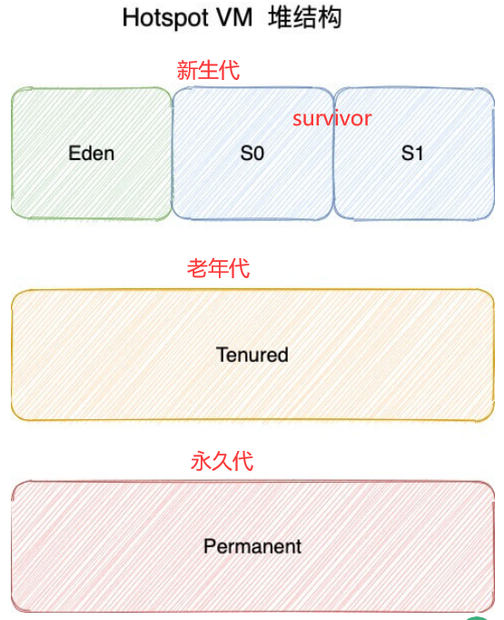
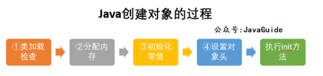

# JVM阅读笔记

## 一、Java内存区域与内存溢出异常

### 1.概述

对于Java程序员来说，虚拟机会自动对内存管理，因此不需要C++中的delete/free操作。但是，如果不**了解虚拟机是如何使用内存**，就无法排查错误。

### 2.运行时数据区


其中，**线程共享的**：

- 方法区
- 堆
- 直接内存（不属于运行时数据区）

**线程私有**：

- 程序计数器
- 虚拟机栈
- 本地方法栈

#### 2.1程序计数器

作用：取指令。**字节码解释器工作时通过改变这个计数器的值来选取下一条需要执行的字节码指令，分支、循环、跳转、异常处理、线程恢复等功能都需要依赖这个计数器来完成。**

为何是线程私有的呢？

切换线程恢复的时候，需要记忆到上一次的位置，因此如果每个线程都有独立的程序计数器，就能够顺利恢复到原来的执行位置。

**为了线程切换后能恢复到正确的执行位置，每条线程都需要有一个独立的程序计数器，各线程之间计数器互不影响，独立存储，我们称这类内存区域为“线程私有”的内存。**

**注意：**

- 线程执行Java方法：计数器中记录的是正在执行的虚拟机字节码指令的地址。
- 线程执行的是native方法：记录的是空。
- 唯一不会出现OOM的区域。

#### 2.2Java虚拟机栈

**线程私有，生命周期和线程一致。描述的是 Java 方法执行的内存模型。**

s**每次方法被执行，栈都会同步创建一个栈帧，方法执行后，栈帧会弹出。**

sJava 方法有两种返回方式：

1. return 语句。
2. 抛出异常。

**Java 内存可以粗糙的区分为堆内存（Heap）和栈内存 (Stack)，其中栈就是现在说的虚拟机栈，或者说是虚拟机栈中局部变量表部分。** 

**局部变量表主要存放了编译期可知的各种数据类型**（boolean、byte、char、short、int、float、long、double）、**对象引用**（reference 类型，它不同于对象本身，可能是一个指向对象起始地址的引用指针，也可能是指向一个代表对象的句柄或其他与此对象相关的位置）。

局部变量表的存储空间以Slot表示，long和double可占2个slot，其余1个，在编译期间完成分配。

**注意这个内存区域出现的错误：**

- StackOverFlowError：如果线程请求的栈的深度大于虚拟机栈所允许的深度，就出现此异常。
- OOM：如果栈容量可以动态扩展（HotSpot虚拟机无法动态扩展，但如果申请的栈失败，就会出现此异常），栈扩展时无法申请足够内存，就会出现此异常。

#### 2.3本地方法栈

和虚拟机栈所发挥的作用非常相似，区别是： **虚拟机栈为虚拟机执行 Java 方法 （也就是字节码）服务，而本地方法栈则为虚拟机使用到的 Native 方法服务。** 在 HotSpot 虚拟机中和 Java 虚拟机栈合二为一。

**注意这个内存区域出现的错误：**

- StackOverFlowError：栈深度溢出
- OOM：栈扩展失败

#### 2.4堆

最大的一块。

线程共享。

”几乎“所有的对象实例都在这里分配内存。

- 但是，随着 JIT 编译器的发展与逃逸分析技术逐渐成熟，栈上分配、标量替换优化技术将会导致一些微妙的变化，所有的对象都分配到堆上也渐渐变得不那么“绝对”了。从 JDK 1.7 开始已经默认开启逃逸分析，如果某些方法中的对象引用没有被返回或者未被外面使用（也就是未逃逸出去），那么对象可以直接在栈上分配内存。

从分配内存的角度，所有线程共享的Java堆中可以划分出多个线程私有的分配缓冲区（TLAB,Thread local Allocation Buffer），用来提升对象分配的效率。

堆是垃圾收集器管理的内存区域，也被称作**”GC堆“**。

从回收内存的角度，由于现在收集器基本都采用分代垃圾收集算法，所以 Java 堆还可以细分为：新生代和老年代；再细致一点有：Eden、Survivor、Old 等空间。**进一步划分的目的是更好地回收内存，或者更快地分配内存。**

在 JDK 7 版本及 JDK 7 版本之前，堆内存被通常分为下面三部分：

1. 新生代内存(Young Generation)
2. 老生代(Old Generation)
3. 永久代(Permanent Generation)

下图所示的 Eden 区、两个 Survivor 区 S0 和 S1 都属于新生代，中间一层属于老年代，最下面一层属于永久代。

**JDK 8 版本之后 PermGen 已被 Metaspace(元空间) 取代，元空间使用的是直接内存。**

大部分情况，对象都会首先在 Eden 区域分配，在一次新生代垃圾回收后，如果对象还存活，则会进入 S0 或者 S1，并且对象的年龄还会加 1(Eden 区->Survivor 区后对象的初始年龄变为 1)，当它的年龄增加到一定程度（默认为 15 岁），就会被晋升到老年代中。对象晋升到老年代的年龄阈值，可以通过参数`XX:MaxTenuringThreshold` 来设置。

**🐛 修正（参见：[issue552  (opens new window)](https://github.com/Snailclimb/JavaGuide/issues/552)）** ：“Hotspot 遍历所有对象时，按照年龄从小到大对其所占用的大小进行累积，当累积的某个年龄大小超过了 survivor 区的一半时，取这个年龄和 MaxTenuringThreshold 中更小的一个值，作为新的晋升年龄阈值”。

**动态年龄计算的代码如下**

```text
uint ageTable::compute_tenuring_threshold(size_t survivor_capacity) {
	//survivor_capacity是survivor空间的大小
size_t desired_survivor_size = (size_t)((((double) survivor_capacity)*TargetSurvivorRatio)/100);
size_t total = 0;
uint age = 1;
while (age < table_size) {
total += sizes[age];//sizes数组是每个年龄段对象大小
if (total > desired_survivor_size) break;
age++;
}
uint result = age < MaxTenuringThreshold ? age : MaxTenuringThreshold;
	...
}
```

堆这里最容易出现的就是 `OutOfMemoryError` 错误，并且出现这种错误之后的表现形式还会有几种，比如：

1. **`java.lang.OutOfMemoryError: GC Overhead Limit Exceeded`** ： 当 JVM 花太多时间执行垃圾回收并且只能回收很少的堆空间时，就会发生此错误。
2. **`java.lang.OutOfMemoryError: Java heap space`** :假如在创建新的对象时, 堆内存中的空间不足以存放新创建的对象, 就会引发此错误。(和配置的最大堆内存有关，且受制于物理内存大小。最大堆内存可通过`-Xmx`参数配置，若没有特别配置，将会使用默认值，详见：[Default Java 8 max heap size  (opens new window)](https://stackoverflow.com/questions/28272923/default-xmxsize-in-java-8-max-heap-size))
3. ....

#### 2.5方法区

**线程共享**。

用于存储已被虚拟机加载的类信息、常量、静态变量、即时编译器编译后的代码等数据。

Java虚拟机规范 把它描述为堆的一个逻辑部分。别名”**非堆**“。

很多人把方法区称为永久代。

但是： 方法区和永久代的关系

> 《Java 虚拟机规范》只是规定了有方法区这么个概念和它的作用，并没有规定如何去实现它。那么，在不同的 JVM 上方法区的实现肯定是不同的了。 **方法区和永久代的关系很像 Java 中接口和类的关系，类实现了接口，而永久代就是 HotSpot 虚拟机对虚拟机规范中方法区的一种实现方式。** 也就是说，永久代是 HotSpot 的概念，方法区是 Java 虚拟机规范中的定义，是一种规范，而永久代是一种实现，一个是标准一个是实现，其他的虚拟机实现并没有永久代这一说法。

方法区（HotSpot 的永久代）被彻底移除了（JDK1.7 就已经开始了），取而代之是元空间，元空间使用的是直接内存。

- 原因：

  1.永久代有JVM设置的上限OOM的概率会增大，元空间使用的是本机内可用的内存。

  - -可以使用 `-XX：MaxMetaspaceSize` 标志设置最大元空间大小，默认值为 unlimited，这意味着它只受系统内存的限制。`-XX：MetaspaceSize` 调整标志定义元空间的初始大小如果未指定此标志，则 Metaspace 将根据运行时的应用程序需求动态地重新调整大小。 ----- 著作权归Guide哥所有。 链接: https://javaguide.cn/java/jvm/memory-area/#_2-5-%E6%96%B9%E6%B3%95%E5%8C%BA

- 2.合并HotSpot和JRockit的时候，因为JRockit没有永久代，为了HotSpot的发展，去掉了永久代。

#### 2.6运行时常量池

方法区的一部分。

Class 文件中除了有类的版本、字段、方法、接口等描述信息外，还有**常量池表**（用于存放编译期生成的各种字面量和符号引用）,常量池表被存放在方法区的运行时常量池中。

> **🐛 修正（参见：[issue747  (opens new window)](https://github.com/Snailclimb/JavaGuide/issues/747)，[reference  (opens new window)](https://blog.csdn.net/q5706503/article/details/84640762)）** ：
>
> 1. **JDK1.7 之前运行时常量池逻辑包含字符串常量池存放在方法区, 此时 hotspot 虚拟机对方法区的实现为永久代**
> 2. **JDK1.7 字符串常量池被从方法区拿到了堆中, 这里没有提到运行时常量池,也就是说字符串常量池被单独拿到堆,运行时常量池剩下的东西还在方法区, 也就是 hotspot 中的永久代** 。
> 3. **JDK1.8 hotspot 移除了永久代用元空间(Metaspace)取而代之, 这时候字符串常量池还在堆, 运行时常量池还在方法区, 只不过方法区的实现从永久代变成了元空间(Metaspace)**


#### 2.7直接内存

**直接内存并不是虚拟机运行时数据区的一部分，也不是虚拟机规范中定义的内存区域，但是这部分内存也被频繁地使用。而且也可能导致 OutOfMemoryError 错误出现。**

JDK1.4 中新加入的 **NIO(New Input/Output) 类**，引入了一种基于**通道（Channel）**与**缓存区（Buffer）**的 I/O 方式，它**可以直接使用 Native 函数库直接分配堆外内存**，然后通过一个存储在 Java 堆中的 DirectByteBuffer 对象作为这块内存的**引用**进行操作。这样就能在一些场景中显著提高性能，因为避免了在 Java 堆和 Native 堆之间来回复制数据。

### 3.HotSpot虚拟机对象探秘

本大节为HotSpot虚拟机对象在Java堆中对象分配、布局和访问的过程。

#### ⭕3.1对象的创建



- 类加载检查
  - 虚拟机遇到new指令时，先要检查这个指令的参数能否在常量池中定位到这个类的符号引用，并检查这个符号引用代表的类是否已被加载、解析和初始化过。
- 分配内存
  - 类加载检查通过后，要为为新对象分配内存。在堆中划分一块确定大小的内存分配给新对象（分配内存的大小在类加载完成后就可以确定）。
  - 内存分配的2种方式
    - 指针碰撞：前提是内存规整。把内存分为使用过和未被使用过的部分，中间有一个指针作为分界点，分配到时候移动指针（向空闲方向）即可。
    - 空闲列表：内存不规整。维护一个记录可用内存的列表，分配的时候查找列表。
    - 如何判断内存规整？
      - 标记-清除：不规整、
      - 标记-整理：规整、
  - 内存分配的并发问题解决：
    - **CAS+失败重试：** CAS 是乐观锁的一种实现方式。所谓乐观锁就是，每次不加锁而是假设没有冲突而去完成某项操作，如果因为冲突失败就重试，直到成功为止。**虚拟机采用 CAS 配上失败重试的方式保证更新操作的原子性。**
    - **TLAB：** 为每一个线程预先在 堆分配一块儿内存，那个线程要分配内存，就在TLAB中分配，TLAB用完了，分配新的TLAB需要同步锁定
- 初始化零值
  - 内存分配完成后，把分配到的内存空间都初始化为零值
- 设置对象头
  - 对象头存放：比如这个对象是哪个类的实例；如何找到这个类的元数据信息；对象的哈希码；对象的GC分代年龄等信息。
- 执行init()方法
  - 构造函数。new指令之后会接着执行<init>方法。

#### 3.2对象的内存布局

​		对象在堆中的布局可划分为3个部分：**对象头**、**实例数据**和**对齐填充**。

- 对象头
  - 存储自身对象的运行时数据。（哈希码、GC 分代年龄、锁状态标志等）
  - 类型指针。指向它类型元数据。
- 实例数据（对象真正存储的有效信息）
  - 我们在程序中定义的各种类型的字段内容。
- 对齐填充
  - 占位作用。
  - 任何对象的大小都是8字节的整数倍，如果没有对齐，可用它补全。

#### 3.3对象的访问定位

- 使用句柄
  - 
  - 好处：对象移动（垃圾回收造成）时，不必修改reference，只需修改句柄池的指针。
- 直接指针
  - 
  - 好处：速度快。（对象访问频繁）HotSpot采用第二种。

### 4.面试题

#### 4.1.字符串常量池以及字符串的intern();

**String 类型的变量和常量做“+”运算时发生了什么？** 

先来看字符串不加 `final` 关键字拼接的情况（JDK1.8）：

```java
String str1 = "str";
String str2 = "ing";
String str3 = "str" + "ing";//常量池中的对象
String str4 = str1 + str2; //在堆上创建的新的对象
String str5 = "string";//常量池中的对象
System.out.println(str3 == str4);//false
System.out.println(str3 == str5);//true
System.out.println(str4 == str5);//false
```

> **注意** ：比较 String 字符串的值是否相等，可以使用 `equals()` 方法。 `String` 中的 `equals` 方法是被重写过的。 `Object` 的 `equals` 方法是比较的对象的内存地址，而 `String` 的 `equals` 方法比较的是字符串的值是否相等。如果你使用 `==` 比较两个字符串是否相等的话，IDEA 还是提示你使用 `equals()` 方法替换。


> 对于基本数据类型来说，== 比较的是值。对于引用数据类型来说，==比较的是对象的内存地址。

对于编译期可以确定值的字符串，也就是常量字符串 ，jvm 会将其存入字符串常量池。

> **字符串常量池** 是 JVM 为了提升性能和减少内存消耗针对字符串（String 类）专门开辟的一块区域，主要目的是为了避免字符串的重复创建。
>
> ```java
> String aa = "ab"; // 放在常量池中
> String bb = "ab"; // 从常量池中查找
> System.out.println(aa==bb);// true
> ```
>
> JDK1.7 之前运行时常量池逻辑包含字符串常量池存放在方法区。JDK1.7 的时候，字符串常量池被从方法区拿到了堆中。

并且，字符串常量拼接得到的字符串常量在编译阶段就已经被存放字符串常量池，这个得益于编译器的优化。

> 在编译过程中，Javac 编译器（下文中统称为编译器）会进行一个叫做 **常量折叠(Constant Folding)** 的代码优化。《深入理解 Java 虚拟机》中是也有介绍到：
>
> 
>
> 常量折叠会把常量表达式的值求出来作为常量嵌在最终生成的代码中，这是 Javac 编译器会对源代码做的极少量优化措施之一(代码优化几乎都在即时编译器中进行)。
>
> 对于 `String str3 = "str" + "ing";` 编译器会给你优化成 `String str3 = "string";` 。
>
> 并不是所有的常量都会进行折叠，只有编译器在程序编译期就可以确定值的常量才可以：
>
> 1. 基本数据类型(byte、boolean、short、char、int、float、long、double)以及字符串常量
> 2. `final` 修饰的基本数据类型和字符串变量
> 3. 字符串通过 “+”拼接得到的字符串、基本数据类型之间算数运算（加减乘除）、基本数据类型的位运算（<<、>>、>>> ）

因此，`str1` 、 `str2` 、 `str3` 都属于字符串常量池中的对象。

引用的值在程序编译期是无法确定的，编译器无法对其进行优化。

对象引用和“+”的字符串拼接方式，实际上是通过 `StringBuilder` 调用 `append()` 方法实现的，拼接完成之后调用 `toString()` 得到一个 `String` 对象 。

```java
String str4 = new StringBuilder().append(str1).append(str2).toString();
```

因此，`str4` 并不是字符串常量池中存在的对象，属于堆上的新对象。

我画了一个图帮助理解：


我们在平时写代码的时候，尽量避免多个字符串对象拼接，因为这样会重新创建对象。如果需要改变字符串的话，可以使用 `StringBuilder` 或者 `StringBuffer`。

不过，字符串使用 `final` 关键字声明之后，可以让编译器当做常量来处理。


```java
final String str1 = "str";
final String str2 = "ing";
// 下面两个表达式其实是等价的
String c = "str" + "ing";// 常量池中的对象
String d = str1 + str2; // 常量池中的对象
System.out.println(c == d);// true
```


被 `final` 关键字修改之后的 `String` 会被编译器当做常量来处理，编译器在程序编译期就可以确定它的值，其效果就想到于访问常量。

如果 ，编译器在运行时才能知道其确切值的话，就无法对其优化。

示例代码如下（`str2` 在运行时才能确定其值）：


```java
final String str1 = "str";
final String str2 = getStr();
String c = "str" + "ing";// 常量池中的对象
String d = str1 + str2; // 在堆上创建的新的对象
System.out.println(c == d);// false
public static String getStr() {
      return "ing";
}
```


**我们再来看一个类似的问题！**


```java
String str1 = "abcd";
String str2 = new String("abcd");
String str3 = new String("abcd");
System.out.println(str1==str2);  //false
System.out.println(str2==str3);  //false
```


上面的代码运行之后会输出什么呢？

答案是：

```text
false
false
```


**这是为什么呢？**

我们先来看下面这种创建字符串对象的方式：


```java
// 从字符串常量池中拿对象
String str1 = "abcd";
```


这种情况下，jvm 会先检查字符串常量池中有没有"abcd"，如果字符串常量池中没有，则创建一个，然后 str1 指向字符串常量池中的对象，如果有，则直接将 str1 指向"abcd"；

因此，`str1` 指向的是字符串常量池的对象。

我们再来看下面这种创建字符串对象的方式：


```java
// 直接在堆内存空间创建一个新的对象。
String str2 = new String("abcd");
String str3 = new String("abcd");
```


**只要使用 new 的方式创建对象，便需要创建新的对象** 。

使用 new 的方式创建对象的方式如下，可以简单概括为 3 步：

1. 在堆中创建一个字符串对象
2. 检查字符串常量池中是否有和 new 的字符串值相等的字符串常量
3. 如果没有的话需要在字符串常量池中也创建一个值相等的字符串常量，如果有的话，就直接返回堆中的字符串实例对象地址。

因此，`str2` 和 `str3` 都是在堆中新创建的对象。

**字符串常量池比较特殊，它的主要使用方法有两种：**

1. 直接使用双引号声明出来的 `String` 对象会直接存储在常量池中。
2. 如果不是用双引号声明的 `String` 对象，使用 `String` 提供的 `intern()` 方法也有同样的效果。`String.intern()` 是一个 Native 方法，它的作用是：
   1. JDK1.7：查看常量池有无此对象，不存在就创建并引用（指向它）；存在就返回当前字符串。
   2. 如果字符串常量池中已经包含一个等于此 String 对象内容的字符串，则返回常量池中该字符串的引用；如果没有，JDK1.7 之前（不包含 1.7）的处理方式是在常量池中创建与此 `String` 内容相同的字符串，并返回常量池中创建的字符串的引用，JDK1.7 以及之后，字符串常量池被从方法区拿到了堆中，jvm 不会在常量池中创建该对象，而是将堆中这个对象的引用直接放到常量池中，减少不必要的内存开销。❓❓❓❓❓❓❓
   3. [深入解析String#intern - 美团技术团队 (meituan.com)](https://tech.meituan.com/2014/03/06/in-depth-understanding-string-intern.html)

示例代码如下（JDK 1.8） :

```java
String s1 = "Javatpoint";
String s2 = s1.intern();
String s3 = new String("Javatpoint");
String s4 = s3.intern();
System.out.println(s1==s2); // True
System.out.println(s1==s3); // False
System.out.println(s1==s4); // True
System.out.println(s2==s3); // False
System.out.println(s2==s4); // True
System.out.println(s3==s4); // False
```


**总结** ：

1. 对于基本数据类型来说，==比较的是值。对于引用数据类型来说，==比较的是对象的内存地址。
2. 在编译过程中，Javac 编译器（下文中统称为编译器）会进行一个叫做 **常量折叠(Constant Folding)** 的代码优化。常量折叠会把常量表达式的值求出来作为常量嵌在最终生成的代码中，这是 Javac 编译器会对源代码做的极少量优化措施之一(代码优化几乎都在即时编译器中进行)。
3. 一般来说，我们要尽量避免通过 new 的方式创建字符串。使用双引号声明的 `String` 对象（ `String s1 = "java"` ）更利于让编译器有机会优化我们的代码，同时也更易于阅读。
4. 被 `final` 关键字修改之后的 `String` 会被编译器当做常量来处理，编译器程序编译期就可以确定它的值，其效果就想到于访问常量。

####  4.2 String s1 = new String("abc");这句话创建了几个字符串对象？

会创建 1 或 2 个字符串：

- 如果字符串常量池中已存在字符串常量“abc”，则只会在堆空间创建一个字符串常量“abc”。
- 如果字符串常量池中没有字符串常量“abc”，那么它将首先在字符串常量池中创建，然后在堆空间中创建，因此将创建总共 2 个字符串对象。

#### 4.3 8 种基本类型的包装类和常量池

Java 基本类型的包装类的大部分都实现了常量池技术。

`Byte`,`Short`,`Integer`,`Long` 这 4 种包装类默认创建了数值 **[-128，127]** 的相应类型的缓存数据，`Character` 创建了数值在 **[0,127]** 范围的缓存数据，`Boolean` 直接返回 `True` Or `False`。

两种浮点数类型的包装类 `Float`,`Double` 并没有实现常量池技术。

```java
Integer i1 = 33;
Integer i2 = 33;
System.out.println(i1 == i2);// 输出 true
Integer i11 = 333;
Integer i22 = 333;
System.out.println(i11 == i22);// 输出 false
Double i3 = 1.2;
Double i4 = 1.2;
System.out.println(i3 == i4);// 输出 false
```

**Integer 缓存源代码：**

```java
/**
*此方法将始终缓存-128 到 127（包括端点）范围内的值，并可以缓存此范围之外的其他值。
*/
public static Integer valueOf(int i) {
    if (i >= IntegerCache.low && i <= IntegerCache.high)
      return IntegerCache.cache[i + (-IntegerCache.low)];
    return new Integer(i);
}
private static class IntegerCache {
    static final int low = -128;
    static final int high;
    static final Integer cache[];
}
```

**`Character` 缓存源码:**

```java
public static Character valueOf(char c) {
    if (c <= 127) { // must cache
      return CharacterCache.cache[(int)c];
    }
    return new Character(c);
}

private static class CharacterCache {
    private CharacterCache(){}

    static final Character cache[] = new Character[127 + 1];
    static {
        for (int i = 0; i < cache.length; i++)
            cache[i] = new Character((char)i);
    }
}
```


**`Boolean` 缓存源码：**

```java
public static Boolean valueOf(boolean b) {
    return (b ? TRUE : FALSE);
}
```


如果超出对应范围仍然会去创建新的对象，缓存的范围区间的大小只是在性能和资源之间的权衡。

下面我们来看一下问题。下面的代码的输出结果是 `true` 还是 `false` 呢？

```java
Integer i1 = 40;
Integer i2 = new Integer(40);
System.out.println(i1==i2);
```

`Integer i1=40` 这一行代码会发生装箱，也就是说这行代码等价于 `Integer i1=Integer.valueOf(40)` 。因此，`i1` 直接使用的是常量池中的对象。而`Integer i2 = new Integer(40)` 会直接创建新的对象。

因此，答案是 `false` 。你答对了吗？

记住：**所有整型包装类对象之间值的比较，全部使用 equals 方法比较**。


**Integer 比较更丰富的一个例子:**

```java
Integer i1 = 40;
Integer i2 = 40;
Integer i3 = 0;
Integer i4 = new Integer(40);
Integer i5 = new Integer(40);
Integer i6 = new Integer(0);

System.out.println(i1 == i2);// true
System.out.println(i1 == i2 + i3);//true
System.out.println(i1 == i4);// false
System.out.println(i4 == i5);// false
System.out.println(i4 == i5 + i6);// true
System.out.println(40 == i5 + i6);// true
```

`i1` , `i2` , `i3` 都是常量池中的对象，`i4` , `i5` , `i6` 是堆中的对象。

`i4 == i5 + i6` 为什么是 true 呢？因为， `i5` 和 `i6` 会进行自动拆箱操作，进行数值相加，即 `i4 == 40` 。 `Integer` 对象无法与数值进行直接比较，所以 `i4` **自动拆箱**转为 int 值 40，最终这条语句转为 `40 == 40` 进行数值比较。

### 5.OOM实战

# 二、垃圾收集器与内存分配策略

### 1.概述及实战

**程序计数器**、**虚拟机栈**、**本地方法栈**、这3个区是线程私有的，栈中的栈帧分配多少内存，基本上是已知的（编译时大体上已知），不需要过多考虑垃圾回收的问题。

**堆、方法区**有着不确定性，只有在运行阶段才区创建对象，这部分的垃圾回收是动态的。

为什么要了解垃圾回收？

- 需要排查内存泄漏、溢出等问题时、当垃圾收集成为系统高并发的瓶颈时、we need it!

#### .1.1堆中的详细划分


从垃圾回收的角度，由于现在收集器基本都采用分代垃圾收集算法，所以 Java 堆还可以细分为：新生代和老年代：再细致一点有：Eden 空间、From Survivor、To Survivor 空间等。**进一步划分的目的是更好地回收内存，或者更快地分配内存。**

#### **1.2对象的分配：**

- 大部分情况，对象都会首先在 Eden 区域分配，在一次新生代垃圾回收后，如果对象还存活，则会进入 s0 或者 s1，

- Hotspot 遍历所有对象时，按照年龄从小到大对其所占用的大小进行累积，当累积的某个年龄大小超过了 survivor 区的一半时，取这个年龄和 MaxTenuringThreshold 中更小的一个值，作为新的晋升年龄阈值 。

  - 对象晋升到老年代的年龄阈值，可以通过参数 `-XX:MaxTenuringThreshold` 来设置默认值，这个值会在虚拟机运行过程中进行调整，可以通过`-XX:+PrintTenuringDistribution`来打印出当次 GC 后的 Threshold。

  - **动态年龄计算的代码如下**

    ```java
    uint ageTable::compute_tenuring_threshold(size_t survivor_capacity) {
    //survivor_capacity是survivor空间的大小
    size_t desired_survivor_size = (size_t)((((double)survivor_capacity)*TargetSurvivorRatio)/100);
    //survivor空间的大小✖目标survivor空间的比率再➗100 = survivor区的一般 TargetSurvivorRatio可能为50%
    size_t total = 0;
    uint age = 1;
    while (age < table_size) {
      //sizes数组是每个年龄段对象大小
      total += sizes[age];
      if (total > desired_survivor_size) {
          break;
      }
      age++;
    }
    uint result = age < MaxTenuringThreshold ? age : MaxTenuringThreshold;
    ...
    }
    ```

- 就会被晋升到老年代中。

- 经过这次 GC 后，Eden 区和"From"区已经被清空。这个时候，"From"和"To"会交换他们的角色，也就是新的"To"就是上次 GC 前的“From”，新的"From"就是上次 GC 前的"To"。不管怎样，都会保证名为 To 的 Survivor 区域是空的。Minor GC 会一直重复这样的过程，在这个过程中，有可能当次 Minor GC 后，Survivor 的"From"区域空间不够用，有一些还达不到进入老年代条件的实例放不下，则放不下的部分会提前进入老年代。

#### 1.3测试对象的分配

### 2.对象已死亡？

#### 2.1引用计数算法

判断对象是否存活：

- 添加一个引用计数器，每当有一个地方引用它，计数器就加一：引用失效，减一；计数器为0，就不能使用。
  - 因为它很难解决对象直接相互循环引用的问题：对象直接相互引用，再将他们赋值为null，但是计数器还是不为0.导致无法回收。
  - 因此JVM不是通过此方法判断对象的存活。

#### 2.2可达性分析算法

**“GC Roots”** 为起点，从这些节点开始向下搜索，节点所走过的路径称为**引用链**，当一个对象到 GC Roots **没有任何引用链相连**的话，则证明此对象是不可用的，需要被回收。


**可作为GC Roots的对象**：

- 虚拟机栈引用的对象（方法栈堆里面的局部变量、参数等）
- 本地方法栈native引用的对象
- 方法区中类静态属性引用的对象（类的引用类型，静态变量）
- 方法区中常量引用的对象 （字符串常量池中的引用）
- 同步锁持有的对象

**对象可以被回收，就代表一定会被回收吗？**

即使在可达性分析法中不可达的对象，也并非是“非死不可”的，这时候它们暂时处于“缓刑阶段”，要真正宣告一个对象死亡，至少要经历**两次标记**过程；可达性分析法中不可达的对象被**第一次标记**（**引用链**）并且进行一次筛选，筛选的条件是此对象是否有必要执行 `finalize` 方法。**当对象没有覆盖 `finalize` 方法，或 `finalize` 方法已经被虚拟机调用过时，虚拟机将这两种情况视为没有必要执行。**

被判定为需要执行的对象将会被放在一个队列中进行第二次标记，除非这个对象与引用链上的任何一个对象建立关联，否则就会被真的回收。

> `Object` 类中的 `finalize` 方法一直被认为是一个糟糕的设计，成为了 Java 语言的负担，影响了 Java 语言的安全和 GC 的性能。JDK9 版本及后续版本中各个类中的 `finalize` 方法会被逐渐弃用移除。忘掉它的存在吧！
>
> 参考：
>
> - [JEP 421: Deprecate Finalization for Removal  (opens new window)](https://openjdk.java.net/jeps/421)
> - [是时候忘掉 finalize 方法了](https://mp.weixin.qq.com/s/LW-paZAMD08DP_3-XCUxmg)

#### 2.3再谈引用

**1．强引用（StrongReference）**

以前我们使用的大部分引用实际上都是强引用，这是使用最普遍的引用。如果一个对象具有强引用，那就类似于**必不可少的生活用品**，垃圾回收器绝不会回收它。（无论任何情况，只要强引用，垃圾收集器永远不会回收那个对象。）当内存空间不足，Java 虚拟机宁愿抛出 OutOfMemoryError 错误，使程序异常终止，也不会靠随意回收具有强引用的对象来解决内存不足问题。

**2．软引用（SoftReference）**

如果一个对象只具有软引用，那就类似于**可有可无的生活用品**。如果内存空间足够，垃圾回收器就不会回收它，**如果内存空间不足了，就会回收这些对象的内存。**只要垃圾回收器没有回收它，该对象就可以被程序使用。软引用可用来实现内存敏感的高速缓存。

软引用可以和一个引用队列（ReferenceQueue）联合使用，如果软引用所引用的对象被垃圾回收，JAVA 虚拟机就会把这个软引用加入到与之关联的引用队列中。

**3．弱引用（WeakReference）**

如果一个对象只具有弱引用，那就类似于**可有可无的生活用品**。弱引用与软引用的区别在于：只具有弱引用的对象拥有更短暂的生命周期。在垃圾回收器线程扫描它所管辖的内存区域的过程中，一旦发现了只具有弱引用的对象，**不管当前内存空间足够与否，都会回收它的内存。**不过，由于垃圾回收器是一个优先级很低的线程， 因此不一定会很快发现那些只具有弱引用的对象。

弱引用可以和一个引用队列（ReferenceQueue）联合使用，如果弱引用所引用的对象被垃圾回收，Java 虚拟机就会把这个弱引用加入到与之关联的引用队列中。

**4．虚引用（PhantomReference）**

"虚引用"顾名思义，就是形同虚设，与其他几种引用都不同，虚引用并不会决定对象的生命周期。如果一个对象仅持有虚引用，那么它就和没有任何引用一样，在任何时候都可能被垃圾回收。

**虚引用主要用来跟踪对象被垃圾回收的活动**。

**虚引用与软引用和弱引用的一个区别在于：** **虚引用必须和引用队列（ReferenceQueue）联合使用。当垃圾回收器准备回收一个对象时，如果发现它还有虚引用，就会在回收对象的内存之前，把这个虚引用加入到与之关联的引用队列中。**程序可以通过判断引用队列中是否已经加入了虚引用，来了解被引用的对象是否将要被垃圾回收。程序如果发现某个虚引用已经被加入到引用队列，那么就可以在所引用的对象的内存被回收之前采取必要的行动。

特别注意，在程序设计中一般很少使用弱引用与虚引用，使用软引用的情况较多，这是因为**软引用可以加速 JVM 对垃圾内存的回收速度，可以维护系统的运行安全，防止内存溢出（OutOfMemory）等问题的产生**。

#### 2.4回收方法区

方法区的垃圾回收：

- 废弃的常量。
  - 判断是否是废弃的变量：
  - **JDK1.7 之前运行时常量池逻辑包含字符串常量池存放在方法区, 此时 hotspot 虚拟机对方法区的实现为永久代**
  - **JDK1.7 字符串常量池被从方法区拿到了堆中, 这里没有提到运行时常量池,也就是说字符串常量池被单独拿到堆,运行时常量池剩下的东西还在方法区, 也就是 hotspot 中的永久代** 。
  - **JDK1.8 hotspot 移除了永久代用元空间(Metaspace)取而代之, 这时候字符串常量池还在堆, 运行时常量池还在方法区, 只不过方法区的实现从永久代变成了元空间(Metaspace)**
  - 假如在字符串常量池中存在字符串 "abc"，如果当前没有任何 String 对象引用该字符串常量的话，就说明常量 "abc" 就是废弃常量，如果这时发生内存回收的话而且有必要的话，"abc" 就会被系统清理出常量池了。
- 不再使用的类型。
  - 该类所有的实例都已经被回收，也就是 Java 堆中不存在该类及其子类的任何实例。
  - 加载该类的 `ClassLoader` 已经被回收。
  - 该类对应的 `java.lang.Class` 对象没有在任何地方被引用，无法在任何地方通过反射访问该类的方法。

### 3垃圾收集算法

#### 3.1标记-清除

步骤：

- 首先标记出所有需要回收的对象。
- 标记完成后，统一回收所有标记过的对象。

缺点：

- **效率不搞。**假如堆出现大量对象，大部分需要回收，就需要大量的标记和清除。
- **内存空间碎片化。**分配大对象时无法找到连续的内存空间。

#### 3.2标记-复制

步骤：

- 半区复制
  - 把可用的内存空间分成2块，
  - 每次只用一块，当这块用完了，把存活的复制到另一块，再清除已使用的内存空间。

缺点：

- 如果存活的对象很多，会产生复制所需的开销。
- 将可用空间缩为一般，造成空间浪费。

优点：

- 解决内存碎片化问题。
- 可用于新生代的清除。

#### 3.3标记-整理

步骤：

- 把所有存活对象移动代内存空间一端
- 清理边界以外的内存

移动的缺点：

- 移动存活对象相当于”stop the world“，（必须暂停用户的进程，ZGC垃圾实现了并发执行？）
- 不移动又会造成空间碎片
- 不移动：延迟小，CMS垃圾收集器
- 移动：停顿，Parallel Scavenge垃圾收集器

#### 3.4分代收集理论

**为何分代？**

当前虚拟机的垃圾收集都采用分代收集算法，这种算法没有什么新的思想，只是根据对象存活周期的不同将内存分为几块。一般将 java 堆分为新生代和老年代，**这样我们就可以根据各个年代的特点选择合适的垃圾收集算法**。

比如在**新生代中，每次收集都会有大量对象死去**（**朝生夕灭**），所以可以选择”标记-复制“算法，只需要付出少量对象的复制成本就可以完成每次垃圾收集。而老年代的对象存活几率是比较高的，而且没有额外的空间对它进行分配担保，所以我们必须选择“标记-清除”或“标记-整理”算法进行垃圾收集。

### 4.垃圾收集器

#### 4.1Serial 收集器


#### 4.2ParNew 收集器


#### 4.3Parallel Scavenge 收集器


#### 4.4Serial Old 收集器


#### 4.5Parallel Old 收集器


#### 4.6CMS 收集器


#### 4.7G1 收集器


#### 4.8 ZGC 收集器
