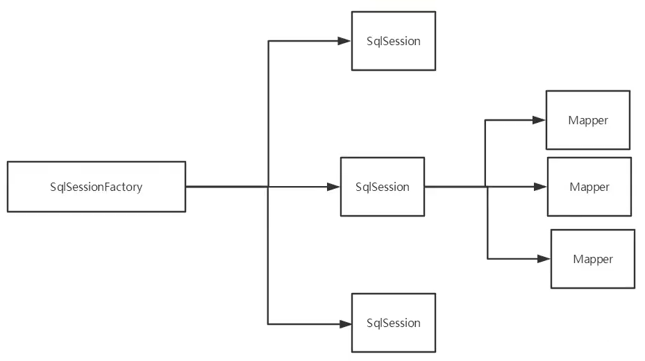
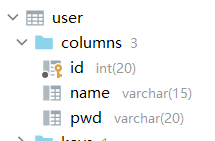
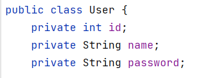
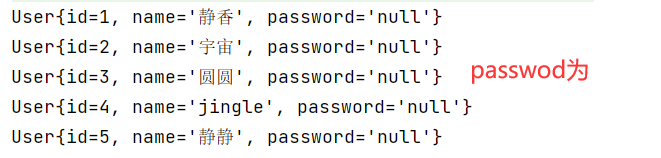
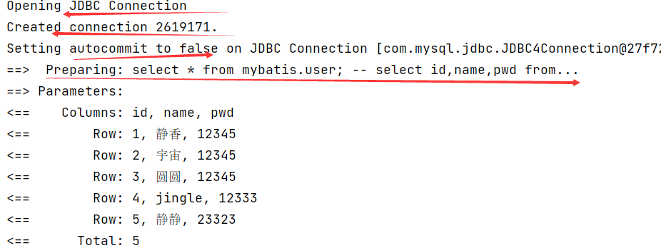
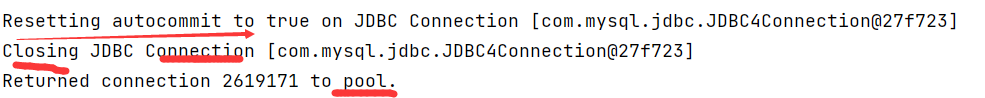
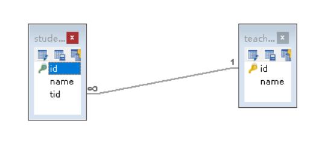
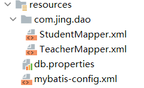
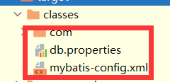

# 学习mybatis之前要理解什么？

## 	反射！！（有时间看下！未完成）

## 代理模式

## 工厂模式

## 单例模式

## 环境

- JDK1.8
- Mysql5.7
- maven 3.6.3
- IDEA

## 回顾

- JDBC
- Mysql
- Java基础
- Maven
- Juni

## SSM框架：配置文件的最好的方式：看官网文档


# Mybatis

## 一、Mybatis简介

### 1.1 什么是Mybatis

如何获得Mybatis

- maven仓库：

```xml
<!-- https://mvnrepository.com/artifact/org.mybatis/mybatis -->
        <dependency>
            <groupId>org.mybatis</groupId>
            <artifactId>mybatis</artifactId>
            <version>3.5.6</version>
        </dependency>
```

- 中文文档：https://mybatis.org/mybatis-3/zh/index.html
- Github:https://github.com/mybatis/mybatis-3

### 1.2 持久化

数据持久化

- 持久化就是将程序的数据在持久状态和瞬时状态转化的过程
- 内存：**断电即失**
- 数据库（Jdbc），io文件持久化
- 生活方面例子：冷藏，罐头。

**为什么需要持久化？**

- 不想丢掉一些对象
- 内存太贵

### 1.3 持久层

Dao层，Service层，Controller层…

- 完成持久化工作的代码块
- 层界限十分明显

### 1.4 为什么需要Mybatis？

- 帮助程序猿将数据存入到数据库中
- 方便
- 传统的JDBC代码太复杂，简化–>框架–>自动化
- 优点：

**最重要的一点：使用的人多！**
Spring-SpringMVC-SpringBoot

## 二、第一个Mybatis程序

1.搭建环境

2.导入mybatis

3.编写代码

4.测试

### 2.1搭建环境

创建数据库

```mysql
CREATE DATABASE mybatis;

USE mybatis;
CREATE TABLE `user`(
`id` INT(20) PRIMARY KEY,
`name` VARCHAR(15) DEFAULT NULL,
`pwd` VARCHAR(20))
ENGINE = INNODB DEFAULT CHARSET = utf8;

INSERT INTO `user`() VALUES(1,'静香','12345'),
(2,'宇宙','12345'),(3,'圆圆','12345')
```

新建项目

1.新建一个简单的maven项目

2.删掉src

3.导入maven依赖

```xml
<!-- 数据库驱动-->
<dependency>
    <groupId>mysql</groupId>
    <artifactId>mysql-connector-java</artifactId>
    <version>5.1.26</version>
</dependency>
<!-- mybatis-->
<!-- https://mvnrepository.com/artifact/org.mybatis/mybatis -->
<dependency>
    <groupId>org.mybatis</groupId>
    <artifactId>mybatis</artifactId>
    <version>3.4.6</version>
</dependency>

<!-- junit-->
<dependency>
    <groupId>junit</groupId>
    <artifactId>junit</artifactId>
    <version>4.12</version>
</dependency>
```

### 2.2创建一个模块

- 编写mybatis核心配置文件xml（参考官方文档）

```xml
<?xml version="1.0" encoding="UTF-8" ?>
<!DOCTYPE configuration
  PUBLIC "-//mybatis.org//DTD Config 3.0//EN"
  "http://mybatis.org/dtd/mybatis-3-config.dtd">
<configuration>
  <environments default="development">
    <environment id="development">
      <transactionManager type="JDBC"/>
      <dataSource type="POOLED">
        <property name="driver" value="${driver}"/>
        <property name="url" value="${url}"/>
        <property name="username" value="${username}"/>
        <property name="password" value="${password}"/>
      </dataSource>
    </environment>
  </environments>
  <mappers>
    <mapper resource="org/mybatis/example/BlogMapper.xml"/>
  </mappers>
</configuration>
```

- 编写mybatis工具类

```java
//sqlsessionFactory ==> sqlsession
public class MybatisUtils {
    private static SqlSessionFactory sqlSessionFactory;

    static {
        try {
            //获取sqlsessionFactory队对象
            String resource = "mybatis-config.xml";
            InputStream inputStream = Resources.getResourceAsStream(resource);
            sqlSessionFactory = new SqlSessionFactoryBuilder().build(inputStream);
        } catch (IOException e) {
            e.printStackTrace();
        }
    }

//    既然有了 SqlSessionFactory，顾名思义，我们可以从中获得 SqlSession 的实例。
//    SqlSession 提供了在数据库执行 SQL 命令所需的所有方法。你可以通过 SqlSession 实例来直接执行已映射的 SQL 语句。
    public static SqlSession getSqlSession(){
        return sqlSessionFactory.openSession();
    }


}
```

### 2.3编写代码

- 实体类

  就是javabean

- dao接口

  一样like last...

  ```java
  public interface UserDAO {
      public List<User> getUserList();
  }
  ```

- dao实现类

  不用写实现类，直接写个UserMapper.xml

  ```xml
  <?xml version="1.0" encoding="UTF-8" ?>
  <!DOCTYPE mapper
          PUBLIC "-//mybatis.org//DTD Mapper 3.0//EN"
          "http://mybatis.org/dtd/mybatis-3-mapper.dtd">
  <mapper namespace="com.jing.dao.user.UserDAO">
      <select id="getUserList" resultType="com.jing.pojo.user.User">
          select * from mybatis.user;
      </select>
  </mapper>
  ```

**注意要在mybatis核心配置文件xml中添加Mapper.xml**

### 2.4测试

在绿色的java中创建一个test类；junit测试！

#### 可能出现的问题1，

由于maven约定大于配置，resource下方xml，要想放在其他地方，可通过以下方式解决。

```xml
<!--在build中配置resources，来防止我们资源导出失败的问题-->
<build>
    <resources>
        <resource>
            <directory>src/main/resources</directory>
            <includes>
                <include>**/*.properties</include>
                <include>**/*.xml</include>
            </includes>
            <filtering>true</filtering>
        </resource>
        <resource>
            <directory>src/main/java</directory>
            <includes>
                <include>**/*.properties</include>
                <include>**/*.xml</include>
            </includes>
            <filtering>true</filtering>
        </resource>
    </resources>
</build>
```

写完后要刷新

#### 可能出现的问题2，

**注意要在mybatis核心配置文件xml中添加Mapper.xml**

#### 可能出现的问题3，

资源要关闭,用try-with-resources

[(58条消息) Java7里try-with-resources分析_横云断岭的专栏-CSDN博客_java try-with-resources](https://blog.csdn.net/hengyunabc/article/details/18459463?ops_request_misc=%7B%22request%5Fid%22%3A%22163732073516780366560582%22%2C%22scm%22%3A%2220140713.130102334..%22%7D&request_id=163732073516780366560582&biz_id=0&utm_medium=distribute.pc_search_result.none-task-blog-2~all~sobaiduend~default-2-18459463.first_rank_v2_pc_rank_v29&utm_term=java+try-with-resources+return&spm=1018.2226.3001.4187)了解一下！！！（未完成，不太懂看了）

## 三、CRUD

### 1.nameSpace

**namespace中的包名要和dao/mapper 接口类名一致！**

### 2.select

- id：接口中的方法名
- resultType：sql语句的返回值
- parameterType：参数类型

### 3.insert，update,delete

insert,update,delete要commit

[(72条消息) Mybatis中的事物提交commit（）方法_世界这么大-CSDN博客_mybatis手动commit](https://blog.csdn.net/weixin_37934748/article/details/84874708)

### 4.万能的map

如果实体类的参数过多，但是只要要修改1个地方，还要new 个user 参数太多，

因此，只要写个map就行了

### 5.模糊查询

[(59条消息) Mybatis预防SQL注入之like模糊查询整理_Skylar.Liu的博客-CSDN博客](https://blog.csdn.net/qq_34868715/article/details/100734095)

### （未学习）

例子如下：

[mybatis模糊查询防止SQL注入 - QiaoZhi - 博客园 (cnblogs.com)](https://www.cnblogs.com/qlqwjy/p/7818579.html)

## 四、配置解析

### 1.核心配置文件

mybatis-config.xml

MyBatis 的配置文件包含了会深深影响 MyBatis 行为的设置和属性信息。

- configuration（配置）
  - [properties（属性）](https://mybatis.org/mybatis-3/zh/configuration.html#properties)
  - [settings（设置）](https://mybatis.org/mybatis-3/zh/configuration.html#settings)
  - [typeAliases（类型别名）](https://mybatis.org/mybatis-3/zh/configuration.html#typeAliases)
  - [typeHandlers（类型处理器）](https://mybatis.org/mybatis-3/zh/configuration.html#typeHandlers)
  - [objectFactory（对象工厂）](https://mybatis.org/mybatis-3/zh/configuration.html#objectFactory)
  - [plugins（插件）](https://mybatis.org/mybatis-3/zh/configuration.html#plugins)
  - environments（环境配置）
    - environment（环境变量）
      - transactionManager（事务管理器）
      - dataSource（数据源）
  - [databaseIdProvider（数据库厂商标识）](https://mybatis.org/mybatis-3/zh/configuration.html#databaseIdProvider)
  - [mappers（映射器）](https://mybatis.org/mybatis-3/zh/configuration.html#mappers)

### 2.环境变量（environment）

MyBatis 可以配置成适应多种环境，这种机制有助于将 SQL 映射应用于多种数据库之中。

**尽管可以配置多个环境，但每个 SqlSessionFactory 实例只能选择一种环境。**

如果你想连接两个数据库，就需要创建两个 SqlSessionFactory 实例，每个数据库对应一个。

- transactionManager（事务管理器）
  - jdbc – 这个配置直接使用了 JDBC 的提交和回滚设施，它依赖从数据源获得的连接来管理事务作用域。
  - managed
- dataSource（数据源）
  - UNPOOLED ：这个数据源的实现会每次请求时打开和关闭连接。配置的少。
  - POOLED：这种数据源的实现利用“池”的概念将 JDBC 连接对象组织起来，避免了创建新的连接实例时所必需的初始化和认证时间。 配置的多。
  - JNDI：out了。

### 3.属性(properties)

可以引入外部资源文件。

```xml
<properties resource="db.properties"/>
```

db.properties

```properties
url=jdbc:mysql://localhost:3306/mybatis
driver=com.mysql.jdbc.Driver
username=root
password=root
```

### 4.类型别名（typeAliases）

类型别名可为 Java 类型设置一个缩写名字。 它仅用于 XML 配置，意在降低冗余的全限定类名书写。

example:

```xml
<!--通过实体类起别名-->
<typeAliases>
    <typeAlias alias="User" type="com.jing.pojo.User"></typeAlias>
</typeAliases>
```

也可以指定一个包名，MyBatis 会在包名下面搜索需要的 Java Bean，example：

```xml
<!--通过包起别名-->
<typeAliases>
    <package name="com.jing.pojo"/>
</typeAliases>
```

每一个在包 `com.jing.pojo` 中的 Java Bean，在没有注解的情况下，会使用 Bean 的首字母小写的非限定类名来作为它的别名。 比如 `com.jing.pojo.Author` 的别名为 `author`；若有注解，则别名为其注解值。

```java
@Alias("user")
public class User {
```

下面是一些为常见的 Java 类型内建的类型别名。它们都是不区分大小写的，注意，为了应对原始类型的命名重复，采取了特殊的命名风格。

| 别名       | 映射的类型 |
| :--------- | :--------- |
| _byte      | byte       |
| _long      | long       |
| _short     | short      |
| _int       | int        |
| _integer   | int        |
| _double    | double     |
| _float     | float      |
| _boolean   | boolean    |
| string     | String     |
| byte       | Byte       |
| long       | Long       |
| short      | Short      |
| int        | Integer    |
| integer    | Integer    |
| double     | Double     |
| float      | Float      |
| boolean    | Boolean    |
| date       | Date       |
| decimal    | BigDecimal |
| bigdecimal | BigDecimal |
| object     | Object     |
| map        | Map        |
| hashmap    | HashMap    |
| list       | List       |
| arraylist  | ArrayList  |
| collection | Collection |
| iterator   | Iterator   |

### 5.设置（setting）

| 设置名             | 描述                                                         | 有效值                                                       | 默认值 |
| :----------------- | :----------------------------------------------------------- | :----------------------------------------------------------- | :----- |
| logImpl            | 指定 MyBatis 所用日志的具体实现，未指定时将自动查找。        | SLF4J \| LOG4J \| LOG4J2 \| JDK_LOGGING \| COMMONS_LOGGING \| STDOUT_LOGGING \| NO_LOGGING | 未设置 |
| cacheEnabled       | 全局性地开启或关闭所有映射器配置文件中已配置的任何缓存。     | true \| false                                                | true   |
| lazyLoadingEnabled | 延迟加载的全局开关。当开启时，所有关联对象都会延迟加载。 特定关联关系中可通过设置 `fetchType` 属性来覆盖该项的开关状态。 | true \| false                                                | false  |

### 6.其他配置

- [typeHandlers（类型处理器）](https://mybatis.org/mybatis-3/zh/configuration.html#typeHandlers)
- [objectFactory（对象工厂）](https://mybatis.org/mybatis-3/zh/configuration.html#objectFactory)
- plugins（插件）

### 7.映射器（mappers）

mapperregistry:注册绑定mapper文件

方式一：

```xml
<mappers>
    <mapper resource="com/jing/dao/UserMapper.xml"/>
</mappers>
```

方式二：

```xml
<!-- 使用映射器接口实现类的完全限定类名 -->
<mappers>
  <mapper class="org.mybatis.builder.AuthorMapper"/>
  <mapper class="org.mybatis.builder.BlogMapper"/>
  <mapper class="org.mybatis.builder.PostMapper"/>
</mappers>
```

注意：接口和xml必须同名，且在一个包下。

方式三：

```xml
<!-- 将包内的映射器接口实现全部注册为映射器 -->
<mappers>
  <package name="org.mybatis.builder"/>
</mappers>
```

注意：接口和xml必须同名，且在一个包下。

## 五、作用域和生命周期

作用域和生命周期类别是至关重要的，因为错误的使用会导致非常严重的并发问题。


#### SqlSessionFactoryBuilder

- 一旦创建了 SqlSessionFactory，就不再需要它了。
- **局部变量**。

#### SqlSessionFactory

- 可比拟为”数据库连接池“
- 一旦被创建就应该在应用的运行期间一直存在，**没有任何理由丢弃它或重新创建另一个实例**。
-  SqlSessionFactory 的最佳作用域是**应用作用域**。**application**
- 最简单的就是使用**单例模式或者静态单例模式**。

#### SqlSession

- 可比拟为”连到连接池的请求“
- SqlSession 的实例不是线程安全的，因此是不能被共享的，所以它的最佳的作用域是请求或方法作用域。
- 需要关闭

 如果你现在正在使用一种 Web 框架，考虑将 SqlSession 放在一个**和 HTTP 请求相似的作用域**中。 换句话说，每次收到 HTTP 请求，就可以打开一个 SqlSession，返回一个响应后，就关闭它。



每个mapper，代表具体的业务!

## 六、解决属性名和字段不一致的问题

### 1.问题

数据库中



pojo中



结果



原因：

```xml
<select id="getUserList" resultType="com.jing.pojo.User">
        select * from mybatis.user;
--     select id,name,pwd from...
    </select>
```

解决：

1.select id,name,pwd as password from.

### 2.ResultMap

- `resultMap`元素是 MyBatis 中最重要最强大的元素。
- ResultMap 的设计思想是，对简单的语句做到零配置，对于复杂一点的语句，只需要描述语句之间的关系就行了。
- MyBatis 会在幕后自动创建一个 `ResultMap`，再根据属性名来映射列到 JavaBean 的属性上。
- `ResultMap` 的优秀之处——你完全可以不用显式地配置它们。（就是没有resultMap标签）

```xml
<resultMap id="UserMap" type="User">
--    <result column="id" property="id"></result>
--    <result column="name" property="name"></result>
    <result column="pwd" property="password"></result>
</resultMap>
<select id="getUserList" resultMap="UserMap">
    select * from mybatis.user;
```

## 七、日志

### 1.日志工厂

如果数据库操作异常，需要排错，日志可以很好的解决。

以前：sout,debug

现在：日志工厂

- SLF4J
- LOG4J 【掌握】
- LOG4J2
- JDK_LOGGING
- COMMONS_LOGGING
- STDOUT_LOGGING 【掌握】
- NO_LOGGING

在mybatis中，具体使用哪个日志实现，需要在设置中设定！

### 2.STDOUT_LOGGING标准日志工厂实现

XML配置日志：

```xml
<!--    日志工厂-->
    <settings>
        <setting name="logImpl" value="STDOUT_LOGGING"/>
    </settings>
```

开始：



查询完毕：



### 3.LOG4J

什么是log4j?

- 通过使用Log4j，我们可以控制日志信息输送的目的地是控制台、文件、GUI组件
- 我们也可以控制每一条日志的输出格式；
- 通过定义每一条日志信息的级别，我们能够更加细致地控制日志的生成过程
- 这些可以通过一个配置文件来灵活地进行配置，而不需要修改应用的代码。

1.先导入log4j的包

```xml
<!-- https://mvnrepository.com/artifact/log4j/log4j -->
<dependency>
    <groupId>log4j</groupId>
    <artifactId>log4j</artifactId>
    <version>1.2.17</version>
</dependency>
```

2.log4j.properties

```properties
# set log levels
log4j.rootLogger=DEBUG,console,file
# 输出到控制台
log4j.appender.console=org.apache.log4j.ConsoleAppender
log4j.appender.console.Target=System.out
log4j.appender.console.Threshold=DEBUG
log4j.appender.console.layout=org.apache.log4j.PatternLayout
log4j.appender.console.layout.ConversionPattern=[%c]-%m%n
# 文件输出的相关设置
log4j.appender.file=org.apache.log4j.RollingFileAppender
log4j.appender.file.File=./log/miandui417.log
log4j.appender.file.MaxFileSize=10mb
log4j.appender.file.Threshold=DEBUG
log4j.appender.file.layout=org.apache.log4j.PatternLayout
log4j.appender.file.layout.ConversionPattern=[%p][%d{yy-MM-dd}][%c]%m%n
# 日志输出级别
log4j.logger.org.mybatis=DEBUG
log4j.logger.java.sql=DEBUG
log4j.logger.java.sql.Statement=DEBUG
log4j.logger.java.sql.ResultSet=DEBUG
log4j.logger.java.sql.PreparedStatement=DEBUG
```

3.配置log4j为日志的实现

```xml
<settings>
    <setting name="logImpl" value="LOG4J"/>
</settings>
```

4.log4j的使用

**简单使用**

1.注意是apach.log4j的logger

2.日志对象，参数为当前的class

```java
static Logger logger = Logger.getLogger(UserMapperTest.class);
```

3.日志级别

```java
logger.info("info:进入了log4j");
logger.debug("debug:进入了log4j");
logger.error("error:进入了log4j");
```

## 八、分页(sth未学习)

**为什么分页？**

减少数据处理量。


### 1.**使用limit分页**

```sql
select * from table limit startIndex,'你要查几条数据。';
select * from table limit 2;[0,2]
```


**使用mybatis实现分页**

注意：select的参数如果有2个的话，得用实体类或者map。

其实这个limit分页**并不标准**。没有面向对象。

标准的：[(60条消息) 【Mybatis】Mybatis常见的分页实现方法_lucashu的博客-CSDN博客_mybatis如何进行分页](https://blog.csdn.net/huweiliyi/article/details/107910959#:~:text=后台查询数据的时如果数据量较多需要对数据进行分页处理，Mybatis有多种方法能够实现数据分页， 最简单的就是利用原生的sql关键字 limit 来实现分页，也可以利用,interceptor 来拼接sql实现分页功能，还可以利用 PageHelper 开源框架来实现分页。)

1.接口

```java
//分页查询
List<User> getUserByLimit(Map<String,Integer> map);
```

2.Mapper.xml

```xml
<select id="getUserByLimit" resultMap="UserMap" parameterType="map">
    select * from mybatis.user limit #{startIndex},#{pageSize};
</select>
```

3.测试

```java
@Test
public void test2(){
    //一、获取sqlsession对象
    SqlSession sqlSession = MybatisUtils.getSqlSession();
    //二、getMapper来实现接口
    UserMapper mapper = sqlSession.getMapper(UserMapper.class);
    HashMap<String, Integer> map = new HashMap<String, Integer>();
    map.put("startIndex",0);
    map.put("pageSize",2);
    List<User> userList = mapper.getUserByLimit(map);
    for (User user : userList) {
        System.out.println(user);
    }
    //关闭资源
    sqlSession.close();

}
```

### 2.用PageHelper分页

### (未学习)

## 九、使用注解开发（问题，xml原理）

### 9.1面向接口编程

1.注解在接口上实现

```java
@Select("select * from user")
//获取全部用户
List<User> getUserList();
```

2.核心配置文件绑定接口

```xml
<!--    绑定接口-->
    <mappers>
        <mapper class="com.jing.dao.UserMapper" />
    </mappers>
```

3.测试

**注解的原理**：简单理解

**本质：反射机制**

**底层：动态代理**

反射查找到接口类，找到返回值类型，包名，方法名，sql语句

xml文件需要的东西都找到了。

```xml
 <select id="getUserList" resultType="com.jing.pojo.user.User">
        select * from mybatis.user;
    </select>
```

**至于xml的原理，还不太懂。**

## Mybatis的详细执行流程


### 9.2CRUD

我们可以在工具类创建SqlSession的时候设置自动提交事务

```java
public static SqlSession getSqlSession(){
    return sqlSessionFactory.openSession(true);
}
```

使用注解CRUD其他一样的

```java
//当方法存在多个参数时，参数前一定要加上@Param
@Select("select * from user where id = #{id}")
User getUserByIdI(@Param("id") int id);
```

**注意：使用注解一定要绑定接口**

```xml
<!--    绑定接口-->
    <mappers>
        <mapper class="com.jing.dao.UserMapper" />
    </mappers>
```

### 9.3关于@Param注解

[Mybatis中@Param的用法和作用详解 - 简书 (jianshu.com)](https://www.jianshu.com/p/313fcb88a596)

- 基本类型的参数或String类型，需要加上
- 引用类型不需要加
- 如果只有一个基本类型的话，可以忽略，但建议加
- 在SQL种引用的就是@Param中设定的属性名

### 9.4#{} ${}区别

### 9.5Lombok的使用

Project Lombok is a **java library** that automatically **plugs** into your editor and build tools, spicing up your java.
**Never write another getter or equals method again**, with **one annotation** your class has a fully featured builder, Automate your logging variables, and much more.

使用步骤：

1.idea下载lombok插件

2.导入maven依赖

```xml
<!-- https://mvnrepository.com/artifact/org.projectlombok/lombok -->
<dependency>
    <groupId>org.projectlombok</groupId>
    <artifactId>lombok</artifactId>
    <version>1.18.20</version>
    <scope>provided</scope>
</dependency>
```

3.@Data:无参构造，get，set，toSring，hashcode，equals

@Getter and @Setter
@ToString
@EqualsAndHashCode
@AllArgsConstructor, @RequiredArgsConstructor and @NoArgsConstructor
@Log, @Log4j, @Log4j2, @Slf4j, @XSlf4j
@Data

## 十、多对一、一对多的处理

多个学生有一个老师，有**关联**，多对一

一个老师，有很多学生，**集合**，一对多



1.写实体类User和Teacher

2.写Mapper接口

3.写mapper.xml，绑定到核心配置文件

****

**resource和classes同一级**

4.测试

### 2.多对一演示

多个学生有一个老师

- association – 一个复杂类型的关联；许多结果将包装成这种类型
  - 嵌套结果映射 – 关联可以是 `resultMap` 元素，或是对其它结果映射的引用
- collection – 一个复杂类型的集合
  - 嵌套结果映射 – 集合可以是 `resultMap` 元素，或是对其它结果映射的引用

#### 按照查询嵌套处理

```xml
<!--嵌套子查询
    1.查询学生
    2.根据学生的tid查找老师-->
    <select id="getStudentList" resultMap="student">
        select * from mybatis.student
    </select>
    <resultMap id="student" type="Student">
        <result property="id" column="id"></result>
        <result property="name" column="name"></result>
<!--  关联：对象 -->
<!--  集合：colelction-->
        <association property="teacher" column="tid" javaType="teacher" select="getTeacherById" ></association>
    </resultMap>
    <select id="getTeacherById" resultType="Teacher">
        select * from mybatis.teacher where id = #{id}
    </select>
```

#### 按照结果嵌套处理

```xml
<!--    联表查询-->
    <select id="getStudentList2" resultMap="student2">
        select s.id,s.name,t.id tid,t.name tname
        from mybatis.student s left join mybatis.teacher t on t.id = s.tid
    </select>
    <resultMap id="student2" type="Student">
        <result property="id" column="id"></result>
        <result property="name" column="name"></result>
        <association property="teacher" javaType="Teacher">
            <result property="id" column="tid"></result>
            <result property="name" column="tname"></result>
        </association>
    </resultMap>
```

### 3.一对多演示

一个老师有多个学生

#### 环境搭建

- student,teacher类

- ```java
  @Data
  public class Teacher {
      private int id;
      private String name;
  	//一个老师有多个学生
      private List<Student> students;
  }
  ```

- mapper接口

- mapper xml

- xml的绑定

#### 按照结果嵌套处理

```xml
<!--    嵌套结果查询-->
    <select id="getTeacher" resultMap="teacherr">
        select s.id sid,s.name sname,t.id tid,t.name tname
        from mybatis.student s,mybatis.teacher t
        where t.id=s.tid and t.id = #{tid}
    </select>
    <resultMap id="teacherr" type="teacher">
        <result property="id" column="tid"></result>
        <result property="name" column="tname"></result>
        <collection property="students"  ofType="Student">
            <result property="id" column="sid"></result>
            <result property="name" column="sname"></result>
            <result property="tid" column="tid"></result>
        </collection>
    </resultMap>
```

### 4.小结

javaType vs ofType

- javaType  用来指定实体类中的属性
- ofType  用来指定映射到List或者集合中的pojo类型，泛型中的约束类型

assocation 关联  多对一

collection   集合  一对多

## 十一、动态SQL

动态 SQL 是 MyBatis 的强大特性之一。

如果你使用过 JDBC 或其它类似的框架，你应该能理解根据不同条件拼接 SQL 语句有多痛苦，例如拼接时要确保不能忘记添加必要的空格，还要注意去掉列表最后一个列名的逗号。利用动态 SQL，可以彻底摆脱这种痛苦。

- if
- choose (when, otherwise)
- trim (where, set)
- foreach

### 搭建环境

```sql
CREATE TABLE `blog`(
`id` VARCHAR(50) NOT NULL COMMENT '博客id',
`title` VARCHAR(100) NOT NULL COMMENT '博客标题',
`author` VARCHAR(30) NOT NULL COMMENT '博客作者',
`create_time` DATETIME NOT NULL COMMENT '创建时间',
`views` INT(30) NOT NULL COMMENT '浏览量'
)ENGINE=INNODB DEFAULT CHARSET=utf8;
```

### If

```xml
<select id="getBlogIf" parameterType="map" resultType="blog">
    select * from mybatis.blog where 1=1
<if test="title != null">
    and title = #{title}
</if>
    <if test="author != null">
        and author = #{author}
    </if>
</select>
```

### trim、where、set

**trim可以自定义**

***where*** 元素只会在子元素返回任何内容的情况下才插入 “WHERE” 子句。而且，若子句的开头为 “AND” 或 “OR”，*where* 元素也会将它们去除。

if的改进！

```xml
<select id="getBlogIf" parameterType="map" resultType="blog">
    select * from mybatis.blog 
<where>
    <if test="title != null">
        and title = #{title}
    </if>
    <if test="author != null">
        and author = #{author}
    </if>
</where>

</select>
```

用于动态更新语句的类似解决方案叫做 ***set***。*set* 元素可以用于动态包含需要更新的列，忽略其它不更新的列。比如：

```xml
<update id="updateAuthorIfNecessary">
  update Author
    <set>
      <if test="username != null">username=#{username},</if>
      <if test="password != null">password=#{password},</if>
      <if test="email != null">email=#{email},</if>
      <if test="bio != null">bio=#{bio}</if>
    </set>
  where id=#{id}
</update>
```

### choose，when，otherwise

MyBatis 提供了 choose 元素，它有点像 Java 中的 switch 语句。

```xml
<select id="findActiveBlogLike"
     resultType="Blog">
  SELECT * FROM BLOG WHERE state = ‘ACTIVE’
  <choose>
    <when test="title != null">
      AND title like #{title}
    </when>
    <when test="author != null and author.name != null">
      AND author_name like #{author.name}
    </when>
    <otherwise>
      AND featured = 1
    </otherwise>
  </choose>
</select>
```

**所谓的动态SQL，本质还是sql语句，只是我们可以在SQL层面，执行一个逻辑代码。**

if where set choose when

### SQL片段

我们有些sql代码会重复，给他写道到片段里，提高复用性。

1.使用sql标签提取公共部分

```xml
<sql id="if-title-author">
    <if test="title != null">
        and title = #{title}
    </if>
    <if test="author != null">
        and author = #{author}
    </if>
</sql>
```

2.在需要使用的地方加上include标签即可

```xml
<where>
  <include refid="if-title-author"></include>
</where>
```

### foreach

动态 SQL 的另一个常见使用场景是对集合进行遍历（尤其是在构建 IN 条件语句的时候）。比如：

```xml
<select id="selectPostIn" resultType="domain.blog.Post">
  SELECT *
  FROM POST P
  WHERE ID in
  <foreach item="item" index="index" collection="list"
      open="(" separator="," close=")">
        #{item}
  </foreach>
</select>
```

声明可以在元素体内使用的集合项（item）和索引（index）变量。它也允许你指定开头与结尾的字符串以及集合项迭代之间的分隔符。这个元素也不会错误地添加多余的分隔符，看它多智能！

### 需要学习（未学习）

- mysql引擎

- innodb实现原理

- 索引

- 索引优化

## 十二、缓存

### 简介

1、什么是缓存 [ Cache ]？

- 存在内存中的临时数据。
- 将用户经常查询的数据放在缓存（内存）中，用户去查询数据就不用从磁盘上(关系型数据库数据文件)查询，从缓存中查询，从而提高查询效率，解决了高并发系统的性能问题。

2、为什么使用缓存？

- 减少和数据库的交互次数，减少系统开销，提高系统效率。

3、什么样的数据能使用缓存？

- 经常查询并且不经常改变的数据。


### Mybatis缓存

- MyBatis包含一个非常强大的查询缓存特性，它可以非常方便地定制和配置缓存。缓存可以极大的提升查询效率。

- MyBatis系统中默认定义了两级缓存：**一级缓存**和**二级缓存**

- - 默认情况下，只有一级缓存开启。（SqlSession级别的缓存，也称为本地缓存）
  - 二级缓存需要手动开启和配置，他是基于namespace级别的缓存。
  - 为了提高扩展性，MyBatis定义了缓存接口Cache。我们可以通过实现Cache接口来自定义二级缓存


### 一级缓存

一级缓存也叫本地缓存：

- 与数据库同一次会话期间查询到的数据会放在本地缓存中。
- 以后如果需要获取相同的数据，直接从缓存中拿，没必须再去查询数据库；


### 测试

1、在mybatis中加入日志，方便测试结果

2、编写接口方法

```
//根据id查询用户
User queryUserById(@Param("id") int id);
```

3、接口对应的Mapper文件

```
<select id="queryUserById" resultType="user">
  select * from user where id = #{id}
</select>
```

4、测试

```
@Test
public void testQueryUserById(){
   SqlSession session = MybatisUtils.getSession();
   UserMapper mapper = session.getMapper(UserMapper.class);

   User user = mapper.queryUserById(1);
   System.out.println(user);
   User user2 = mapper.queryUserById(1);
   System.out.println(user2);
   System.out.println(user==user2);

   session.close();
}
```

5、结果分析


### 一级缓存失效的四种情况

一级缓存是SqlSession级别的缓存，是一直开启的，我们关闭不了它；

一级缓存失效情况：没有使用到当前的一级缓存，效果就是，还需要再向数据库中发起一次查询请求！

1、sqlSession不同

```
@Test
public void testQueryUserById(){
   SqlSession session = MybatisUtils.getSession();
   SqlSession session2 = MybatisUtils.getSession();
   UserMapper mapper = session.getMapper(UserMapper.class);
   UserMapper mapper2 = session2.getMapper(UserMapper.class);

   User user = mapper.queryUserById(1);
   System.out.println(user);
   User user2 = mapper2.queryUserById(1);
   System.out.println(user2);
   System.out.println(user==user2);

   session.close();
   session2.close();
}
```

观察结果：发现发送了两条SQL语句！

结论：**每个sqlSession中的缓存相互独立**

2、sqlSession相同，查询条件不同

```
@Test
public void testQueryUserById(){
   SqlSession session = MybatisUtils.getSession();
   UserMapper mapper = session.getMapper(UserMapper.class);
   UserMapper mapper2 = session.getMapper(UserMapper.class);

   User user = mapper.queryUserById(1);
   System.out.println(user);
   User user2 = mapper2.queryUserById(2);
   System.out.println(user2);
   System.out.println(user==user2);

   session.close();
}
```

观察结果：发现发送了两条SQL语句！很正常的理解

结论：**当前缓存中，不存在这个数据**

3、sqlSession相同，两次查询之间执行了增删改操作！

增加方法

```
//修改用户
int updateUser(Map map);
```

编写SQL

```
<update id="updateUser" parameterType="map">
  update user set name = #{name} where id = #{id}
</update>
```

测试

```
@Test
public void testQueryUserById(){
   SqlSession session = MybatisUtils.getSession();
   UserMapper mapper = session.getMapper(UserMapper.class);

   User user = mapper.queryUserById(1);
   System.out.println(user);

   HashMap map = new HashMap();
   map.put("name","kuangshen");
   map.put("id",4);
   mapper.updateUser(map);

   User user2 = mapper.queryUserById(1);
   System.out.println(user2);

   System.out.println(user==user2);

   session.close();
}
```

观察结果：查询在中间执行了增删改操作后，重新执行了

结论：**因为增删改操作可能会对当前数据产生影响**

4、sqlSession相同，手动清除一级缓存

```
@Test
public void testQueryUserById(){
   SqlSession session = MybatisUtils.getSession();
   UserMapper mapper = session.getMapper(UserMapper.class);

   User user = mapper.queryUserById(1);
   System.out.println(user);

   session.clearCache();//手动清除缓存

   User user2 = mapper.queryUserById(1);
   System.out.println(user2);

   System.out.println(user==user2);

   session.close();
}
```

### 总结：**一级缓存就是一个map**

### **二级缓存**

- 二级缓存也叫全局缓存，一级缓存作用域太低了，所以诞生了二级缓存

- 基于namespace级别的缓存，一个名称空间，对应一个二级缓存；

- 工作机制

- - 一个会话查询一条数据，这个数据就会被放在当前会话的一级缓存中；
  - 如果当前会话关闭了，这个会话对应的一级缓存就没了；但是我们想要的是，会话关闭了，一级缓存中的数据被保存到二级缓存中；
  - 新的会话查询信息，就可以从二级缓存中获取内容；
  - 不同的mapper查出的数据会放在自己对应的缓存（map）中；


### 使用步骤

1、开启全局缓存 【mybatis-config.xml】

```
<setting name="cacheEnabled" value="true"/>
```

2、去每个mapper.xml中配置使用二级缓存，这个配置非常简单；【xxxMapper.xml】

```
<cache/>

官方示例=====>查看官方文档
<cache
 eviction="FIFO"
 flushInterval="60000"
 size="512"
 readOnly="true"/>
这个更高级的配置创建了一个 FIFO 缓存，每隔 60 秒刷新，最多可以存储结果对象或列表的 512 个引用，而且返回的对象被认为是只读的，因此对它们进行修改可能会在不同线程中的调用者产生冲突。
```

3、代码测试

- 所有的实体类先实现序列化接口
- 测试代码

```
@Test
public void testQueryUserById(){
   SqlSession session = MybatisUtils.getSession();
   SqlSession session2 = MybatisUtils.getSession();

   UserMapper mapper = session.getMapper(UserMapper.class);
   UserMapper mapper2 = session2.getMapper(UserMapper.class);

   User user = mapper.queryUserById(1);
   System.out.println(user);
   session.close();

   User user2 = mapper2.queryUserById(1);
   System.out.println(user2);
   System.out.println(user==user2);

   session2.close();
}
```

> 结论

- 只要开启了二级缓存，我们在同一个Mapper中的查询，可以在二级缓存中拿到数据
- 查出的数据都会被默认先放在一级缓存中
- 只有会话提交或者关闭以后，一级缓存中的数据才会转到二级缓存中


### 缓存原理图


### EhCache


第三方缓存实现--EhCache: 查看百度百科

Ehcache是一种广泛使用的java分布式缓存，用于通用缓存；

要在应用程序中使用Ehcache，需要引入依赖的jar包

```
<!-- https://mvnrepository.com/artifact/org.mybatis.caches/mybatis-ehcache -->
<dependency>
   <groupId>org.mybatis.caches</groupId>
   <artifactId>mybatis-ehcache</artifactId>
   <version>1.1.0</version>
</dependency>
```

在mapper.xml中使用对应的缓存即可

```xml
<mapper namespace = “org.acme.FooMapper” >
   <cache type = “org.mybatis.caches.ehcache.EhcacheCache” />
</mapper>
```

编写ehcache.xml文件，如果在加载时未找到/ehcache.xml资源或出现问题，则将使用默认配置。

```xml
<?xml version="1.0" encoding="UTF-8"?>
<ehcache xmlns:xsi="http://www.w3.org/2001/XMLSchema-instance"
        xsi:noNamespaceSchemaLocation="http://ehcache.org/ehcache.xsd"
        updateCheck="false">
   <!--
      diskStore：为缓存路径，ehcache分为内存和磁盘两级，此属性定义磁盘的缓存位置。参数解释如下：
      user.home – 用户主目录
      user.dir – 用户当前工作目录
      java.io.tmpdir – 默认临时文件路径
    -->
   <diskStore path="./tmpdir/Tmp_EhCache"/>
   
   <defaultCache
           eternal="false"
           maxElementsInMemory="10000"
           overflowToDisk="false"
           diskPersistent="false"
           timeToIdleSeconds="1800"
           timeToLiveSeconds="259200"
           memoryStoreEvictionPolicy="LRU"/>

   <cache
           name="cloud_user"
           eternal="false"
           maxElementsInMemory="5000"
           overflowToDisk="false"
           diskPersistent="false"
           timeToIdleSeconds="1800"
           timeToLiveSeconds="1800"
           memoryStoreEvictionPolicy="LRU"/>
   <!--
      defaultCache：默认缓存策略，当ehcache找不到定义的缓存时，则使用这个缓存策略。只能定义一个。
    -->
   <!--
     name:缓存名称。
     maxElementsInMemory:缓存最大数目
     maxElementsOnDisk：硬盘最大缓存个数。
     eternal:对象是否永久有效，一但设置了，timeout将不起作用。
     overflowToDisk:是否保存到磁盘，当系统当机时
     timeToIdleSeconds:设置对象在失效前的允许闲置时间（单位：秒）。仅当eternal=false对象不是永久有效时使用，可选属性，默认值是0，也就是可闲置时间无穷大。
     timeToLiveSeconds:设置对象在失效前允许存活时间（单位：秒）。最大时间介于创建时间和失效时间之间。仅当eternal=false对象不是永久有效时使用，默认是0.，也就是对象存活时间无穷大。
     diskPersistent：是否缓存虚拟机重启期数据 Whether the disk store persists between restarts of the Virtual Machine. The default value is false.
     diskSpoolBufferSizeMB：这个参数设置DiskStore（磁盘缓存）的缓存区大小。默认是30MB。每个Cache都应该有自己的一个缓冲区。
     diskExpiryThreadIntervalSeconds：磁盘失效线程运行时间间隔，默认是120秒。
     memoryStoreEvictionPolicy：当达到maxElementsInMemory限制时，Ehcache将会根据指定的策略去清理内存。默认策略是LRU（最近最少使用）。你可以设置为FIFO（先进先出）或是LFU（较少使用）。
     clearOnFlush：内存数量最大时是否清除。
     memoryStoreEvictionPolicy:可选策略有：LRU（最近最少使用，默认策略）、FIFO（先进先出）、LFU（最少访问次数）。
     FIFO，first in first out，这个是大家最熟的，先进先出。
     LFU， Less Frequently Used，就是上面例子中使用的策略，直白一点就是讲一直以来最少被使用的。如上面所讲，缓存的元素有一个hit属性，hit值最小的将会被清出缓存。
     LRU，Least Recently Used，最近最少使用的，缓存的元素有一个时间戳，当缓存容量满了，而又需要腾出地方来缓存新的元素的时候，那么现有缓存元素中时间戳离当前时间最远的元素将被清出缓存。
  -->

</ehcache>
```
