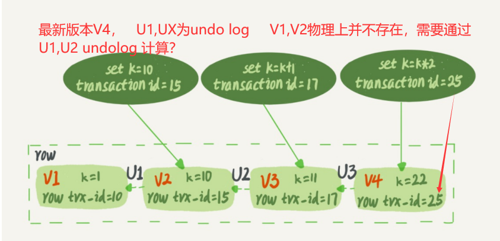

# Mysql45讲note

## 一、MySQL的基础架构（一条查询语句怎样执行）

一条查询SQL语句：

` select * from T where ID=10；`执行的过程中，内部发生了什么？

从MySQL的基础架构说起：


- **Server层**包括连接器、查询缓存、分析器、优化器、执行器等，涵盖**MySQL的大多数核心服务功能**，以及所有的内置函数（如日期、时间、数学和加密函数等），所有跨存储引擎的功能都在 这一层实现，比如存储过程、触发器、视图等。
- 而**存储引擎层**负责数据的存储和提取。其架构模式是**插件式**的，支持InnoDB、MyISAM、 Memory等多个存储引擎。

### 连接器（作用，空闲，长短连接的选择）

`mysql -h#host -P#port -u#user -p#pwd`

连接器负责跟客户端**建立连接**、**获取权限**、**维持和管理连接**。

**连接完成后，如果你没有后续的动作**，这个连接就处于**空闲**（Sleep）状态，你可以在showprocesslist命 令中看到它。

客户端如果太长时间没动静，**连接器就会自动将它断开**。这个时间是由参数**wait_timeout**控制 的，默认值是**8小时**。

MySQL使用**长连接**是指连接成功后，如果客户端持续有请求，则**一直使用同一个连接**。**短连接** 则是指每次执行完很少的几次**查询就断开连接**，下次查询再**重新建立**一个。

- 全部使用长连接，会造成MySQL占用内存太大，原因：连接所分配的内存中，一些资源是和连接的生命周期一致，连接关闭内存才可释放，出现OOM，导致MySQL强制重启。解决方案
  -  定期断开长连接。使用一段时间，或者程序里面判断执行过一个占用内存的大查询后，断开 连接，之后要查询再重连。
  - 是MySQL 5.7或更新版本，可以在每次执行一个比较大的操作后，通过执行 mysql_reset_connection来重新初始化连接资源。这个过程不需要重连和重新做权限验证， 但是会将连接恢复到刚刚创建完时的状态。

### 查询缓存

不需要，查询缓存的失效非常频繁，只要有对一个表的更新，这个表上所有的查询缓存都会被清空。

除非你的业务就是有一张静态表，很长时间才会更新一次。 比如，一个系统配置表，那这张表上的查询才适合使用查询缓存。

参数`query_cache_type`设置成` DEMAND`，这样对于**默认的SQL语句都不使用查询缓存**。

可以指定查询语句走缓存`select SQL_CACHE * from T where ID=10`.

### 分析器（词法分析，语法分析）

分析器先会做“**词法分析**”。你输入的是由多个字符串和空格组成的一条SQL语句，MySQL需要识别出里面的字符串分别是什么，代表什么。

MySQL从你输入的"**select**"这个关键字识别出来，这**是一个查询语句**。它也要把字符串“T”识别 成“表名T”，把字**符串“ID”识别成“列ID”**。

做完了这些识别以后，就要做**“语法分析”**。根据词法分析的结果，语法分析器会根据语法规则， 判断你输入的这个SQL语句是否满足MySQL语法。

`You have an error in your SQL syntax”`

### 优化器

优化器是在**表里面有多个索引的时候**，决定使用哪个索引；或者在**一个语句有多表关联（join） 的时候**，决定**各个表的连接顺序**。

比如

```mysql
 select * from t1 join t2 using(ID) where t1.c=10 and t2.d=20;
```

- 既可以先从表t1里面取出c=10的记录的ID值，再根据ID值关联到表t2，再判断t2里面d的值是 否等于20。
- 也可以先从表t2里面取出d=20的记录的ID值，再根据ID值关联到t1，再判断t1里面c的值是否 等于10。

### 执行器

开始执行的时候，要先判断一下你对这个表T有没有执行查询的**权限**

是否有**索引**

- 有，
  - 调用InnoDB引擎接口取这个表的第一行，判断ID值是不是10，如果不是则跳过，如果是则 将这行存在结果集中；
  - 调用引擎接口取“下一行”，重复相同的判断逻辑，直到取到这个表的最后一行。
- 无，
  - 执行的逻辑也差不多。第一次调用的是“**取满足条件**的第一行”这个接口，之后 循环取“**满足条件**的下一行”这个接口

**慢查询日志**中看到一个`rows_examined`的字段，**表示这个语句执行过程中扫描了多少行**。这个值就是在执行器每次调用引擎获取数据行的时候累加的。 在有些场景下，执行器调用一次，在引擎内部则扫描了多行，因此**引擎扫描行数跟 `rows_examined`并不是完全相同**的。

## 二、MySQL的日志模块（一条更新语句怎样执行）

一条SQL语句`update T set c=c+1 where ID=2`

你执行语句前要先连接数据库，这是**连接器**的工作。 

前面我们说过，在一个表上有更新的时候，跟这个表有关的**查询缓存**会失效，所以这条语句就会 把表T上所有缓存结果都清空。这也就是我们一般不建议使用查询缓存的原因。 

接下来，**分析器**会通过**词法和语法解析**知道这是一条更新语句。

**优化器**决定要使用ID这个索引。 然后，执行器负责具体执行，找到这一行，然后更新。

 与查询流程不一样的是，更新流程还涉及两个重要的日志模块，它们正是我们今天要讨论的主 角：**redo log（重做日志）和 binlog（归档日志）**。如果接触MySQL，那这两个词肯定是绕不过 的，我后面的内容里也会不断地和你强调。不过话说回来，redo log和binlog在设计上有很多有 意思的地方，这些设计思路也可以用到你自己的程序里。

### redo日志

而粉板和账本配合的整个过程，其实就是MySQL里经常说到的WAL技术，**WAL的全称是WriteAhead Logging**，它的关键点就是先写日志，再写磁盘，也就是先写粉板，等不忙的时候再写账 本。

具体来说，当有一条记录需要更新的时候，I**nnoDB引擎就会先把记录写到redo log（粉板）里面**，并更新内存，这个时候更新就算完成了。同时，I**nnoDB引擎会在适当的时候，将这个操作记录更新到磁盘里面**，而这个更新往往是在系统比较空闲的时候做，这就像打烊以后掌柜做的事。

 如果今天赊账的不多，掌柜可以等打烊后再整理。但如果某天赊账的特别多，粉板写满了，又怎么办呢？这个时候掌柜只好放下手中的活儿，**把粉板中的一部分赊账记录更新到账本中**，然后把这些记录从粉板上擦掉，**为记新账腾出空间**。

**redo log**是**固定大小**的，比如**可以配置为一组4个文件**，每个文件的大小是 1GB，那么这块**“粉板”总共就可以记录4GB的操作**。从头开始写，**写到末尾就又回到开头循环** 写，如下面这个图所示


#### crash safe

有了redo log，InnoDB就可以保证即使数据库发生异常重启，之前提交的记录都不会丢失，这个能力称为crash-safe。

### binlog

而**Server层**也有自己的日志，称为**binlog（**归档日志）。

redo和binlog的不同：

- **redo log**是**InnoDB引擎**特有的；**binlog**是MySQL的**Server层**实现的，所有引擎都可以使用。
- redo log是**物理日志**，记录的是“在某个数据页上做了什么修改”；binlog是**逻辑日志**，记录的是这个语句的原始逻辑，比如“给ID=2这一行的c字段加1 ”。
- redo log是**循环写的**，空间固定会用完；binlog是可以**追加写入**的。“追加写”是指binlog文件 写到一定大小后会切换到下一个，并不会覆盖以前的日志。

结合日志说明update的过程：


### 两阶段提交

#### 怎样让数据库恢复到半个月内任意一秒的状态？

**binlog会记录所有的逻辑操作**，并且是采用“**追加写**”的形式。如果你的DBA承 诺说半个月内可以恢复，那么备份系统中一定会保存最近半个月的所有binlog，同时系统会定期做整库备份。这里的“定期”取决于系统的重要性，可以是一天一备，也可以是一周一备。当**需要恢复到指定的某一秒**时，比如某天下午两点发现中午十二点有一次误删表，需要找回数据，那你可以这么做：

- 首先，**找到最近的一次全量备份**，如果你运气好，可能就是昨天晚上的一个备份，**从这个备份恢复到临时库；**
-  然后，从备份的时间点开始，**将备份的binlog依次取出**来，重放到中午误删表之前的那个时刻。
- 这样你的临时库就跟误删之前的线上库一样了，然后你可以把表数据从临时库取出来，按需要恢复到线上库去。

#### 为什么要2阶段提交？

反证法：

**先写redo log后写binlog。**

- 假设在redo log写完，binlog还没有写完的时候，**MySQL进程异常重启**。由于我们前面说过的，**redo log**写完之后，系统即使崩溃，**仍然能够把数据恢复回来，所以恢复后这一行c的值是1**。

- 但是由于binlog没写完就crash了，这时候**binlog里面就没有记录这个语句**。因此，之后备份日志的时候，存起来的binlog里面就没有这条语句。 

- 然后你会发现，**如果需要用这个binlog来恢复临时库**的话，由于这个语句的binlog丢失，这个**临时库就会少了这一次更新**，**恢复出来的这一行c的值就是0，与原库的值不同**。

**先写binlog后写redo log。**

- 如果在binlog写完之后crash，由于redo log还没写，**崩溃恢复以后这个事务无效**，**所以这一行c的值是0**。
- 但是**binlog里面已经记录了“把c从0改成1”这个日志**。所以，在之后用binlog来恢复的时候就多了一个事务出来，**恢复出来的这一行c的值就是 1，与原库的值不同**。

### 参数

redo log用于保证crash-safe能力。`innodb_flush_log_at_trx_commit`这个参数设置成`1`的时候， 表示每次事务的redo log都直接持久化到磁盘。这个参数我建议你设置成1，这样可以保证 MySQL异常重启之后数据不丢失。

`sync_binlog`这个参数设置成`1`的时候，表示每次事务的binlog都持久化到磁盘。这个参数我也建 议你设置成1，这样可以保证MySQL异常重启之后binlog不丢失。


## 三、事务隔离：

### 事务以及事务出现的问题

**事务**就是要保证一组数据库操作，要么全部成功，要么全部失败。

MySQL原生的**MyISAM引擎不支持事务**

**ACID（Atomicity、Consistency、Isolation、Durability，即原子性、一 致性、隔离性、持久性）**，

有多个事务同时执行的时候，就可能出现**脏读（dirty read）、不可重复读（non- repeatable read）、幻读（phantomread）**的问题，为了解决这些问题，就有了**“隔离级别**”的概 念。

你隔离得越严实，**效率**就会越低。因此很多时候，我们都要在二者之间寻找一个平衡点。

### 事务隔离级别

SQL标准的**事务隔离级别包括**：**读未提交（read uncommitted）、 读提交（read committed）、可重复读（repeatable read）和串行化（serializable** ）。

- 读未提交，还没提交事务呢，更新就能被别的事务看到。（还没玩呢，就被发现玩。）
-  读提交，提交了事务，更新才被别的事务发现。（等你玩完，收拾你。）
- 可重复读，事务执行的过程中看到的数据，是不会改变的，重复（和刚开始看的时候一致）。未提交，别的事务看不到的，（自己都看不到？）。
  - 一句话：**事务在执行期间看到的数据前后必须是一致的。**
- 串行化，“**写”会加“写锁”，“读”会加“读锁”。**当出现读写锁冲突的时候，**后访问的事务必须等前一个事务执行完成，才能继续执行**。

Oracle数据库的默认隔离级别其 实就是“读提交”，因此对于一些从Oracle迁移到MySQL的应用，为保证数据库隔离级别的一致， 你一定要记得将MySQL的隔离级别设置为“**读提交**”。	

- 将启动参数`transaction-isolation`的值设置成`READ-COMMITTED`

**什么时候需要“可重复读”的场景呢？**

- 数据校对逻辑。假设你在管理一个个人银行账户表。一个表存了每个月月底的余额，一个表存了账单明细。这时 候你要做数据校对，也就是判断上个月的余额和当前余额的差额，是否与本月的账单明细一致。 你一定希望在校对过程中，即使有用户发生了一笔新的交易，也不影响你的校对结果。

### 事务隔离的实现

在MySQL中，实际上每条记录在更新的时候都会同时记录一条**回滚操作**。记录上的最新值，通过回滚操作，都可以得到前一个状态的值。

 假设一个值从1被按顺序改成了2、3、4，在回滚日志里面就会有类似下面的记录。


当前值是4，但是在查询这条记录的时候，**不同时刻启动的事务会有不同的read-view**。如图中看到的，在视图A、B、C里面，这一个记录的值分别是1、2、4，**同一条记录在系统中可以存在多个版本**，就是数据库的**多版本并发控制（MVCC）**。

**回滚日志**总不能一直保留吧，**什么时候删除**呢？

- 答案是，在不需要的时候才删除。 也就是说，系统会判断，当没有事务再需要用到这些回滚日志时，回滚日志会被删除。 
  - 什么时候才不需要了呢？就是当**系统里没有比这个回滚日志更早的read-view的时候**。

**尽量不用长事务**

- 长事务意味着系统里面**会存在很老的事务视图**。由于这些事务随时可能访问数据库里面的任何数据，所以这个事务提交之前，数据库里面它可能用到的回滚记录都必须保留，这**就会导致大量占用存储空间**。
- 在**MySQL 5.5及以前的版本**，**回滚日志是跟数据字典一起放在ibdata文件**里的，即使长事务最终提交，回滚段被清理，文件也不会变小。
- 长事务还占用锁资源，也可能拖垮整个库。

### 事务的启动方式

- 显式启动事务语句， `begin` 或` start transaction`。配套的提交语句是`commit`，回滚语句是 `rollback`。
- `set autocommit=0`，这个命令会将这个线程的自动提交关掉。意味着如果你只执行一个 select语句，这个事务就启动了，而且并不会自动提交。这个事务持续存在直到你主动执行 `commit `或 `rollback `语句，或者断开连接。

先执行一个`set autocommit=0`的命令。这就导致接下来的 查询都在事务中，**如果是长连接，就导致了意外的长事务**。

建议你**总是使用set autocommit=1,** 通过**显式语句的方式来启动事务**。

减少交互`commit work and chain`

可以在**information_schema库**的**innodb_trx这个表**中查询长事务，比如下面这个语句，用于查找持续时间超过60s的事务。

```sql
select * from information_schema.innodb_trx where TIME_TO_SEC(timediff(now(),trx_started))>60
```

## 四、索引（上）

<font color = "orange">索引的出现其实就是为了提高数据查询的效率，就像书的目录一样。</font>

### 索引的实现模型

三种常见、也比较简单的 数据结构，它们分别是哈希表、有序数组和搜索树。

### 1.哈希表

以**键-值（key-value）**存储数据的结构，我们只要输入待查找的值即key，就可以找到其对应的值即Value。

哈希的思路很简单，把值放在数组里，用一个**哈希函数把key换算成一个确定的位置，然后把value放在数组的这个位置**。

 不可避免地，**多个key值经过哈希函数的换算，会出现同一个值的情况**。处理这种情况的一种**方法是，拉出一个链表**。


图中四个**ID_card_n**的值**并不是递增**的，这样做的好处是**增加新的User时速度会很快**，只需要往后追加。但缺点是，因为不是有序的，所以**哈希索引做区间查询的速度是很慢**的。

哈希表这种结构**适用于**只有**等值查询**（MAP）的场景，比如**Memcached及其他一些NoSQL引 擎**。

- 简单来说，**等值查询就是用等于号来判断过滤条件**，范围查询就是用大于小于来判断。

### 2.有序数组

有序数组在**等值查询和范围查询场景中的性能就都非常优秀**。

等值查询：二分法

范围：不用suo了

有序数组索引只适用于**静态存储引擎**，比如你要保存的是2017年某个城市的所有人口信息，这类不会再修改的数据。

### 3.搜索树

二叉树搜索树维持**O(log(N))的查询复杂度**，你就需要保持这棵树是**平衡二叉树**。为了做这个保证，更 新的时间复杂度也是**O(log(N))**。

**索引不止存在内存中，还要写到磁盘上。**一棵100万节点的平衡二叉树，树高20。一次查询可能需要访问20个数据块。从磁盘随机读一个数据块需要10 ms左右的寻址时间。查询可真够慢的。要使用**“N叉”树**

以**InnoDB的一个整数字段索引为例**，这个**N差不多是1200**。这棵树高是4的时候，就可以存1200的3次方个值，这已经17亿了。考虑到**树根的数据块总是在内存中**的，一个10亿行的表上一 个整数字段的索引，查找一个值最多只需要访问3次磁盘。其实，树的第二层也有很大概率在内存中，那么访问磁盘的平均次数就更少了。

<font color="red">每碰到一个新数据库，我 们需要先关注它的数据模型，这样才能从理论上分析出这个数据库的适用场景。</font>

### InnoDB的索引模型

在InnoDB中，表都是**根据主键顺序以索引的形式存放**的，这种存储方式的表称为**索引组织表**。 又因为前面我们提到的，InnoDB使用了**B+树索引模型**，所以数据都是存储在B+树中的。

```sql
create table T(
id int primary key,
k int not null,
name varchar(16),
index (k))engine=InnoDB;
```

表中R1~R5的(ID,k)值分别为(100,1)、(200,2)、(300,3)、(500,5)和(600,6)


根据叶子节点的内容，索引类型分为**主键索引**和**非主键索引**。 

- 主键索引的**叶子节点**存的是整行数据。在InnoDB里，主键索引也被称为**聚簇索引**（clustered index）。
-  非主键索引的**叶子节点**内容是主键的值。在InnoDB里，非主键索引也被称为**二级索引** （secondary index）。

#### 基于主键索引和普通索引的查询有什么区别？ 

- 如果语句是`select * from T where ID=500`，即主键查询方式，则**只需要搜索ID这棵B+树**；
- 如果语句是`select * from T where k=5`，即普通索引查询方式，则**需要先搜索k索引树，得到ID 的值为500，再到ID索引树搜索一次**。这个过程称为**回表**。

### 索引维护

B+树为了**维护索引有序性**，在插入新值的时候需要做必要的维护。以上面这个图为例，如果插 入新的行ID值为700，则只需要在R5的记录后面插入一个新记录。如果**新插入的ID值为400**，就 相对麻烦了，需要逻辑上**挪动后面的数据，空出位置**。

**如果R5所在的数据页已经满**了，根据B+树的算法，这时候**需要申请一个新的数据页**，然后挪动部分数据过去。这个过程称为**页分裂**。

在这种情况下，性能自然会受影响。 除了性能外，**页分裂操作还影响数据页的利用率**。原本放在一个页的数据，现在分到两个页中， 整体空间利用率降低大约50%。 **当然有分裂就有合并**。

**当相邻两个页由于删除了数据，利用率很低之后，会将数据页做合并。**合并的过程，可以认为是分裂过程的逆过程。

> 讨论auto increment的使用场景呀！

**好处**：

- 自增主键的插入数据模式，正符合了我们前面提到的递增插入的场景。**每次插入一条新记录，都是追加操作，都不涉及到挪动其他记录，也不会触发叶子节点的分裂。**

- 而**有业务逻辑的字段做主键**，则往往**不容易保证有序插**入，这样写数据成本相对较高。

**从存储空间来看：**

- 假设你的表中确实有一个唯一字段，比如 字符串类型的身份证号，那应该用身份证号做主键，还是用自增字段做主键呢？
  - 如果用身份证号做主键，那么每个**二级索引（非主键索引）的叶子节点占用约20个字节**，而如果用整型做主键，则只要4个字节，如果是长整型（bigint）则是 8个字节。

<font color = "green">显然，主键长度越小，普通索引的叶子节点就越小，普通索引占用的空间也就越小。</font>

> 有没有什么场景适合用业务字段直接做主键的呢？(典型的KV场景)

- 只有一个索引
- 该索引必须是唯一索引。(**普通索引允许被索引的数据列包含重复的值。**唯一索引不允许)

由于没有其他索引，所以也就**不用考虑其他索引的叶子节点大小**的问题。

### 如何避免长事务对业务的影响？

## 五、索引（下）

### 覆盖索引

> 执行select *fromTwhere k between 3 and 5，需要执行几次树的搜 索操作，会扫描多少行？


还有第5步，找6，不符合。

如何避免回表，优化呢？

> select ID from T where k between 3 and 5

这时只需要查ID的值，而ID的值已经在k索引树上了，因此可以直接提供查询结果，**不需要回表**。也就是说，在这个查询里面，索引k已经“覆盖了”我们的查询需求，我们称为**覆盖索引**。

### 在一个市民信息表上，是否有必要将身份证号和名字建立联合索引？

- 如果现在有一个高频请求，要**根据市民的身份证号查询他的姓名**，这个**联合索引就有意义**了。它 可以在这个高频请求上用到覆盖索引，**不再需要回表查整行记录，减少语句的执行时间**。

### 最左前缀原则

可以看到，不只是索引的全部定义，**只要满足最左前缀，就可以利用索引来加速检索。**这个最左前缀可以是	**联合索引的最左N个字段**			`用（name，age）这个联合索引,逻辑需求是查到所有名字是“张三”的人时`

​	**也可以是字符串索引的最左M个字符**			`where name like ‘张%`。

> 在建立联合索引的时候，如何安排索引内的字段顺序。

 这里我们的评估标准是，**索引的复用能力**。因为可以支持最左前缀，所以当已经有了(a,b)这个联 合索引后，一般就不需要单独在a上建立索引了。因此，**第一原则是，如果通过调整顺序，可 以少维护一个索引，那么这个顺序往往就是需要优先考虑采用的。**

如果索引中的字段都要维护，考虑的是空间。name,age   +  age而不是name

### 索引下推

联合索引（name, age）

```mysql
mysql> select * from tuser where name like '张%' and age=10 and ismale=1;
```

搜索索引树的时候，只能**用 “张”，找到第一个满足条件的记录ID3**。当然，这还不错，总比全表扫描要好。

MySQL5.6以前，从ID3回表，对比后面的字段。（图1）

MySQL5.6以后，索引下推。（图2）


- 图1中，在(name,age)索引里面我特意**去掉了age**的值，这个过程**InnoDB并不会去看age的值**， 只是按顺序把“name第一个字是’张’”的记录一条条取出来回表。因此，**需要回表4次。**
- InnoDB在(name,age)**索引内部就判断了age是否等于10**，对于不等于10的 记录，直接判断并跳过。在我们的这个例子中，只需要对ID4、ID5这两条记录回表取数据判 断，就**只需要回表2次。**

### 通过两个alter 语句重建索引k，以及通过两个alter语句重建主键索引是否合理。

- 索引可能因为删除，或者页分裂等原因，导致**数据页有空洞**，重建索引的过程会创建一个新的索引，把数据按顺序插入，这样 **页面的利用率最高，也就是索引更紧凑、更省空间**。

- 因此，**重建索引k合理**。

- ```sql
  alter table T drop primary key;
  alter table T add primary key(id)
  ```

- 重建主键的过程不合理。不论是删除主键还是创建主键，**都会将整个表重建**。所以连着执行这两个语句的话，第一个语句就白做了。这两个语句，你可以用这个语句代替 ： `alter table T engine=InnoDB`。

## 六、全局锁和表锁

<font color = "blue">根据加锁的范围，MySQL里面的锁大致可以分成全局锁、表级锁和行锁三类。</font>

### 全局锁

MySQL提供了一个**加全局读锁的方法**，命令是 `Flush tables with read lock (FTWRL)`。

当你需要让整个库处于**只读状态**的时候，可以使用这个命令，之后**其他线程的以下语句会被阻塞**：数据更新语句（数据的增删改）、数据定义语句（包括 建表、修改表结构等）和更新类事务的提交语句。

 **全局锁的典型使用场景是，做全库逻辑备份**。也就是把整库每个表都select出来存成文本。

**让整库都只读，听上去就很危险**：

- 如果你在**主库**上备份，那么在备份期间都不能执行更新**，业务基本上就得停摆**；
- 如果你在**从库**上备份，那么备份期间从库不能执行主库同步过来的binlog，会导致**主从延迟**。

#### 为什么不用mysqldump？

官方自带的逻辑备份工具是mysqldump。当`mysqldump`使用参数`–single-transaction`的时候，导数据之前就会**启动一个事务**，**来确保拿到一致性视图**。而由于MVCC的支持，这个过程中数据是可以正常更新的。

single-transaction方法**只适用于所有的表使用事务引擎**的库。如果有的表使用了 支持事务的引擎，那么备份就只能通过**FTWRL方法**。

#### 既然要全库只读，为什么不使用set global readonly=true的方式呢

- 一是，在**有些系统中，readonly的值会被用来做其他逻辑，比如用来判断一个库是主库还是备库。**因此，**修改global变量的方式影响面更大**，我不建议你使用。 

- 二是，在**异常处理机制**上有差异。如果执行FTWRL命令之后由于客户端发生异常断开，那么 MySQL会自动释放这个全局锁，整个库回到**可以正常更新的状态**。而将整个库设置为 readonly之后，如果客户端发生异常，则数据库就**会一直保持readonly状态，这样会导致整个 库长时间处于不可写状态，风险较高**。

### 表级锁

<font color = "blue">表级别的锁有两种：一种是表锁，一种是元数据锁（meta data lock，MDL)。</font>

#### 表锁

`lock tables …read/write`

可以用`unlock tables`主动释放锁，也可以在客户端断开的时候自动释放。

lock tables语法除了会限制别的线程的读写外，也**限定了本线程接下来的操作对象**。

#### MDL

MDL不需要显式使用，**在访问一个表的时候会被自动加上**。

MDL的作用是，保证读写的正确性。你可以想象一下，如果一个查询正在遍历一个 表中的数据，而执行期间另一个线程对这个表结构做变更，删了一列，那么查询线程拿到的结果 跟表结构对不上，肯定是不行的。

在**MySQL 5.5版本中引入了MDL**，当对一个表做增删改查操作的时候，加MDL**读锁**；当 要对表做结构变更操作的时候，加MDL**写锁**。


#### 即使是小表，操作不慎也 会出问题。我们来看一下下面的操作序列，假设表t是一个小表。


如果只有session C自己被阻塞还没什么关系，但是之后所有要在表t上新申请MDL读锁的请求也会被session C阻塞。前面我们说了，所有对表的增删改查操作都需要先申请MDL读锁，就都被锁住，等于这个表现在完全不可读写了。

 如果某个表上的查询语句频繁，而且客户端有重试机制，也就是说超时后会再起一个新session 再请求的话，这个库的线程很快就会爆满。

#### 如何安全地给小表加字段？

首先**我们要解决长事务**，事务不提交，就会一直占着MDL锁。在MySQL的information_schema 库的 innodb_trx表中，你可以查到当前执行中的事务。如果你要做DDL变更的表刚好有长事务 在执行，要考虑先暂停DDL，或者kill掉这个长事务。

比较理想的机制是，**在alter table语句里面 设定等待时间**，如果**在这个指定的等待时间里面能够拿到MDL写锁最好**，拿不到也不要阻塞后 面的业务语句，先放弃。之后开发人员或者DBA再通过重试命令重复这个过程。(如下)

```sql
ALTER TABLE tbl_name NOWAIT add column ...
ALTER TABLE tbl_name WAIT N add column ...
```

### 总结

**全局锁**主要用在**逻辑备份**过程中。对于全部是InnoDB引擎的库，我建议你选择使用–singletransaction参数，对应用会更友好。

**表锁**一般是在数据库引擎不支持行锁的时候才会被用到的。如果你发现你的应用程序里有lock tables这样的语句，你需要追查一下，比较可能的情况是：

- ​	要么是你的系统现在还在用MyISAM这类不支持事务的引擎，那要安排升级换引擎；
- ​    要么是你的引擎升级了，但是代码还没升级。我见过这样的情况，最后业务开发就是把lock tables 和 unlock tables 改成 begin 和 commit，问题就解决了。 

**MDL会直到事务提交才释放**，在做表结构变更的时候，你一定要小心不要导致锁住线上查询和 更新。

## 七、行锁

MySQL的行锁是在引擎层由各个引擎自己实现的。

Myisam不支持行锁。

### 1.从两阶段锁说起


事务A持有的两个记录的行锁，都是在commit的时候才释放的。 也就是说，**在InnoDB事务中，行锁是在需要的时候才加上的，但并不是不需要了就立刻释放，而是要等到事务结束时才释放。**这个就是**两阶段锁协议。**

因此，

我们要注意：

**<font color="#FFA52E">如果你的事务中需要锁多个行，要把最可能造成锁冲突、最可能影响并发度的锁尽量往后放。</font>**

比如，

顾客A要在影院B购买电影票。

1. 从顾客A账户余额中扣除电影票价； 

2. 给影院B的账户余额增加这张电影票价；
2.  记录一条交易日志。

他们在同一事务，但是，假设B也购买影院B的电影票。会blocking，

可以修改顺序3，1，2来提升并发度。

但可能会产生新的问题。。。。。

### 2.死锁和死锁检测


事务A在等待事务B释放id=2的行锁，而事务B在等待事务A释放id=1的行锁。 事务A和事务B在**互相等待对方的资源释放**，就是进入了**死锁状态**。当出现死锁以后，有**两种策略**：

- 一种策略是，**直接进入等待，直到超时**。这个超时时间可以通过参数 `innodb_lock_wait_timeout`来设置。
- 另一种策略是，发起**死锁检测**，发现死锁后，主动**回滚死锁链条中的某一个事务**，让其他事务得以继续执行。将参数`innodb_deadlock_detect`设置为`on`，表示开启这个逻辑。

在InnoDB中，`innodb_lock_wait_timeout`的默认值是50s，对于在线服务来说，这个**等待时间往往是无法接受的**。❌

 但是，我们又不可能直接把这个时间设置成一个很小的值，比如1s。这样当出现死锁的时候，确 实很快就可以解开，但如果不是死锁，而是简单的锁等待呢？所以，超时时间设置太短的话，会 **出现很多误伤**。

**主动死锁检测**，而且 `innodb_deadlock_detect`的默认值本身就是on。主动死锁检测在发生死锁的时候，是能够快速发 现并进行处理的，但是它也是有额外负担的。✔

每个新来的被堵住的线程，都要判断会不会由于自己的加入导致了死锁，这是一个**时间复杂度是 O(n)（检测其他的线程！）**的操作。假设有1000个并发线程要同时更新同一行，那么死锁检测操作就是100万（1000 * 1000）这个量级 的。

> 怎么解决由这种热点行更新导致的性能问题呢？

- **可以临时把死锁检测关掉**。但是这种操作本身带有一定的风险，因为业务设计的时候一般不会把死锁当做一个严 重错误，毕竟出现死锁了，就回滚，然后通过业务重试一般就没问题了，这是业务无损的。而**关掉死锁检测意味着可能会出现大量的超时，这是业务有损的。**

- **控制并发度。**
  - 在**客户端做并发控制**。但是，你会很快发现这个方法**不太可行**，因为客户端很多。我见过 一个应用，有600个客户端，这样即使每个客户端控制到只有5个并发线程，汇总到数据库服务端以后，**峰值并发数也可能要达到3000(自己这里的)。**
  - 并发控制要做在数据库服务端。如果你有中间件，可以考虑在中间件实现；
  - 修改MySQL源码。基本思路就是，对于**相同行的更新， 在进入引擎之前排队**。这样在InnoDB内部就不会有大量的死锁检测工作。

- 再不济
  - **你可以考虑通过将一行改成逻辑上的多行来减少锁冲突。**

### 问题❓❓❓❓❓❓

上期的题目没看懂。。

## 八、事务到底是隔离的还是不隔离的（一致性读、当前读和行锁串起来）

review: 事务隔离级别的可重复读，会创建一个read-view，事务在执行期间看到的数据前后必须是一致的。

review: 行锁，假设一个事务要更新一行，这一行被别的事务锁住，等到它更新数据的时候，它读到的值又是啥呢？

例：


研究：

视图：是InnoDB在实现MVCC时用到的**一致性读视图**，即**consistent read view**，用于**支持 RC（Read Committed，读提交）和RR（Repeatable Read，可重复读）隔离级别**的实现。

在可重复读隔离级别下，事务在启动的时候就“**拍了个快照**”。注意，这个快照是**基于整库**的。

wc,库那么大，怎么实现的呢？

先看一个东西



**通过当前版本和udlog计算！**

多个版本（row）有自己的row trx_id

**低水位**：事务id的最小值

**高水位**：已经创建事务ID的最大值+1


这样，对于当前事务的启动瞬间来说，**一个数据版本的rowtrx_id，有以下几种可能**： 

1. 如果落在**绿色部分**，表示**这个版本是已提交的事务或者是当前事务自己生成**的，这个数据是**可见**的；

2. 如果落在**红色部分**，表示这个版本是**由将来启动的事务生成**的，是肯定不可见的；

3. 如果落在**黄色部分**，那就包括两种情况

   a. 若 **rowtrx_id在数组**中，表示这个版本是由**还没提交的事务**生成的，**不可见**； 

   b. 若 rowtrx_id**不在数组**中，表示这个版本是**已经提交了的事务生成**的，**可见**。 

比如，对于**图2**中的数据来说，如果有一个事务，它的**低水位是18**，那么当它访问这一行数据时**，就会从V4通过U3计算出V3，所以在它看来，这一行的值是11**。 你看，有了这个声明后，系统里面随后发生的更新，是不是就跟这个事务看到的内容无关了呢？ 因为之后的更新，生成的版本一定属于上面的2或者3(a)的情况，而对它来说，这些新的数据版本是不存在的，所以这个事务的快照，就是“静态”的了。

 所以你现在知道了，<font color="red">**InnoDB利用了“所有数据都有多个版本”的这个特性，实现了“秒级创建快照”的能力。**</font>

OK回到最开始的问题：

> **为什么事务A是1**

**做如下假设：** 

1. 事务A开始前，系统里面只有一个活跃事务ID是99；
2. 事务A、B、C的版本号分别是100、101、102，且当前系统里只有这四个事务； 
3.  三个事务开始前，(1,1）这一行数据的rowtrx_id是90。

这样，事务A的视图数组就是[99,100], 事务B的视图数组是[99,100,101], 事务C的视图数组是 [99,100,101,102]。


**在事务A查询的时候，其实事务B还没有提交，但是它生成的(1,3)这个版本已 经变成当前版本了。但这个版本对事务A必须是不可见的，否则就变成脏读了。**

好，现在事务A要来读数据了，它的视图数组是[99,100]。

当然了，读数据都是从当前版本读起的。所以，事务A查询语句的读数据流程是这样的： 

- 找到(1,3)的时候，判断出**rowtrx_id=101，比高水位大，处于红色区域，不可见**；
- 接着，找到上一个历史版本，一看**rowtrx_id=102**，比高水位大，**处于红色区域，不可见；** 
- 再往前找，终于找到了（1,1)，它的rowtrx_id=90，比低水位小，处于绿色区域，可见。

**一个数据版本，对于一个事务视图来说，除了自己的更新总是可见以 外，有三种情况：**

1. **版本未提交，不可见；**
2. **版本已提交，但是是在视图创建后提交的，不可见；** 

​	**3. 版本已提交，而且是在视图创建前提交的，可见。**

(1,3)还没提交，属于情况1，不可见； 

(1,2)虽然提交了，但是是在视图数组创建之后提交的，属于情况2，不可见； 

(1,1)是在视图数组创建之前提交的，可见。

> **那么，事务B是怎么回事呢，事务B为什么可以看见（1，2）**
>
> **事务B的视图数组是先生成的，之后事务C才提交，不是应该看不见(1,2)吗，怎么能 算出(1,3)来**


是的，如果事务B在更新之前查询一次数据，这个查询返回的k的值确实是1。

但是，当它要去更新数据的时候，就不能再在历史版本上更新了，否则事务C的更新就丢失了。

 因此，事务B此时的set k=k+1是在（1,2）的基础上进行的操作。 所以，这里就用到了这样一条规则：**更新数据都是先读后写的**，**而这个读，只能读当前的值，称为“当前读”（current read）**。

因此，**在更新的时候，当前读拿到的数据是(1,2)，更新后生成了新版本的数据(1,3)，**这个新版本 的**rowtrx_id是101。**

除了update语句外，**select语句如果加锁，也是 当前读**。 所以，如果把事务A的查询语句select *fromt where id=1修改一下，**加上**`lock in share mode` 或` for update`，也都可以`读到版本号是101的数据`，返回的`k的值是3`。

<font color= "green">**分别加了读锁（S锁，共享锁）和写锁（X锁，排他锁）**</font>

```mysql
mysql> select k from t where id=1 lock in share mode;		s锁
mysql> select k from t where id=1 for update;			x锁
```

> **如果事务C修改一下呢**，举一反三。。。


**C更新后并没有马上提交**，在它提交前，事务B的更新语句先发起了。

前面说过 了，虽然事务C’还没提交，但是(1,2)这个版本也已经生成了，并且是当前的最新版本。

#### **那么，事务B的更新语句会怎么处理呢？** 

这时候，我们在上一篇文章中提到的**“两阶段锁协议”**就要上场了。事务C’没提交，**也就是说(1,2) 这个版本上的写锁还没释放。**而事务B是当前读，必须要读最新版本，而且必须加锁，因此就被锁住了，**必须等到事务C’释放这个锁，才能继续它的当前读。**

### 事务的可重复读能力咋实现的呢？

- <font color = "#FF6E1B">可重复读的核心就是**一致性读（consistent read**）；而事务更新数据的时候，只能用**当前读**。如果当前的记录的**行锁被其他事务占用**的话，就需要进入**锁等待**。</font>（精辟！）

### 读提交和可重复读的区别是啥？

- 在可重复读隔离级别下，只需要在事务开始的时候创建一致性视图，之后事务里的其他查询**都共用这个一致性视图**； 

- 在读提交隔离级别下，每一个语句执行前都会**重新算出一个新的视图**。

**注意：**“`start transaction with consistent snapshot`; ”的意思是从这个语句开始，创建一个持续整个事务的一致性快照。所以，**在读提交隔离级别下，这个用法就没意义**了，等效于 普通的start transaction

实践：

> **读提交下事务ABC的值是啥？**


### 总结

InnoDB的行数据有**多个版本**，每个数据**版本有自己的rowtrx_id**，每个事务或者语句有自己的一致性视图。普通查询语句是一致性读，**一致性读会根据rowtrx_id和一致性视图确定数据版本的可见性**。

#### 为什么表结构不支持“可重复读”？

这是因为表结构没有对应的行数据，也没有 rowtrx_id，因此只能遵循当前读的逻辑。

### 上期题目

如果你要删除一个表里面的前10000行数据，有以下三种方法可以做到：

第一种，直接执行`delete fromTlimit 10000; `

第二种，在一个连接中循环执行20次 `delete fromTlimit 500; `

第三种，在20个连接中同时执行`delete fromTlimit 500。`

第二种方式是相对较好的。 

第一种方式（即：直接执行delete fromTlimit 10000）里面，单个语句占用时间长，锁的时间也 比较长；而且大事务还会导致主从延迟。 

第三种方式（即：在20个连接中同时执行delete fromTlimit 500），会人为造成锁冲突。（可能会死锁，连接可能会操作同一资源）。

## 九、普通索引和唯一索引的choose

**普通索引允许被索引的数据列包含重复的值。**唯一索引不允许

> #### **引出问题**

假设你在维护一个市民系统，每个人都有一个**唯一的身份证号**，而且业务代码已经保证了不会写 入两个重复的身份证号。如果市民系统需要按照身份证号查姓名，就会执行类似这样的SQL语句：

```sql
select name from CUser where id_card = 'xxxxxxxyyyyyyzzzzz';
```

所以，你一定会考虑在id_card字段上建索引。 由于身份证号字段比较大，我不建议你把身份证号当做主键，那么现在你有两个选择，要么给 i**d_card字段创建唯一索引，要么创建一个普通索引。怎么选择呢？**

### 查询比较


执行查询的语句是 `select id from T where k=5`。这个查询语句在索引树上查找的过程，先是通过B+树从树根开始，按层搜索到叶子节点，也就是图中右下角的这个数据页，然后可以认为数据页内部通过二分法来定位记录。

- 对于**普通索引**来说，查找到满足条件的第一个记录(5,500)后，需要查找下一个记录，直到碰到第一个不满足k=5条件的记录。
-  对于唯一索引来说，由于索引定义了唯一性，**查找到第一个满足条件的记录后，就会停止继续检索**。

 那么，这个不同带来的性能差距会有多少呢？答案是，微乎其微。

InnoDB的数据是按`数据页为单位来读写的`。也就是说，当需要读一条记录的时候， 并不是将这个记录本身从磁盘读出来，而是**以页为单位，将其整体读入内存**。在InnoDB中，每个数据页的大小默认是16KB。

所以说，当找到**k=5的记录的时候，它所在的数据页就都在内存**里了。 那么，对于**普通索引**来说，要多做的那一次“查找和判断下一条记录”的操作，就**只需要一次指针寻找和一次计算**。 

当然，**如果k=5这个记录刚好是这个数据页的最后一个记录**，那么要取下一个记录，必须读取下 一个数据页，这个**操作会稍微复杂**一些。

### 更新比较

#### change buffer

当需要更新一个数据页时，如果数据页在内存中就直接更新，而如果这个数据页还没有在内存中 的话，在不影响数据一致性的前提下，InooDB会将这些更新操作缓存在change buffer中，这样 就不需要从磁盘中读入这个数据页了。在下次查询需要访问这个数据页的时候，将数据页读入内 存，然后执行change buffer中与这个页有关的操作。通过这种方式就能保证这个数据逻辑的正 确性。

将change buffer中的操作应用到原数据页，得到最新结果的过程称为merge。

除了访问这个数据 页会触发merge外，系统有后台线程会定期merge。在数据库正常关闭（shutdown）的过程中， 也会执行merge操作。

##### 优点

如果能够将更新操作先记录在change buffer，**减少读磁盘**，语句的**执行速度会得到明显的提升**。而且，数据读入内存是需要占用buffer pool的，所以这种方式还能够**避免占用内存，提高内存利用率。**

#### 什么条件可以使用change buffer

对于唯一索引来说，**所有的更新操作都要先判断这个操作是否违反唯一性约束**。比如，要插入 (4,400)这个记录，就要先判断现在表中是否已经存在k=4的记录，而这**必须要将数据页读入内存 才能判断**。如果都已经读入到内存了，那**直接更新内存**会更快，就**没必要使用change buffer** 了。

 因此，唯一索引的更新就不能使用change buffer，实际上也**只有普通索引可以使用**。

#### changebuffer的参数设置

change buffer用的是buffer pool里的内存，因此不能无限增大。change buffer的大小，可以通 过参数`innodb_change_buffer_max_size`来动态设置。这个参数设置为50的时候，表示change buffer的大小最多只能占用buffer pool的50%。

#### 重头戏：比较更新的区别

如果要在这张表中插入一个 新记录(4,400)的话，InnoDB的处理流程是怎样的。

第一种情况是，这个**记录要更新的目标页在内存**中。这时，InnoDB的处理流程如下：

- 对于唯一索引来说，找到3和5之间的位置，判断到没有冲突，插入这个值，语句执行结束；
-  对于普通索引来说，找到3和5之间的位置，插入这个值，语句执行结束。 

这样看来，普通索引和唯一索引对更新语句性能影响的差别，只是一个判断，只会耗费微小的 CPU时间。 **但，这不是我们关注的重点**。 

第二种情况是，这个**记录要更新的目标页不在内存**中。这时，InnoDB的处理流程如下：

- 对于唯一索引来说，需要将数据页读入内存，判断到没有冲突，插入这个值，语句执行结束；
- 对于**普通索引来说，则是将更新记录在change buffer**，语句执行就结束了。

 将数据从磁盘读入内存涉及随机IO的访问，是数据库里面成本最高的操作之一。change buffer因为减少了随机磁盘访问，所以对更新性能的提升是会很明显的。

#### change buffer的使用场景

对于写多读少的业务来说，页面在写完以后马上被访问到的概率比较小，此时change buffer的使用效果最好。这种业务模型常见的就是账单类、日志类的系统。 

反过来，假设一个业务的更新模式是写入之后马上会做查询，那么即使满足了条件，将更新先记 录在change buffer，但之后由于马上要访问这个数据页，会立即触发merge过程。这样随机访问 IO的次数不会减少，反而增加了change buffer的维护代价。所以，对于这种业务模式来 说，change buffer反而起到了副作用。

#### change buffer 和 redo log

<font color="green">redo log 主要节省的是随 机写磁盘的IO消耗（转成顺序写），而change buffer主要节省的则是随机读磁盘的IO消 耗。</font>

### 上期题目

事务隔离级别是可重复读。 现在，我要把所有“字段c和id值相等的行”的c值清零，但是却发现了一个“诡异”的、改不掉的情 况。请你构造出这种情况，并说明其原理。

```mysql
mysql> CREATE TABLE `t` (
`id` int(11) NOT NULL,
`c` int(11) DEFAULT NULL,
PRIMARY KEY (`id`)
) ENGINE=InnoDB;
insert into t(id, c) values(1,1),(2,2),(3,3),(4,4);
```


然后事物A继续执行 `update test2 set c = 0 where id = c;`，很明显由于事物B已经提交了，事物A的update的使用的是`当前读`，判断条件不满足，所以事物 A 不会更新任何数据。

接着，事物 A 执行select语句，为什么结果还是以前的数据呢？ 是因为事物 A 的select使用的`一致读`，也叫快照读，读取的还是以前的快照数据。

## 十、MySQL为什么有时候会选错索引？

> bg:不知道你有没有碰到过这种情况，一条本来可以执行得很快的语句，却由于MySQL选错了索 引，而导致执行速度变得很慢？


session B的查询语句select *fromt where a between 10000 and 20000**就不会再选择 索引a**了。我们可以通过慢查询日志（slowlog）来查看一下具体的执行情况。 为了说明优化器选择的结果是否正确，我增加了一个对照，即:使用force index(a)来让优化器强制使用索引a（这部分内容，我还会在这篇文章的后半部分中提到）。

```sql
set long_query_time=0;
select * from t where a between 10000 and 20000; /*Q1*/
select * from t force index(a) where a between 10000 and 20000;/*Q2*
```

- 第一句，是将慢查询日志的阈值设置为0，表示这个线程接下来的语句都会被记录入慢查询日志中； 
- 第二句，Q1是session B原来的查询； 
- 第三句，Q2是加了force index(a)来和session B原来的查询语句执行情况对比。


Q1扫描了10万行，显然是走了全表扫描，执行时间是40毫秒。Q2扫描了10001行， 执行了21毫秒。也就是说，我们在没有使用force index的时候，MySQL用错了索引，导致了更长的执行时间。

### 优化器的锅？

优化器选择索引的目的，是找到一个最优的执行方案，并用最小的代价去执行语句。在数据库里面，扫描行数是影响执行代价的因素之一。扫描行数并不是唯一的判断标准，优化器还会结合是否使用临时表、是否排序等因素进行 综合判断。

##### 扫描行数是怎么判断的？

MySQL在真正开始执行语句之前，并不能精确地知道满足这个条件的记录有多少条，而**只能根据统计信息来估算记录数。** 这个统计信息就是索引的“**区分度**”。

显然，一个索引上不同的值越多，这个索引的区分度就越好。而一**个索引上不同的值的个数，我们称之为“基数”（cardinality）**。也就是说，这个**基数越大，索引的区分度越好**。

- `show index`显示基数。


##### MySQL是怎样得到索引的基数的呢？

**采样统计**的时候，InnoDB默认会选择N个数据页，统计这些页面上的不同值，得到一个平均值，然后乘以这个索引的页面数，就得到了这个索引的基数。

而数据表是会持续更新的，索引统计信息也不会固定不变。所以，**当变更的数据行数超过1/M的 时候，会自动触发重新做一次索引统计**。

在MySQL中，有两种存储索引统计的方式，可以通过设置参数`innodb_stats_persistent`的值来选择： 

- 设置为on的时候，表示统计信息会持久化存储。这时，默认的N是20，M是10。 

- 设置为off的时候，表示统计信息只存储在内存中。这时，默认的N是8，M是16。

 由于是采样统计，所以不管N是20还是8，这个基数都是很容易不准的。

但，这还不是全部。 

你可以从图4中看到，这次的索引统计值（cardinality列）虽然不够精确，但大体上还是差不多 的，**选错索引一定还有别的原因。** 其实索引统计只是一个输入，对于一个具体的语句来说，优化器还要判断，执行这个语句本身要 扫描多少行。


##### 优化器为什么放着扫描37000行的执行计划不用，却选择了扫描行数是100000的执行计划呢？

这是因为，如果使用索引a，每次从索引a上拿到一个值，都要回到主键索引上查出整行数据， 这个代价优化器也要算进去的。

而如果选择扫描10万行，是直接在主键索引上扫描的，没有额外的代价。 

优化器会估算这两个选择的代价，从结果看来，优化器认为直接扫描主键索引更快。当然，从执 行时间看来，这个选择并不是最优的。

使用普通索引需要把回表的代价算进去，在图1执行explain的时候，也考虑了这个策略的代价 ， 但图1的选择是对的。也就是说，这个策略并没有问题。

所以冤有头债有主，MySQL选错索引，这件事儿还得归咎到没能准确地判断出扫描行数。

##### solute

既然是统计信息不对，那就修正。analyze table t 命令，可以用来重新统计索引信息。我们来看 一下执行效果。

> 优化器不止看扫描行数


如果使用索引a进行查询，那么就是扫描索引a的前1000个值，然后取到对应的id，再到主键索 引上去查出每一行，然后根据字段b来过滤。显然这样需要扫描1000行。

 如果使用索引b进行查询，那么就是扫描索引b的最后50001个值，与上面的执行过程相同，也是 需要回到主键索引上取值再判断，所以需要扫描50001行。

然而，Mysql选择了索引B

##### 如何解决呢？

1.`force index`

2.**修改语句，**引导MySQL使用我们期望的索引。比如，在这个例子里，显然把“`order byb limit 1`” 改 成 “`order byb,a limit 1`” ，语义的逻辑是相同的。

- 之前优化器选择使用索引b，是因为它认为使用索引b可以避免排序（b本身是索引，已经是有序 的了，如果**选择索引b的话，不需要再做排序，只需要遍历**），所以即使扫描行数多，也判定为 代价更小。
-  现在`order byb,a` 这种写法，要求按照b,a排序，就意味着**使用这两个索引都需要排序**。因此，扫 描行数成了影响决策的主要条件，于是此时优化器选了只需要扫描1000行的索引a。 
- 当然，这种修改并不是通用的优化手段，只是刚好在这个语句里面有limit 1，因此如果有满足条 件的记录， order byb limit 1和order byb,a limit 1 都会返回b是最小的那一行，**逻辑上一致，才 可以这么做**。

3.在有些场景下，我们可以**新建一个更合适的索引**，来提供给优化器做选 择，或**删掉误用的索引**。

### 上期问题


`change buffer`一开始是写内存的，那么如果这个时候机器掉电重启，会不会导致`change buffer`丢失呢？change buffer丢失可不是小事儿，再从磁盘读入数据可就没有了 merge(**把操作应用到原数据页面)**过程，就等于是数据丢失了。会不会出现这种情况呢？

- 是不会丢失，留言区的很多同学都回答对了。虽然是只更新内存，但是在事务提 交的时候，我们**把change buffer的操作也记录到redo log里**了，所以崩溃恢复的时候，change buffer也能找回来。

##### merge的过程是否会把数据直接写回磁盘？

merge的执行流程是这样的：

1. 从磁盘读入数据页到内存（老版本的数据页）；
2. 从change buffer里找出这个数据页的change buffer 记录(可能有多个），依次应用，**得到新版数据页**；
3.  写redo log。这个redo log包含了数据的变更和change buffer的变更。

到这里merge过程就结束了。这时候，数据页和内存中change buffer对应的磁盘位置都还没有修改，属于脏页，**之后各自刷回自己的物理数据，就是另外一个过程了**。

## 十一、怎么给字符串字段加索引？

### 案例分析

> 几乎所有的系统都支持邮箱登录，如何在邮箱这样的字段上建立合理的索引，是我们今天 要讨论的问题。
>
> 我们可以知道，如果email这个字段上没有索引，那么这个语句就只能做全表扫描。 
>
> 同时，MySQL是支持前缀索引的，也就是说，你可以定义字符串的一部分作为索引。

```sql
mysql> alter table SUser add index index1(email);
或
mysql> alter table SUser add index index2(email(6))
```

- 第一个语句创建的index1索引里面，包含了每个记录的整个字符串；

- 而第二个语句创建的index2 索引里面，对于每个记录都是只取前6个字节。 

#### 那么，这两种不同的定义在数据结构和存储上有什么区别呢？


由于email(6)这个索引结构中每个邮箱字段都只取**前6个字节**（即： zhangs），所以**占用的空间会更小**，这就是使用前缀索引的优势。

 但，这同时带来的损失是，可能会增加额外的记录扫描次数。

##### `select id,name,email from SUser where email='zhangssxyz@xxx.com'`在这2个索引下如何执行？

**如果使用的是index1（即email整个字符串的索引结构），执行顺序是这样的：** 

1. 从index1索引树找到满足索引值是’zhangssxyz@xxx.com’的这条记录，取得ID2的值；
2. 到主键上查到主键值是ID2的行，判断email的值是正确的，将这行记录加入结果集；
3. 取index1索引树上刚刚查到的位置的下一条记录，发现已经不满足 email='zhangssxyz@xxx.com’的条件了，循环结束。 

这个过程中，只需要回主键索引取一次数据，所以系统认为**只扫描了一行**。

**如果使用的是index2（即email(6)索引结构），执行顺序是这样的：** 

1. 从index2索引树找到满足索引值是’zhangs’的记录，找到的第一个是ID1；
2. 到主键上查到主键值是ID1的行，判断出email的值不是’zhangssxyz@xxx.com’，这行记录丢 弃；
3. 取index2上刚刚查到的位置的下一条记录，发现仍然是’zhangs’，取出ID2，再到ID索引上取 整行然后判断，这次值对了，将这行记录加入结果集； 
4. 重复上一步，直到在idxe2上取到的值不是’zhangs’时，循环结束。

 在这个过程中，要回主键索引取4次数据，也就是**扫描了4行**。

**但是**，对于这个查询语句来说，**如果你定义的index2不是email(6)而是email(7）**，也就是说取 email字段的前7个字节来构建索引的话，即满足前缀’zhangss’的记录只有一个，也能够直接查到 ID2，**只扫描一行就结束了**。

也就是说<font color="blue">使用前缀索引，定义好长度，就可以做到既节省空间，又不用额外增加太多的查询成本。</font>

#### 当要给字符串创建前缀索引时，有什么方法能够确定我应该使用多长的前缀呢？

在建立索引时关注的是区分度，**区分度越高越好**。因为区分度越高，意味着重复的 键值越少。因此，我们可以通过**统计索引上有多少个不同的值来判断要使用多长的前缀**。

```sql
mysql> select
count(distinct left(email,4)）as L4,
count(distinct left(email,5)）as L5,
count(distinct left(email,6)）as L6,
count(distinct left(email,7)）as L7,
from SUser;
```

### 前缀索引对覆盖索引的影响

```sql
select id,email from SUser where email='zhangssxyz@xxx.com';
```

这个语句只要求返回id和email字段。

如果使用index1（即email整个字符串的索引结构）的话，可以利用**覆盖索引**，从index1查 到结果后直接就返回了，**不需要回到ID索引再去查一次**。

而如果使用index2（即email(6)索引结 构）的话，就不得不回到ID索引再去判断email字段的值。(因为它命中不了索引树中的email，所以必须去回表)

#### 参考链接：[mysql覆盖索引与回表 - 简书 (jianshu.com)](https://www.jianshu.com/p/8991cbca3854)

即使你将index2的定义修改为email(18)的前缀索引，这时候虽然index2已经包含了所有的信息， 但InnoDB还是要回到id索引再查一下，因为系统并不确定前缀索引的定义是否截断了完整信息。

### 其他方式

#### 遇到前缀的区分度不够好的情况时，我们要怎么办呢？比如，我们国家的身份证号。

一共18位，其中前6位是地址码，所以同一个县的人的身份证号前6位一般会是相同的。

 假设你维护的数据库是一个市的公民信息系统，这时候如果对身份证号做长度为6的前缀索引的话，这个索引的区分度就非常低了。

 按照我们前面说的方法，可能**你需要创建长度为12以上的前缀索引，才能够满足区分度要求**。

- **第一种方式是使用倒序存储。**如果你存储身份证号的时候把它倒过来存，每次查询的时候，你 可以这么写：

  `mysql> select field_list from t where id_card = reverse('input_id_card_string');`

   由于身份证号的**最后6位没有地址码这样的重复逻辑，所以最后这6位很可能就提供了足够的区分度**。当然了，实践中你不要忘记使用count(distinct)方法去做个验证。

- **第二种方式是使用hash字段。**你可以在表上再创建一个整数字段，来保存身份证的校验码， 同时在这个字段上创建索引。

```sql
alter table t add id_card_crc int unsigned, add index(id_card_crc);
```

每次插入新记录的时候，都同时用**crc32()这个函数得到校验码填到这个新字段**。由于校验码可能存在冲突，也就是说两个不同的身份证号通过crc32()函数得到的结果可能是相同的，所以你的查询语句where部分要判断id_card的值是否精确相同。

两种方案的区别：

1. **从占用的额外空间来看，**倒序存储方式在主键索引上，不会消耗额外的存储空间，而hash字段方法需要增加一个字段。当然，倒序存储方式使用4个字节的前缀长度应该是不够的，如果再长一点，这个消耗跟额外这个hash字段也差不多抵消了。 
2.  **在CPU消耗方面，**倒序方式每次写和读的时候，都需要额外调用一次reverse函数，而hash 字段的方式需要额外调用一次crc32()函数。如果只从这两个函数的计算复杂度来看的 话，**reverse函数额外消耗的CPU资源会更小些。** 
3.  **从查询效率上看，使用hash字段方式的查询性能相对更稳定一些。**因为crc32算出来的值虽 然有冲突的概率，但是概率非常小，可以认为每次查询的平均扫描行数接近1。而**倒序存储** 方式毕竟还是用的前缀索引的方式，也就是**说还是会增加扫描行数**。

### 上期问题


前面我们在构造第一个例子的过程中，通过session A的配合， 让session B删除数据后又重新插入了一遍数据，然后就发现explain结果中，rows字段从10001 变成37000多。

 而如果没有session A的配合，只是单独执行delete fromt 、call idata()、explain这三句话，会看 到rows字段其实还是10000左右。你可以自己验证一下这个结果。

 **这是什么原因呢？**

- delete 语句删掉了所有的数据，然后再通过call idata()插入了10万行数据，看上去是覆盖了原来的10万行。 但是，**session A开启了事务并没有提交，所以之前插入的10万行数据是不能删除的。**这样，之 前的数据每一行数据都有两个版本，旧版本是delete之前的数据，新版本是标记为deleted的数据。 这样，索引a上的数据其实就有两份。
-  然后你会说，不对啊，主键上的数据也不能删，那没有使用force index的语句，使用explain命令 看到的扫描行数为什么还是100000左右？（潜台词，如果这个也翻倍，也许优化器还会认为选 字段a作为索引更合适） 是的，不过这个是主键，主键是直接按照表的行数来估计的。**而表的行数，优化器直接用的是** `showtable status`的值。 这个值的计算方法，我会在后面有文章为你详细讲解

## 十二、为什么Mysql有时候会变慢

把内存里的数据写入磁盘的过程，术语就是 flush。

**当内存数据页跟磁盘数据页内容不一致的时候，我们称这个内存页为“脏页”。内存数据写 入到磁盘后，内存和磁盘上的数据页的内容就一致了，称为“干净页”。**

平时执行很快的更新操作，其实就是在写内存和日志，<font color ="red">**而 MySQL偶尔“抖”一下的那个瞬间，可能就是在刷脏页（flush）。**</font>

### 什么时候flush呢？

- redo log满了。这时候会把checkpoint向前推进，redo log 有空间继续写。

  

  - checkpoint可不是随便往前修改一下位置就可以的。比如上图中，把checkpoint位置从CP推进到 CP’，就需要将两个点之间的日志（浅绿色部分），对应的所有脏页都flush到磁盘上。之后，图 中从write pos到CP’之间就是可以再写入的redo log的区域。

- 系统内存不足。当需要新的内存页，而内存不够用的时候，就要淘汰 一些数据页，空出内存给别的数据页使用。如果淘汰的是“脏页”，就要先将脏页写到磁盘。

- 对应的就是MySQL认为系统“空闲”的时候。当然，MySQL“这家酒店”的生意好起 来可是会很快就能把粉板记满的，所以“掌柜”要合理地安排时间，即使是“生意好”的时候，也 要见缝插针地找时间，只要有机会就刷一点“脏页”。

- 是MySQL正常关闭的情况。这时候，MySQL会把内存的脏页都flush到磁 盘上，这样下次MySQL启动的时候，就可以直接从磁盘上读数据，启动速度会很快。

### 上述flush操作的性能如何？

第三种情况是属于MySQL空闲时的操作，这时系统没什么压力，而第四种场景是数据库 本来就要关闭了。这两种情况下，你不会太关注“性能”问题。所以这里，我们主要来分析一下前 两种场景下的性能问题。

- 第一种是“redo log写满了，要flush脏页”，这种情况是InnoDB**要尽量避免**的。因为出现这种情况 的时候，整个系统就不能再接受更新了，所有的更新都必须堵住。如果你从监控上看，这时候更 新数会跌为0。 

- 第二种是“内存不够用了，要先将脏页写到磁盘”，这种情况其实是**常态**。InnoDB用缓冲池 （buffer pool）管理内存，缓冲池中的内存页有三种状态： 
  - 第一种是，还没有使用的； 
  - 第二种是，使用了并且是干净页； 
  - 第三种是，使用了并且是脏页。

InnoDB的策略是尽量使用内存，因此对于一个长时间运行的库来说，未被使用的页面很少。

而当要读入的数据页没有在内存的时候，就必须到缓冲池中申请一个数据页。这时候只能**把最久不使用的数据页从内存中淘汰掉**：如果要淘汰的是一个干净页，就直接释放出来复用；但如果是脏页呢，就必须将脏页先刷到磁盘，变成干净页后才能复用。

#### 虽然刷脏页是常态，但下面情况会引起性能问题

1. 一个查询要淘汰的脏页个数太多，会导致查询的响应时间明显变长；
2.  日志写满，更新全部堵住，写性能跌为0，这种情况对敏感业务来说，是不能接受的

### InnoDB刷脏页的控制策略

这就要用到`innodb_io_capacity`这个参数了，它会**告诉InnoDB你的磁盘能力**。这个值我建议你设置成磁盘的`IOPS`。磁盘的`IOPS`可以通过`fio`这个工具来测试。

他的主机磁盘用的是SSD，但是`innodb_io_capacity`的值设置的是300。于是，InnoDB认为这个系统的能力就这么差，所以刷脏页刷得特别慢，甚至比脏页生成的速度还慢，这样就造成了脏页累积，影响了查询和更新性能。

虽然我们现在已经定义了“全力刷脏页”的行为，但平时总不能一直是全力刷吧？毕竟磁盘能力不能只用来刷脏页，还需要服务用户请求。所以接下来，我们就一起看看**InnoDB怎么控制引擎按 照“全力”的百分比来刷脏页**。

<font color="green">InnnoDB的刷盘速度就是要参考这两个因素：一个是脏页比例，一个是redo log写盘速度。</font>

参数`innodb_max_dirty_pages_pct`是脏页比例上限，默认值是75%。

InnoDB会根据当前的脏页比例（假设为M），算出一个范围在0到100之间的数字，计算这个数字的伪代码类似这样： 

```java
F1(M)
{
if M>=innodb_max_dirty_pages_pct then
return 100;
return 100*M/innodb_max_dirty_pages_pct;
}

```

InnoDB每次写入的日志都有一个序号，当前写入的序号跟checkpoint对应的序号之间的差值， 我们假设为N。InnoDB会根据这个N算出一个范围在0到100之间的数字，这个计算公式可以记为 F2(N)。F2(N)算法比较复杂，你只要知道N越大，算出来的值越大就好了。

 然后，根据上述算得的F1(M)和F2(N)两个值，取其中较大的值记为R，之后引擎就可以按照`innodb_io_capacity`定义的能力乘以**R%**来**控制刷脏页的速度**。

流程图如下：


所以，无论是你的查询语句在需要内存的时候可能要求淘汰一个脏页，还是由于刷脏页的逻辑会占用IO资源 并可能影响到了你的更新语句，都可能是造成你从业务端感知到MySQL“抖”了一下的原因。

**就要合理地设置`innodb_io_capacity`的值，并且平时要多关注脏页比例，不要让它经常接近75%。**

其中，脏页比例是通过`Innodb_buffer_pool_pages_dirty/Innodb_buffer_pool_pages_total`得到。

#### 一个有趣的策略。 

一旦一个查询请求需要在执行过程中先flush掉一个脏页时，这个查询就可能要比平时慢了

而 MySQL中的一个机制，可能让你的查询会更慢：在准备刷一个脏页的时候，如果这个数据页旁边的数据页刚好是脏页，就会把这个“邻居”也带着一起刷掉；而且这个把“邻居”拖下水的逻辑还可以继续蔓延，也就是对于每个邻居数据页，如果跟它相邻的数据页也还是脏页的话，也会被放到一起刷。 

在InnoDB中，`innodb_flush_neighbors `参数就是用来控制这个行为的，值为1的时候会有上述 的“**连坐”机制**，值为0时表示不找邻居，自己刷自己的。

 找“邻居”这个优化在**机械硬盘时代**是很有意义的，可以减少很多随机IO。机械硬盘的随机IOPS 一般只有几百，相同的逻辑操作减少随机IO就意味着系统性能的大幅度提升。

 而如果使用的是**SSD这类IOPS比较高的设备的话**，我就建议你把`innodb_flush_neighbors的值设置成0`。因为这时候IOPS往往不是瓶颈，而“只刷自己”，就能更快地执行完必要的刷脏页操 作，减少SQL语句响应时间。

在MySQL 8.0中，innodb_flush_neighbors参数的默认值已经是0了。

### 上期问题

**如果你在维护一个学校的学生信息数据库，学生登录名的统一格式是”学号@gmail.com", 而学号 的规则是：十五位的数字，其中前三位是所在城市编号、第四到第六位是学校编号、第七位到第十位是入学年份、最后五位是顺序编号。** 

**系统登录的时候都需要学生输入登录名和密码，验证正确后才能继续使用系统。就只考虑登录验 证这个行为的话，你会怎么设计这个登录名的索引呢？**

由于这个学号的规则，无论是正向还是反向的前缀索引，重复度都比较高。因为维护的只是一个 学校的，因此前面6位（其中，前三位是所在城市编号、第四到第六位是学校编号）其实是固定 的，邮箱后缀都是@gamil.com，因此可以只存入学年份加顺序编号，它们的长度是9位。 

而其实在此基础上**，可以用数字类型来存这9位数字**。比如201100001，这样只需要占4个字 节。其实这个就是一种hash，只是它用了最简单的转换规则：字符串转数字的规则，而刚好我 们设定的这个背景，可以保证这个转换后结果的唯一性。

学校人数少，可以就用原来的字符串即可。

十三、为什么表数据删一半，表大小不变？
