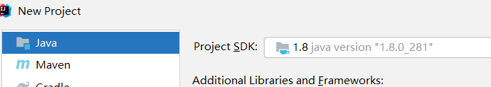
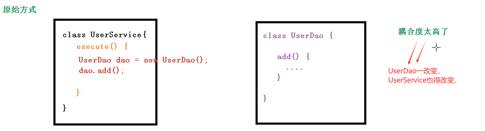
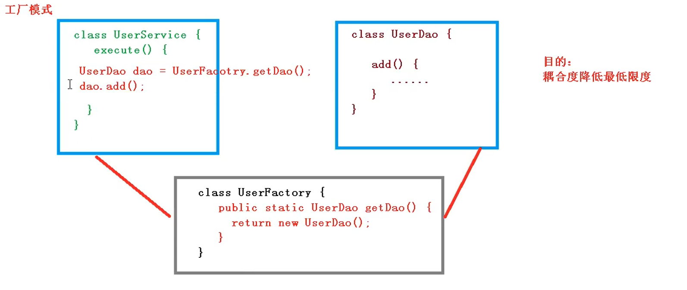
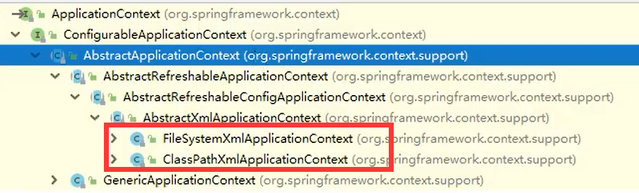
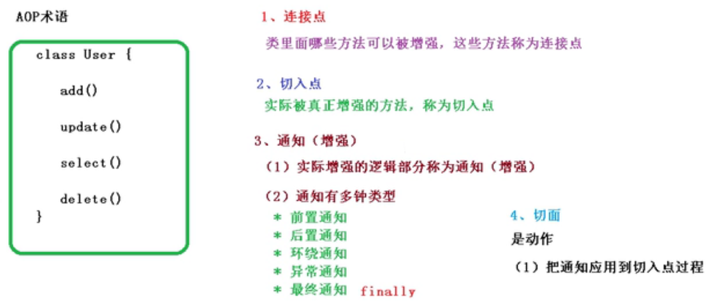

# Spring5

## 一、Spring概念

### 1.Spring概述

#### (1)简单介绍

- Spring是**轻量级**的**开源**的javaEE**框架**。

- Spring框架可以解决企业应用开发的复杂性。

#### (2)Spring的两个核心部分

- **IOC**：控制反转，把创建对象的过程交给Spring管理
- **Aop**：面向切面，不修改源代码的情况下，进行功能增强

#### (3)Spring特点

**1.方便解耦，简化开发**

**2.AOP编程的支持**

**3.方便程序的测试**

**4.方便集成各种优秀框架**

**5.方便事务的操作**

**6.降低API开发难度**

#### (4)版本Spring5

### 2.第一个Spring案例

#### (1)Spring官网：https://spring.io/

#### (2)Spring下载：https://repo.spring.io/ui/native/release/org/springframework/spring

压缩包：


或者maven：

```xml
<!-- https://mvnrepository.com/artifact/org.springframework/spring-context -->
<dependency>
    <groupId>org.springframework</groupId>
    <artifactId>spring-context</artifactId>
    <version>5.2.6.RELEASE</version>
</dependency>

```

#### (3)创建普通java工程



#### (4)导入Spring5相关jar包


#### (5)创建一个类，及方法

```java
public class User {
    public void add(){
        System.out.println("add......");
    }
}
```

#### (6)创建Spring配置文件，在配置文件中配置创建的对象

a.配置文件是springConfig,xml类型；bean1.xml

```xml
<?xml version="1.0" encoding="UTF-8"?>
<beans xmlns="http://www.springframework.org/schema/beans"
       xmlns:xsi="http://www.w3.org/2001/XMLSchema-instance"
       xsi:schemaLocation="http://www.springframework.org/schema/beans http://www.springframework.org/schema/beans/spring-beans.xsd">
<!--配置User对象创建-->
    <bean id="user" class="com.jing.spring.User"></bean>
</beans>
```

#### (7)测试以及结果

```java
  @Test
    public void test(){
//        1.加载Spring配置文件
        ClassPathXmlApplicationContext context = new ClassPathXmlApplicationContext("bean1.xml");
//        2.获取配置创建的对象
        User user = context.getBean("user", User.class);
        System.out.println(user);
        user.add();
	}
```

结果：


## 二、IOC容器

### 1.IOC底层概念和原理

#### a.IOC概念

(1) 控制反转：把创建对象和对象之间的调用过程交给Spring管理 

比如，User类要调用dog类的方法，要得到dog对象，交给Spring管理

(2)调用IOC目的：解耦。

(3)第一个Spring案例就是IOC实现

#### b.IOC底层原理

(1)xml解析，工厂模式，反射






### 2.IOC接口（BeanFactory）

#### a.IOC思想基于IOC容器完成，IOC容器底层就是对象工厂

#### b.Spring提供IOC容器实现的两种方式：（两个接口）

(1)BeanFactory：IOC容器基本实现，是Spring内部的使用接口，一般开发人员不使用。

- 加载配置文件的时候不会去创建对象，在获取对象或使用对象的时候才去创建对象。

(2)ApplicationContext：BeanFactory接口的子接口，提供更强大的功能，一般由开发人员使用。

- 加载配置文件的时候就会去创建对象。

#### c.ApplicationContext有实现类



### 3.Bean管理

#### a.什么是Bean管理？

(0)Bean管理指的是两个操作。

(1)Spring创建对象

(2)Spring注入属性

#### b,Bean管理2种方式

- 基于xml
- 基于注解

### 4.IOC操作Bean管理（基于xml）

#### a.创建对象

- 在Spring配置文件中，使用Bean标签，标签里面添加对应属性
- bean标签的常用属性
  - id属性：唯一标识
  - class属性：类全路径

- 创建对象的时候，**默认也是执行无参构造方法**创建对象

#### b.注入属性

- DI:dependey inject : 依赖注入，就是注入属性

- 注入方式：（两种）

- ```java
  public class Dog {
      private String name;
      //1.有参数构造器注入
      public Dog(String name) {
          this.name = name;
      }
      
      //2.set注入
      public void setName(String name) {
          this.name = name;
      }
  }
  ```

- 1.set注入：

- 创建一个类，里面有set方法。

- ```java
  public class Dog {
      private String name;
  
      public Dog() {
      }
  
      public void setName(String name) {
          this.name = name;
      }
      public void testDemo(){
          System.out.println(name+"是狗。");
      }
  }
  ```

- xml配置:

- ```xml
  <!--1.配置DOg对象创建-->
  <bean id="dog" class="com.jing.spring.Dog">
      <!--2.配置注入属性-->
      <property name="name" value="源源"></property>
  </bean>
  ```

- 2.有参构造注入

- 创建一个类，里面有带参构造器

- ```java
  public class Pig {
      String name;
  
      public Pig(String name) {
          this.name = name;
      }
      public void testDemo(){
          System.out.println(name+"是猪。");
      }
  }
  ```

- xml配置

- ```xml
  <bean id="pig" class="com.jing.spring.Pig">
  <constructor-arg name="name" value="zqq"></constructor-arg>
  </bean>
  ```

- 3.p名称空间注入(不重要)

- 添加p名称空间在配置文件中

- ```xml
  <beans xmlns="http://www.springframework.org/schema/beans"
         xmlns:xsi="http://www.w3.org/2001/XMLSchema-instance"
         xmlns:p="http://www.springframework.org/schema/p"
         xsi:schemaLocation="http://www.springframework.org/schema/beans http://www.springframework.org/schema/beans/sp
  ```

- 进行属性注入，在bean标签里进行操作

- ```xml
  <bean id="dog" class="com.jing.spring.Dog" p:name="dss">
  </bean>
  ```

#### c.注入属性的字面量

- 空值

- ```xml
  <property name="name"><null/></property>
  ```

- 带特殊符号

- ```xml
  <property name="name" value="<<哈士奇>>"></property>  <!--报错-->
  <property name="name" value="&lt;&lt;哈士奇&gt;&gt;"></property>  <!--方法一：把 &lt;<   &gt;>转义-->
   <!--方法二，CDATA-->
          <property name="name" >
              <value><![CDATA[<<哈士奇>>]]></value>  
          </property>
  ```

#### d.注入属性：外部bean

1.创建2个包，service和dao


2.在service调用dao的方法


3.在spring配置文件中配置：

目的：在UserService中注入属性UserDao

类的改变：

```java
public class UserService {
    private UserDao userDao; //属性

    public void setUserDao(UserDao userDao) {
        this.userDao = userDao; //set方法
    }

    public void add(){
        System.out.println("add...........");
        userDao.update();
    }
}
```

xml配置：

```xml
<!--  1.service和dao的对象创建-->
<!--   2.service注入Userdao属性
         name:service属性
         ref:创建userDao对象bean标签的id值 
        -->
    <bean name="userService" class="com.jing.spring.service.UserService">
        <property name="userDao" ref="userDaoImp"/>
    </bean>
    <bean name="userDaoImp" class="com.jing.spring.dao.UserDaoImp"></bean>
```

#### e.注入属性：内部bean和级联bean

1.一对多关系：

一个部门有多个员工，一个员工属于一个部门

部门是1，员工是多

2.在实体间表示一对多

部门类

```java
//部门类
public class Department {
    private String dname;

    public void setDname(String dname) {
        this.dname = dname;
    }
}
```

员工类

```java
//员工类
public class Employee {
    private String ename;
    private String gender;
//    员工属于一个部门
    private Department dept;

    public void setDept(Department dept) {
        this.dept = dept;
    }

    public void setGender(String gender) {
        this.gender = gender;
    }

    public Employee(String ename) {
        this.ename = ename;
    }
}
```

3.内部bean xml

```xml
<!--内部bean-->
    <bean name="employee" class="com.jing.spring.bean.Employee">
        <property name="ename" value="zqq"></property>
        <property name="gender" value="女"></property>
        <property name="dept">
            <bean name="department" class="com.jing.spring.bean.Department">
                <property name="dname" value="好部门"></property>
            </bean>
        </property>
```

4.级联赋值xml

```xml
<bean name="employee" class="com.jing.spring.bean.Employee">
        <property name="ename" value="zqq"></property>
        <property name="gender" value="女"></property>
        <property name="dept" ref="department"></property>
    </bean>
<!-- 级联赋值，在外部顺便带上value-->
    <bean name="department" class="com.jing.spring.bean.Department">
        <property name="dname" value="好部门"></property>
    </bean>
```

方式二

```xml
<bean name="employee" class="com.jing.spring.bean.Employee">
    <property name="ename" value="zqq"></property>
    <property name="gender" value="女"></property>
    <!-- 级联赋值，需要get方法-->
    <property name="dept" ref="department"></property>
    <property name="dept.dname" value="财务部"></property>
</bean>
<bean name="department" class="com.jing.spring.bean.Department"></bean>
```

#### f:注入属性：集合

1.数组

2.list

3.map

4.set

1.创建类

```java
public class Student {
    //数组类型
    private String[] course;
    //集合类型
    private List<String> list;
    //map类型
    private Map<String,String> map;
    //set类型
    private Set<String> set;

    public void setSet(Set set) {
        this.set = set;
    }

    public void setCourse(String[] course) {
        this.course = course;
    }

    public void setList(List<String> list) {
        this.list = list;
    }

    public void setMap(Map<String, String> map) {
        this.map = map;
    }
    public void test(){
        System.out.println(Arrays.toString(course));
        System.out.println(list);
        System.out.println(map);
        System.out.println(set);
    }
}
```

2.xml配置

```xml
<bean name="student" class="com.jing.spring.collectiontype.Student">
    <property name="course">
        <array>
            <value>计算机网络技术</value>
            <value>数据结构</value>
            <value>操作系统</value>
        </array>
    </property>
    <property name="list">
        <list>
            <value>集合1</value>
            <value>集合2</value>
        </list>
    </property>
    <property name="map">
        <map>
            <entry key="key1" value="value1"></entry>
            <entry key="key2" value="value2"></entry>
            <entry key="key3" value="value3"></entry>
        </map>
    </property>
    <property name="set">
        <set>
            <value>set1</value>
            <value>set2</value>
        </set>
    </property>
</bean>
```

3.细节

(1)在集合里面设置对象类型

类：

```java
//course类
public class Course {
    private String cname;

    public void setCname(String cname) {
        this.cname = cname;
    }

    @Override
    public String toString() {
        return "Course{" +
                "cname='" + cname + '\'' +
                '}';
    }
}
```

```java
private List<Course> courseList;

public void setCourseList(List<Course> courseList) {
    this.courseList = courseList;
}
```

xml:

```xml
 <property name="courseList">
        <list>
            <ref bean="c1"></ref>
            <ref bean="c2"></ref>
        </list>
    </property>
</bean>
<bean name="c1" class="com.jing.spring.collectiontype.Course">
    <property name="cname" value="spring"></property>
</bean>
<bean name="c2" class="com.jing.spring.collectiontype.Course">
    <property name="cname" value="springMVC"></property>
</bean>
```

(2)把集注入部分提取出来

spring引入名称空间util

```xml
 xmlns:util="http://www.springframework.org/schema/util"
       xsi:schemaLocation="http://www.springframework.org/schema/beans http://www.springframework.org/schema/beans/spring-beans.xsd
http://www.springframework.org/schema/util http://www.springframework.org/schema/util/spring-util.xsd">
```

使用util标签完成集合注入提取

类：

```java
public class Dog {
    private List<String> list;

    public void setList(List<String> list) {
        this.list = list;
    }
    public void test(){
        System.out.println(list);
    }
}
```

xml:

```xml
<util:list id="dogList">
    <value>哈士奇</value>
    <value>田园犬</value>
    <value>源源</value>
</util:list>
<bean id="doglist" class="com.jing.spring.collectiontype.Dog">
    <property name="list" ref="dogList"></property>
</bean>
```

### 5.IOC操作Bean管理（FactoryBean）

#### a.Spring有两种类型的bean

- 普通bean：在配置文件中定义的bean类型就是返回类型
- 工厂BEAN：在配置文件中定义的bean类型可以和返回类型不一样

#### b.创建一个工厂bean

1.创建类，实现FactoryBean接口

2.实现接口的方法，实现的方法中定义返回类型

```java
public class MyBean implements FactoryBean<Course> {
    @Override
    public Course getObject() throws Exception {
        Course c = new Course();
        c.setCname("123");
        return c;
    }

    @Override
    public Class<?> getObjectType() {
        return null;
    }

    @Override
    public boolean isSingleton() {
        return FactoryBean.super.isSingleton();
    }
}
```

test

```java
  @Test
    public void test2(){
//        1.加载Spring配置文件
        ClassPathXmlApplicationContext context = new ClassPathXmlApplicationContext("bean3.xml");
//        2.获取配置创建的对象
        Course course = context.getBean("mybean", Course.class);
        System.out.println(course);
    }
```

### 6.bean的生命周期

#### 1.在Spring中，设置创建bean实例是单实例还是多实例

#### 2.spring默认情况是单实例情况


#### 3.设置单实例还是多实例

- bean标签的（scope）属性
- 第一个值：默认值singleton
- 第二个值：prototype 多实例对象

#### 4.singleton和prototype区别

- 第一     singleton是单实例，prototype是多实例

- 第二     singleton，加载spring配置文件的时候就会创建单实例对象

  ​             prototype,，不是在spring加载配置文件的时候创建对象，在调用getBean方法时创建多实例对象

#### 5.bean的生命周期

(1)通过构造器创建bean实例（无参构造）

(2)为bean的属性设置值和对其他bean的引用（调用set方法）

(3)调用bean的初始化方法（需要配置初始化的方法）

(4)bean可以使用了（对象获取到了）

(5)当容器关闭的时候，调用bean的销毁方法（需要配置销毁的方法）

#### 6.演示bean生命周期

类

```java
public class Car {
    private String name;

    public Car() {
        System.out.println("第一步 执行无参构造创建bean实例");
    }

    public void setName(String name) {
        this.name = name;
        System.out.println("第二步 s调用set设置值");
    }

    public void initMethod(){
        System.out.println("第三步 执行初始化");
    }

    public void desMethod(){
        System.out.println("第五步 执行销毁");
    }
}
```

xml

```xml
<bean name="car" class="com.jing.spring.bean.Car" init-method="initMethod" destroy-method="desMethod">
        <property name="name" value="三轮车"></property>
</bean>
```

测试

```java
    public void test3(){
//        1.加载Spring配置文件
        ClassPathXmlApplicationContext context = new ClassPathXmlApplicationContext("bean4.xml");
//        2.获取配置创建的对象
        Car car = context.getBean("car", Car.class);
        System.out.println(car+"第四步 获取bean实例对象");
        context.close();
    }
```

#### 7.bean的后置处理器

(1)通过构造器创建bean实例（无参构造）

(2)为bean的属性设置值和对其他bean的引用（调用set方法）

**(3)把bean实例传给bean后置处理器的方法**

(4)调用bean的初始化方法（需要配置初始化的方法）

**(5)把bean实例传给bean后置处理器的方法**

(6)bean可以使用了（对象获取到了）

(7)当容器关闭的时候，调用bean的销毁方法（需要配置销毁的方法）

实现：

创建类，实现BeanPostProcessor

```java
public class MyBeanPost implements BeanPostProcessor {
    @Override
    public Object postProcessBeforeInitialization(Object bean, String beanName) throws BeansException {
        System.out.println("初始化之前执行");
        return BeanPostProcessor.super.postProcessBeforeInitialization(bean, beanName);
    }

    @Override
    public Object postProcessAfterInitialization(Object bean, String beanName) throws BeansException {
        System.out.println("初始化之后执行");
        return BeanPostProcessor.super.postProcessAfterInitialization(bean, beanName);
    }
}
```

xml配置

```xml
<bean name="myBeanPost" class="com.jing.spring.bean.MyBeanPost"></bean>
```

### 7.IOC操作Bean管理（xml自动装配）

a.什么是自动装配？

根据指定装配规则（属性名称或属性类型），spring自动酱匹配的属性值注入。

b.演示自动装配

(1)根据属性名称自动装配

```xml
        <bean id="emp" class="com.jing.spring.pojo.Employee" autowire="byName">
         </bean>
<!--        bean 的id的值必须和set方法的属性的名称一样-->
        <bean id="dep" class="com.jing.spring.pojo.Department"></bean>
```

(2)根据属性类型自动装配

```xml
<bean id="emp" class="com.jing.spring.pojo.Employee" autowire="byType">
         </bean>
<!--        不能设置2个类型-->
        <bean id="dep" class="com.jing.spring.pojo.Department"></bean>
```

### 8.数据库连接池，bean管理外部配置

#### a.直接引入

（1）导入jar包

druid.1.1.19.jar

（2）配置xml

```xml
<bean id="dataSource" class="com.alibaba.druid.pool.DruidDataSource">
    <property name="driverClassName" value="com.mysql.jdbc.Driver">
    </property>
    <property name="url" value="jdbc:mysql://localhost:3306/test" />
    <property name="username" value="root"></property>
    <property name="password" value="rooy"></property>
</bean>
```

b.外部引入

（1）db.propertie

（2）xml

```xml
xmlns:context="http://www.springframework.org/schema/context"
<context:property-placeholder location="classpath:db.properties"></context:property-placeholder>
```

（3）el表达式${}写入key-value

### 9.IOC操作Bean管理（基于注解）


#### 2.Spring针对Bean管理中创建对象提供注释

（1）Component

（2）Service

（3）Controller

（4）Repository

#### 3.用注解创建对象

（1）引入依赖


（2）开启组件扫描

```xml
<!-- 开启组件扫描
        1.如果要扫描多个包，用逗号隔开
        2.扫描包上层目录
      -->
    <context:component-scan base-package="com.jing"></context:component-scan>
```

（3）创建类，在上面添加注解

```java
//value属性可以不写，默认以驼峰命名
@Component(value = "")
public class UserService {

    public void add(){
        System.out.println("add..........");
    }
}
```

#### 4.组件扫描配置


#### 5.属性注入

**（1）@Autowirte：根据属性类型进行自动装配**

第一步：把userservice和userdao对象创建，加入注释

第二步：属性上面添加注解

```java
//不需要添加set方法
@Autowired
private UserDao userDao;
```

**（2）@Qualifier：根据属性名称进行自动注入**

要和上面的Autowired配合使用，一个接口有多个实现类，指定名称。`@Qualifier(value = "创建对象的注解的value的值")`

**（3）@Resource：可以根据类型注入，也可以根据名称注入**`@Resource(name = "")`不写name代表类型，写了代表名称；

这个注解是javax下的,因此官方建议使用上面2种。

**（4）@Value：注入普通类型属性**

```java
@Value(value = "abc")
private String name;
```

#### 6.完全注解开发

第一步 创建配置类

```java
@Configuration
@ComponentScan(basePackages = "com.jing.spring")
public class SpringConfig {
    
}
```

第二部 测试类加载配置文件

```java
//        1.加载Spring配置文件
ApplicationContext context = new AnnotationConfigApplicationContext(SpringConfig.class);
//或者    ApplicationContext context = new AnnotationConfigApplicationContext("com.jing.spring");
```

## 三、Aop

### 1.什么是Aop？

（1）面向切面编程。利用AOP可以对业务逻辑的各个部分进行隔离，从而使得业务逻辑各部分之间的[耦合度](https://baike.baidu.com/item/耦合度/2603938)降低，提高程序的可重用性，同时提高了开发的效率。

（2）通俗描述：不通过修改代码方式，在主代码添加新功能。


### 2.Aop底层原理

#### 1.AOP底层使用动态代理(未学习cglib)

（1）有两种情况动态代理

**第一种 有接口情况，使用JDK动态代理**


代理对象：


模仿写一个

```java
public class UserDaoProxy {
    private UserDao target;

    public UserDaoProxy(UserDao target) {
        this.target = target;
    }

    public UserDao getUserDaoProxy(){
        UserDao proxy=null;
        ClassLoader loader = target.getClass().getClassLoader();
        InvocationHandler handler = new InvocationHandler() {
            @Override
            public Object invoke(Object proxy, Method method, Object[] args) throws Throwable {
                String name = method.getName();
                System.out.println(name+"方法执行拉");
                Object res = method.invoke(target, args);
                return res;
            }
        };


        proxy = (UserDao) Proxy.newProxyInstance(loader, new Class[]{UserDao.class},handler);
        return proxy;
    }
}
```

测试：

```java
public void test2(){
    UserDao userDao = new UserDaoImp();
    UserDao userDaoProxy = new UserDaoProxy(userDao).getUserDaoProxy();
    userDaoProxy.add();
}
```

**第二种 没有接口情况，使用CGLIB动态代理**

JDK动态代理虽然简单易用，但是其有一个致命缺陷是，只能对接口进行代理。如果要代理的类为一个普通类、没有接口，那么Java动态代理就没法使用了。

[CGLIB(Code Generation Library) 介绍与原理 | 菜鸟教程 (runoob.com)](https://www.runoob.com/w3cnote/cglibcode-generation-library-intro.html)(未学习)


#### 2.JDK动态代理实现（复习宋红康动态代理）


#### 3.AOP操作术语

a.连接点

b.切入点

c.通知（增强）

d.切面



#### 4.AOP准备工作

- Spring框架一般基于AspectJ实现AOP操作

  - AspectJ

  - 不是Spring组成部分，独立AOP框架，一般把AspectJ和Spring框架一起使用，进行AOP操作。

- 基于AspectJ实现AOP操作
  - 基于xml配置文件实现
  - 基于注解方式实现

- 引入依赖
  - 
  - 

- 切入点表达式
  - 作用：知道对哪个类里面的哪个方法增强
  - 语法结构：excution(【权限修饰符】【返回类型】【类全路径】【方法名称】（【参数列表】）)
    - **例如：对com.jing.dao.UserDao的add增强**
    - execution(*com.jing.dao.UserDao.add(..) )
    - **例如：对com.jing.dao.UserDao的所有方法增强**
    - execution(*com.jing.dao.UserDao.\*(..) )
    - **例如：对com.jing.dao.所有类的所有方法增强**
    - execution(*com.jing.dao.\*.\*(..) )

#### 5.AOP操作（AspectJ注解）

- 创建类

  - ```java
    public class User {
        public void add(){
            System.out.println("add..........");
        }
    }
    ```

- 创建增强类

  - ```java
    public class UserProxy {
        public void before(){
            System.out.println("前置通知");
        }
    }
    ```

- 进行通知的配置

  - 在spring配置文件，开启注解扫描

    - ```xml
      <!-- 开启组件扫描
              1.如果要扫描多个包，用逗号隔开
              2.扫描包上层目录
            -->
          <context:component-scan base-package="com.jing.spring"></context:component-scan>
      ```

  - 使用注解创建User和UserProxy对象

  - 在增强类上面添加注释@Aspect

    - ```java
      @Component
      @Aspect
      public class UserProxy {
      ```

  - 在Spring配置文件中开启生成代理对象

    - ```xml
      <aop:aspectj-autoproxy></aop:aspectj-autoproxy>
      ```

- 配置不同类型的通知

  - 在增强类里，在作为通知方法上面添加通知类型注解，使用切人点表达式配置。

    - ```java
      //前置通知，第一个*代表返回值类型
      @Before(value = "execution(* com.jing.spring.aopanno.User.add(..)")
      public void before(){
      ```

- 测试

  - ```java
    @Test
    public void test2(){
        ApplicationContext context = new ClassPathXmlApplicationContext("bean1.xml");
        User user = context.getBean("user", User.class);
        user.add();
    }
    ```

- 其他的通知

- 

- ```java
   //前置通知，第一个*代表返回值类型
      @Before(value = "execution(* com.jing.spring.aopanno.User.add(..))")
      public void before(){
          System.out.println("前置通知");
      }
      //最终通知
      @After(value = "execution(* com.jing.spring.aopanno.User.add(..))")
      public void after(){
          System.out.println("后置通知");
      }
      //后置通知
      @AfterReturning(value = "execution(* com.jing.spring.aopanno.User.add(..))")
      public void afterReturning(){
          System.out.println("AfterReturning最终通知。。。。");
      }
      //异常通知
      @AfterThrowing(value = "execution(* com.jing.spring.aopanno.User.add(..))")
      public void afterThrowing(){
          System.out.println("AfterThrowing异常通知。。。。");
      }
      //环绕通知
      @Around(value = "execution(* com.jing.spring.aopanno.User.add(..))")
      public void around(ProceedingJoinPoint proceedingJoinPoint) throws Throwable {
          System.out.println("环绕通知前。。。。");
          proceedingJoinPoint.proceed();
          System.out.println("环绕通知后。。。。");
      }
  ```


- 相同切入点抽取

  - ```java
    @Pointcut(value = "execution(* com.jing.spring.aopanno.User.add(..))")
    public void pointCut(){
    }
    @Before(value = "pointCut()")
    public void before(){
        System.out.println("前置通知");
    }
    ```

- 有多个增强类对同一方法增强，设置增强优先级
  - 在增强类上面添加注解@Order(数字类型值)，数字类型越小优先级越高。

## 四、整合Mybatis

步骤

1. 导入相关jar包

   - junit

   - mybatis

   - mysql数据库

   - spring相关

   - aop植入

   - mybatis-spring

   - 

   - ```xml
       <dependencies>
     <!--        junit-->
             <dependency>
                 <groupId>junit</groupId>
                 <artifactId>junit</artifactId>
                 <version>4.12</version>
                 <scope>test</scope>
             </dependency>
     <!--        mysql-->
             <dependency>
                 <groupId>mysql</groupId>
                 <artifactId>mysql-connector-java</artifactId>
                 <version>5.1.26</version>
             </dependency>
     <!--        mybatis-->
             <dependency>
                 <groupId>org.mybatis</groupId>
                 <artifactId>mybatis</artifactId>
                 <version>3.4.6</version>
             </dependency>
     <!--        spring-webmvc-->
             <dependency>
                 <groupId>org.springframework</groupId>
                 <artifactId>spring-webmvc</artifactId>
                 <version>5.2.6.RELEASE</version>
             </dependency>
             <!--        spring-jdbc-->
             <dependency>
                 <groupId>org.springframework</groupId>
                 <artifactId>spring-jdbc</artifactId>
                 <version>5.2.6.RELEASE</version>
             </dependency>
             <!--        aop-aspectj-->
             <dependency>
                 <groupId>org.aspectj</groupId>
                 <artifactId>aspectjweaver</artifactId>
                 <version>1.8.13</version>
                 <scope>runtime</scope>
             </dependency>
             <!--        spring-mybatis-->
             <!-- https://mvnrepository.com/artifact/org.mybatis/mybatis-spring -->
             <dependency>
                 <groupId>org.mybatis</groupId>
                 <artifactId>mybatis-spring</artifactId>
                 <version>2.0.2</version>
             </dependency>
     <!--        lombok-->
             <dependency>
                 <groupId>org.projectlombok</groupId>
                 <artifactId>lombok</artifactId>
                 <version>1.18.20</version>
             </dependency>
         </dependencies>
     ```

2. 编写配置文件

   遇到的问题1：导不出xml文件

   ```xml
   <!--在build中配置resources，来防止我们资源导出失败的问题-->
   <build>
       <resources>
           <resource>
               <directory>src/main/resources</directory>
               <includes>
                   <include>**/*.properties</include>
                   <include>**/*.xml</include>
               </includes>
               <filtering>true</filtering>
           </resource>
           <resource>
               <directory>src/main/java</directory>
               <includes>
                   <include>**/*.properties</include>
                   <include>**/*.xml</include>
               </includes>
               <filtering>true</filtering>
           </resource>
       </resources>
   </build>
   ```

   问题2：什么test出错了

   ```xml
   //在build里面
   <plugins>
       <plugin>
           <groupId>org.apache.maven.plugins</groupId>
           <artifactId>maven-surefire-plugin</artifactId>
           <configuration>
               <testFailureIgnore>true</testFailureIgnore>
           </configuration>
       </plugin>
   </plugins>
   ```

3. 测试

### 方式一mybatis-spring

1. datasource

2. sqlsessionfactory

3. sqlsessionTemplate

   ```xml
   <!--    datasource ,使用Spring的数据源替换mybatis的配置 c3p0,druid,dbcp
           这里使用Spring提供的jdbc  org.springframework.jdbc.datasource.-->
       <bean id="dataSource" class="org.springframework.jdbc.datasource.DriverManagerDataSource">
           <property name="driverClassName" value="com.mysql.jdbc.Driver"/>
           <property name="url" value="jdbc:mysql://localhost:3306/mybatis"/>
           <property name="username" value="root"/>
           <property name="password" value="root"/>
       </bean>
   <!--    sqlSessionFactory-->
       <bean id="sqlSessionFactory" class="org.mybatis.spring.SqlSessionFactoryBean">
           <property name="dataSource" ref="dataSource" />
           <!--     绑定myBATIS配置文件   -->
           <property name="configLocation" value="classpath:mybatis-config.xml"></property>
       </bean>
   <!--    sqlSessionTemplate 模板，就是sqlSession-->
       <bean id="sqlSession" class="org.mybatis.spring.SqlSessionTemplate">
           <!--只能构造器注入 因为源码中没有set方法-->
           <constructor-arg index="0" ref="sqlSessionFactory"/>
       </bean>
   ```

4. 写dao层的实现接口的实现类，并加上sqlsession属性及其set方法，（因为要实现方法，就得调用sqlsession得到mapper,然后再点方法。）

   ```java
   public class UserMapperImpl implements UserMapper{
   
       private SqlSessionTemplate sqlSession;
   
       public void setSqlSession(SqlSessionTemplate sqlSession) {
           this.sqlSession = sqlSession;
       }
   
       @Override
       public List<User> getUser() {
           UserMapper mapper = sqlSession.getMapper(UserMapper.class);
           return mapper.getUser();
       }
   }
   ```

5. 注入sqlSession属性

   ```xml
   <bean id="userMapper" class="com.jing.dao.UserMapperImpl">
       <property name="sqlSession" ref="sqlSession"></property>
   </bean>
   ```

6. 测试

```java
@Test
public void tes1t(){
    ApplicationContext context = new ClassPathXmlApplicationContext("spring-dao.xml");
    UserMapper bean = context.getBean(UserMapper.class);
    List<User> user = bean.getUser();
    for (User user1 : user) {
        System.out.println(user1);
    }
}
```

### 方式二SqlSessionDaoSupport

`SqlSessionDaoSupport` 是一个抽象的支持类，用来为你提供 `SqlSession`。调用 `getSqlSession()` 方法你会得到一个 `SqlSessionTemplate`，之后可以用于执行 SQL 方法，就像下面这样:

```java
public class UserDaoImpl extends SqlSessionDaoSupport implements UserDao {
  public User getUser(String userId) {
    return getSqlSession().selectOne("org.mybatis.spring.sample.mapper.UserMapper.getUser", userId);
  }
}
```

在这个类里面，通常更倾向于使用 `MapperFactoryBean`，因为它不需要额外的代码。但是，如果你需要在 DAO 中做其它非 MyBatis 的工作或需要一个非抽象的实现类，那么这个类就很有用了。

`SqlSessionDaoSupport` 需要通过属性设置一个 `sqlSessionFactory` 或 `SqlSessionTemplate`。如果两个属性都被设置了，那么 `SqlSessionFactory` 将被忽略。

假设类 `UserMapperImpl` 是 `SqlSessionDaoSupport` 的子类，可以编写如下的 Spring 配置来执行设置：

```xml
<bean id="userDao" class="org.mybatis.spring.sample.dao.UserDaoImpl">
  <property name="sqlSessionFactory" ref="sqlSessionFactory" />
</bean>
```

## 五、声明式事务

### 1.回顾事务

- 把一组业务当成一个业务来做；要么都成功，要么都失败！
- 事务在项目开发中，十分的重要，涉及到数据的一致性问题，不能马虎！
- 确保完整性和一致性。

事务ACID原则：

- 原子性（atomicity）

  事务是原子性操作，由一系列动作组成，事务的原子性确保动作要么全部完成，要么完全不起作用。

- 一致性（consistency）

  一旦所有事务动作完成，事务就要被提交。数据和资源处于一种满足业务规则的一致性状态中。

- 隔离性（isolation）

  可能多个事务会同时处理相同的数据，因此每个事务都应该与其他事务隔离开来，防止数据损坏。

- 持久性（durability）

  事务一旦完成，无论系统发生什么错误，结果都不会受到影响。通常情况下，事务的结果被写到持久化存储器中。

### 2、Spring中的事务管理

- 声明式事务：AOP，不需要在代码
- 编程式事务：需要在代码中进行事务的管理

1. 使用Spring管理事务，注意头文件的约束导入 : tx

```xml
xmlns:tx="http://www.springframework.org/schema/tx"

http://www.springframework.org/schema/tx
http://www.springframework.org/schema/tx/spring-tx.xsd">
```

2. JDBC事务

    ```xml
    <bean id="transactionManager" class="org.springframework.jdbc.datasource.DataSourceTransactionManager">
        <property name="dataSource" ref="dataSource"/>
    </bean>
    ```

3. 配置好事务管理器后我们需要去配置事务的通知

    ```xml
    <!--结合AOP实现事务的织入-->
    <!--配置事务通知-->
    <tx:advice id="txAdvice" transaction-manager="transactionManager">
        <!--给那些方法配置事务-->
        <!--配置事务的传播特性： new -->
        <tx:attributes>
            <tx:method name="add" propagation="REQUIRED"/>
            <tx:method name="delete" propagation="REQUIRED"/>
            <tx:method name="update" propagation="REQUIRED"/>
            <tx:method name="query" read-only="true"/>
            <tx:method name="*" propagation="REQUIRED"/>
        </tx:attributes>
    </tx:advice>
    ```

### **spring事务传播特性：**

事务传播行为就是多个事务方法相互调用时，事务如何在这些方法间传播。spring支持**7种事务传播**行为：

- propagation_requierd：如果当前没有事务，就新建一个事务，如果已存在一个事务中，加入到这个事务中，这是最常见的选择。
- propagation_supports：支持当前事务，如果没有当前事务，就以非事务方法执行。
- propagation_mandatory：使用当前事务，如果没有当前事务，就抛出异常。
- propagation_required_new：新建事务，如果当前存在事务，把当前事务挂起。
- propagation_not_supported：以非事务方式执行操作，如果当前存在事务，就把当前事务挂起。
- propagation_never：以非事务方式执行操作，如果当前事务存在则抛出异常。
- propagation_nested：如果当前存在事务，则在嵌套事务内执行。如果当前没有事务，则执行与propagation_required类似的操作。

Spring **默认**的事务传播行为是 PROPAGATION_REQUIRED，它适合于绝大多数的情况。

就好比，我们刚才的几个方法存在调用，所以会被放在一组事务当中！

4. 配置AOP，导入aop的头文件

    ```xml
    <!--配置事务切入-->
    <aop:config>
        <aop:pointcut id="txPointCut" expression="execution(* com.kuang.mapper.*.*(..))"/>
        <aop:advisor advice-ref="txAdvice" pointcut-ref="txPointCut"/>
    </aop:config>
    ```

5. 删掉刚才插入的数据，再次测试！
