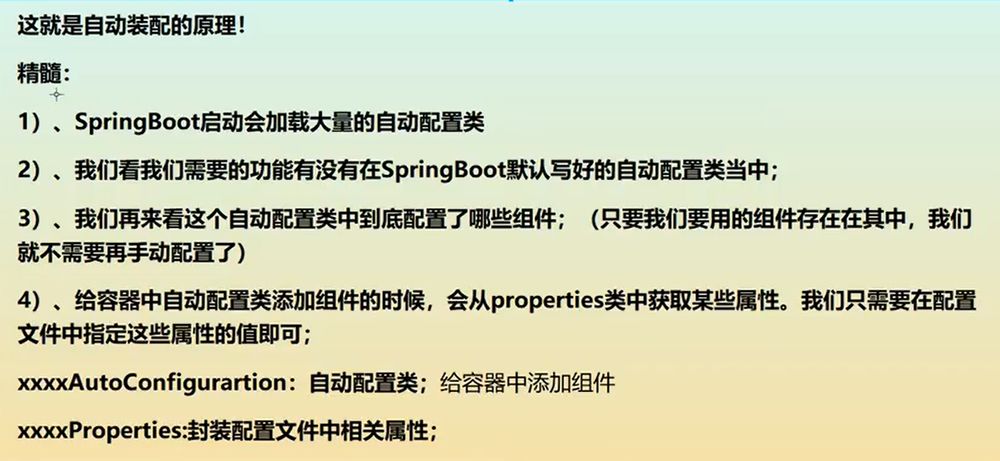
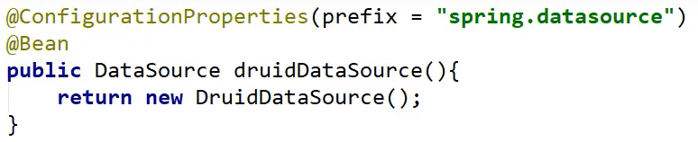

# SpringBoot

## 微服务架构

## 第一个Springboot程序

环境

- jdk1.8
- maven
- springboot
- IDEA


## 原理

[](https://www.cnblogs.com/theRhyme/p/11057233.html)

### pom.xml

- spring-boot-dependency：核心依赖在父工程中
- 引入依赖，不需要版本，因为上面已经搞好了

### starter


### 主程序

### 自动装配


### run()


## yaml写法


## 给属性赋值的几种方式

### properties

### yaml

```yaml
person:
  name: jing@qq.com
  age: 20
  cat:
    name: wuwu
    age: 3
  list: [f,u,c,k]
```


## JSR303校验


除此之外，还有多种。。。null ,not null等等

## 配置文件到处放

### 配置文件位置


file:./config/ > file:./ > classpath:./config/ > classpath:./

### 多环境配置


## 自动装配原理再理解


xxxproperties

再yaml中直接xxx:   和person一样



## Web开发

要解决的问题：

- 导入静态资源
- 首页
- jsp，模板引擎thymeleaf
- 装配扩展SpringMVC
- 拦截器
- 国际化

### 静态资源

new project

spring intialize

choose spring web


```java
public void addResourceHandlers(ResourceHandlerRegistry registry) {
    if (!this.resourceProperties.isAddMappings()) {
        logger.debug("Default resource handling disabled");
    } else {
        this.addResourceHandler(registry, "/webjars/**", "classpath:/META-INF/resources/webjars/");
        this.addResourceHandler(registry, this.mvcProperties.getStaticPathPattern(), (registration) -> {
            registration.addResourceLocations(this.resourceProperties.getStaticLocations());
            if (this.servletContext != null) {
                ServletContextResource resource = new ServletContextResource(this.servletContext, "/");
                registration.addResourceLocations(new Resource[]{resource});
            }

        });
    }
}
```

总结：

1.在Springboot可以使用以下方式处理静态资源

- webjars   /webjars/
- public,static,resources    /**

2.优先级： resources > static(dft) > public

```properties
spring.mvc.static-path-pattern=/??????
```

### 首页定制

将index.html放入静态资源目录即可。

### 模板引擎Thyleaf

#### 1.使用


- 添加依赖

- ```xml
  <dependency>
      <groupId>org.springframework.boot</groupId>
      <artifactId>spring-boot-starter-thymeleaf</artifactId>
  </dependency>
  ```

- 在templates中编写跳转的html
- 

- Controller测试

- ```java
  @Controller
  public class IndexController {
      @RequestMapping("/test")
      public String test(){
          return "test";
      }
  }
  ```

#### 2.语法


### MVC自动装配


### 一个简单的CRUD项目

#### 国际化


#### 登录以及展示列表


#### 404


### 连接数据库

#### JDBC

1.在创建项目时勾选jdbc

- 或者添加依赖

- ```xml
  <dependency>
      <groupId>org.springframework.boot</groupId>
      <artifactId>spring-boot-starter-jdbc</artifactId>
  </dependency>	
  ```

2.配置链接数据库所需信息

- 在application的yaml

- ```yaml
  spring:
    datasource:
      username: root
      password: root
      url: jdbc:mysql://localhost:3306/jdbc
      driver-class-name: com.mysql.jdbc.Driver
  ```

3.如何查询数据？

- 假设在controller层，可以调用用Bean注册好的JdbcTemplate类。

- ```java
  @RestController
  public class JDBCController {
      @Autowired
      JdbcTemplate jdbcTemplate;
  
      @RequestMapping("/jdbc")
      public List<Map<String,Object>> getData(){
          String sql = "select * from users";
          List<Map<String, Object>> maps = jdbcTemplate.queryForList(sql);
          return maps;
      }
  ```

增删改查


#### 整合Druid数据源

[狂神说SpringBoot08：整合Druid (qq.com)](https://mp.weixin.qq.com/s?__biz=Mzg2NTAzMTExNg==&mid=2247483786&idx=1&sn=f5f4ca792611af105140752eb67ce820&scene=19#wechat_redirect)


yaml配置在上方文档里面。

Druid配置类





#### 整合Mybatis

1.mybatiscongfig.xml编写

2.application.xml配置

- 
- classpath:指resources下。

3.pojo类、mapper类

- 

# SpringSecurity

## 简介


## 授权和认证

```java
@EnableWebSecurity
public class SecurityConfig extends WebSecurityConfigurerAdapter {
//    链式编程
    @Override
//    授权
    protected void configure(HttpSecurity http) throws Exception {
//        首页所有人都可访问
//        权限页有权限的人才可访问
        http.authorizeHttpRequests().antMatchers("/").permitAll()
                .antMatchers("/vip/**").hasRole("vip")
                .antMatchers("/normal/**").hasRole("normal")
                .antMatchers("/trash/**").hasRole("trash");
//        没有权限的人到登录页面
        http.formLogin();
//        注销：
        http.logout();
    }

//    认证

    @Override
    protected void configure(AuthenticationManagerBuilder auth) throws Exception {
//        可以从数据库或者内存中读入账户和密码

//        auth.inMemoryAuthentication().withUser("test").password("{noop}123456").roles("vip"); 不带加密
        auth.inMemoryAuthentication().passwordEncoder(new BCryptPasswordEncoder())
                .withUser("test").password(new BCryptPasswordEncoder().encode("123456")).roles("vip");
    }
}
```

如何让用户1只能看到用户1的功能？

- 导入thymeleaf+security的包

- 利用命名空间判断。

## 记住我和登录页面定制


# Shiro

