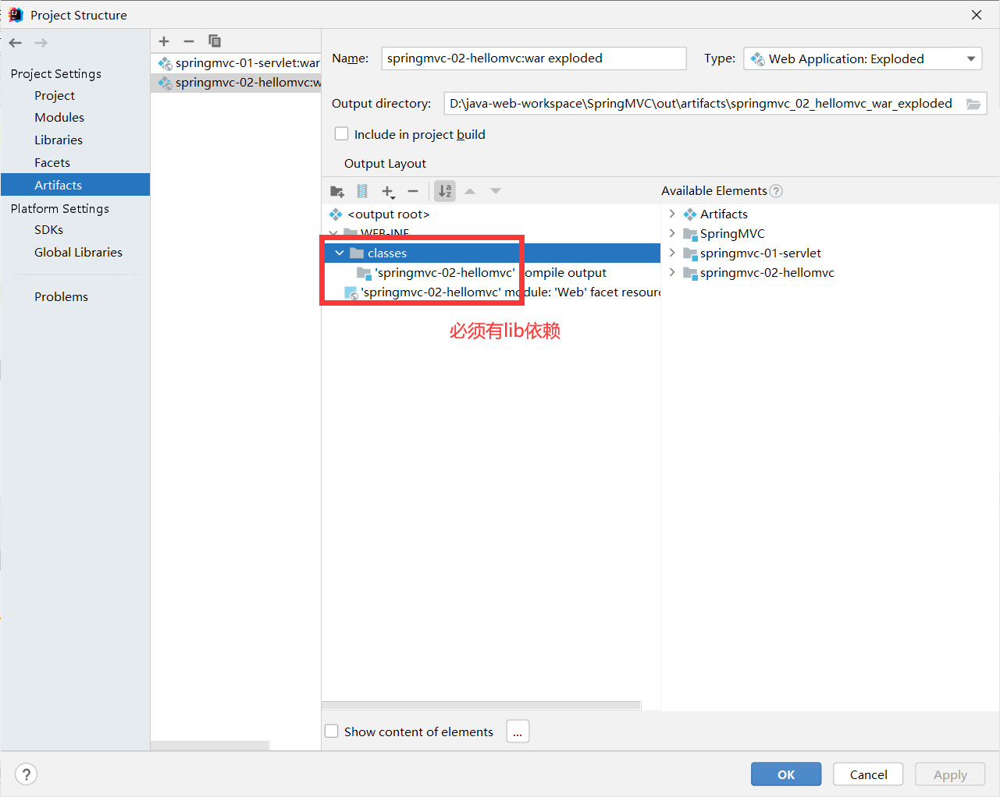
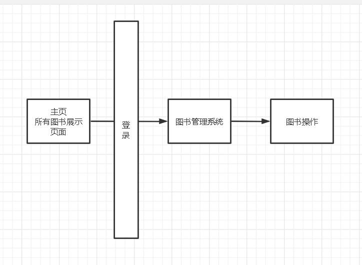
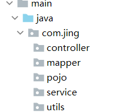

# SpringMVC

## 回顾Servlet

搭建环境

1. ### 导入依赖

   ```xml
   <!--    依赖-->
   <dependencies>
       <dependency>
           <groupId>junit</groupId>
           <artifactId>junit</artifactId>
           <version>4.13</version>
           <scope>test</scope>
       </dependency>
       <dependency>
           <groupId>org.springframework</groupId>
           <artifactId>spring-webmvc</artifactId>
           <version>5.2.6.RELEASE</version>
       </dependency>
       <dependency>
           <groupId>javax.servlet</groupId>
           <artifactId>servlet-api</artifactId>
           <version>2.5</version>
       </dependency>
       <dependency>
           <groupId>javax.servlet.jsp</groupId>
           <artifactId>jsp-api</artifactId>
           <version>2.1</version>
       </dependency>
       <dependency>
           <groupId>javax.servlet.jsp.jstl</groupId>
           <artifactId>jstl-api</artifactId>
           <version>1.2</version>
       </dependency>
   </dependencies>
   ```

2. ### 构建HelloServlet

   ```java
   @Override
   protected void doGet(HttpServletRequest req, HttpServletResponse resp) throws ServletException, IOException {
       //取得参数
       System.out.println("进入了doget");
       String method = req.getParameter("method");
       if (method.equals("add")){
           req.getSession().setAttribute("msg","执行了add方法");
       }else if (method.equals("delete")){
           req.getSession().setAttribute("msg","执行了delete方法");
       }else {
           req.getSession().setAttribute("msg","不是add也不是delete");
       }
       //业务逻辑
       //视图跳转
       req.getRequestDispatcher("result.jsp").forward(req,resp);
   }
   ```

3. ### 绑定到xml

   ```xml
   <servlet>
       <servlet-name>hellodd</servlet-name>
       <servlet-class>com.jing.servlet.HelloServlet</servlet-class>
   </servlet>
   <servlet-mapping>
       <servlet-name>hellodd</servlet-name>
       <url-pattern>/hello</url-pattern>
   </servlet-mapping>
   ```

4. ### 构建index。jsp

   ```html
   <body>
   <form action="${pageContext.request.contextPath}/hello">
     <input type="text" name="method">
     <input type="submit">
   </form>
   ```

5. ### 构建result.jsp

   ```html
   <body>
   <h1>${msg}</h1>
   </body>
   ```

## 初识SpringMVC

### 2.1、概述


Spring MVC是Spring Framework的一部分，是基于Java实现MVC的轻量级Web框架。

查看官方文档：https://docs.spring.io/spring/docs/5.2.0.RELEASE/spring-framework-reference/web.html#spring-web

**我们为什么要学习SpringMVC呢?**

 Spring MVC的特点：

1. 轻量级，简单易学
2. 高效 , 基于请求响应的MVC框架
3. 与Spring兼容性好，无缝结合
4. 约定优于配置
5. 功能强大：RESTful、数据验证、格式化、本地化、主题等
6. 简洁灵活

Spring的web框架围绕**DispatcherServlet** [ 调度Servlet ] 设计。

DispatcherServlet的作用是将请求分发到不同的处理器。从Spring 2.5开始，使用Java 5或者以上版本的用户可以采用基于注解形式进行开发，十分简洁；

正因为SpringMVC好 , 简单 , 便捷 , 易学 , 天生和Spring无缝集成(使用SpringIoC和Aop) , 使用约定优于配置 . 能够进行简单的junit测试 . 支持Restful风格 .异常处理 , 本地化 , 国际化 , 数据验证 , 类型转换 , 拦截器 等等......所以我们要学习 .

**最重要的一点还是用的人多 , 使用的公司多 .** 


### 2.2、中心控制器

​	Spring的web框架围绕DispatcherServlet设计。DispatcherServlet的作用是将请求分发到不同的处理器。从Spring 2.5开始，使用Java 5或者以上版本的用户可以采用基于注解的controller声明方式。

​	Spring MVC框架像许多其他MVC框架一样, **以请求为驱动** , **围绕一个中心Servlet分派请求及提供其他功能**，**DispatcherServlet是一个实际的Servlet (它继承自HttpServlet 基类)**。


SpringMVC的原理如下图所示：

​	当发起请求时被前置的控制器拦截到请求，根据请求参数生成代理请求，找到请求对应的实际控制器，控制器处理请求，创建数据模型，访问数据库，将模型响应给中心控制器，控制器使用模型与视图渲染视图结果，将结果返回给中心控制器，再将结果返回给请求者。


### 2.3、SpringMVC执行原理


图为SpringMVC的一个较完整的流程图，实线表示SpringMVC框架提供的技术，不需要开发者实现，虚线表示需要开发者实现。

**简要分析执行流程**

1. DispatcherServlet表示前置控制器，是整个SpringMVC的控制中心。用户发出请求，DispatcherServlet接收请求并拦截请求。

   我们假设请求的url为 : http://localhost:8080/SpringMVC/hello

   

   **如上url拆分成三部分：**

   http://localhost:8080服务器域名

   SpringMVC部署在服务器上的web站点

   hello表示控制器

   通过分析，如上url表示为：请求位于服务器localhost:8080上的SpringMVC站点的hello控制器。

2. HandlerMapping为处理器映射。DispatcherServlet调用HandlerMapping,HandlerMapping根据请求url查找Handler。

3. HandlerExecution表示具体的Handler,其主要作用是根据url查找控制器，如上url被查找控制器为：hello。

4. HandlerExecution将解析后的信息传递给DispatcherServlet,如解析控制器映射等。

5. HandlerAdapter表示处理器适配器，其按照特定的规则去执行Handler。

6. Handler让具体的Controller执行。

7. Controller将具体的执行信息返回给HandlerAdapter,如ModelAndView。

8. HandlerAdapter将视图逻辑名或模型传递给DispatcherServlet。

9. DispatcherServlet调用视图解析器(ViewResolver)来解析HandlerAdapter传递的逻辑视图名。

10. 视图解析器将解析的逻辑视图名传给DispatcherServlet。

11. DispatcherServlet根据视图解析器解析的视图结果，调用具体的视图。

12. 最终视图呈现给用户。

### 2.4、可能出现的问题



## 第一个mvc程序

[Servlet中/和/*的区别详解_java_脚本之家 (jb51.net)](https://www.jb51.net/article/216853.htm)

[load-on-startup元素：控制Servlet启动优先级 (biancheng.net)](http://c.biancheng.net/servlet2/load-on-startup.html)

### 1.配置Servlet2

```xml
<!--   配置dispatchServlet：springmvc的核心控制器-->
    <servlet>
        <servlet-name>springmvc</servlet-name>
        <servlet-class>org.springframework.web.servlet.DispatcherServlet</servlet-class>
<!--       要绑定springmvc的配置文件-->
        <init-param>
            <param-name>contextConfigLocation</param-name>
            <param-value>classpath:springmvc-servlet.xml</param-value>
        </init-param>
<!--        启动级别：1
    load-on-startup 元素取值规则如下：
        1.它的取值必须是一个整数；
        2.当值小于 0 或者没有指定时，则表示容器在该 Servlet 被首次请求时才会被加载；
        3.当值大于 0 或等于 0 时，表示容器在启动时就加载并初始化该 Servlet，取值越小，优先级越高；
        4.当取值相同时，容器就会自行选择顺序进行加载。
-->
        <load-on-startup>1</load-on-startup>
    </servlet>
<!--
    在springmvc中   /  和  /* 的区别
        /  拦截所有请求，不拦截.jsp
        /* 拦截所有请求

     {"/api/demo2"}) // 精确匹配
     {"/api/*", "/*"}) // 路径匹配
     {"*.jsp", "*.*"}) // 后缀名匹配
     "/"                // 缺省匹配   精确匹配 > 路径匹配 > 后缀名匹配 > 缺省匹配。
      Servlet容器（如Tomcat）内置有专门匹配.jsp这种请求的Servlet处理器，
     后缀名匹配优先级高于缺省匹配

      所以在MVC架构中，例如SpringMVC中，如果你把DispatcherServlet对应的Servlet-Mapping
     匹配模式配置为 /* 时，即使经过视图解析器得到的访问jsp页面的请求也会再次被拦截，从而无法
     得到将要访问的页面而报错。所以应配置为 /。
-->
    <servlet-mapping>
        <servlet-name>springmvc</servlet-name>
        <url-pattern>/</url-pattern>
    </servlet-mapping>
```

### 2.编写sprngxml文件

```xml
<!--    1.处理器映射器-->
    <bean class="org.springframework.web.servlet.handler.BeanNameUrlHandlerMapping"/>
<!--    2.处理器适配器-->
    <bean class="org.springframework.web.servlet.mvc.SimpleControllerHandlerAdapter"/>
<!--    3.视图解析器 模板引擎 thymeleag ...-->
    <bean class="org.springframework.web.servlet.view.InternalResourceViewResolver" id="InternalResourceViewResolver">
        <property name="prefix" value="/WEB-INF/jsp/"/>
        <property name="suffix" value=".jsp"/>
    </bean>

```

### 3.编写conttroller类

```java
public class HelloController implements Controller {
    @Override
    public ModelAndView handleRequest(HttpServletRequest httpServletRequest, HttpServletResponse httpServletResponse) throws Exception {
        ModelAndView mv = new ModelAndView();
        //业务代码
        String result="helloSpringmvc";
        mv.addObject("msg",result);
        //view转发
        mv.setViewName("test");
        return mv;
    }
}
```

### 4.处理器通过bean配置查找

```xml
<!--   处理器BeanNameUrlHandlerMapping-->
    <bean id="/hello" class="com.kuang.controller.HelloController"/>
</beans>
```

## 使用注解开发

### 1.配置xml文件

```xml
<?xml version="1.0" encoding="UTF-8"?>
<web-app xmlns="http://xmlns.jcp.org/xml/ns/javaee"
         xmlns:xsi="http://www.w3.org/2001/XMLSchema-instance"
         xsi:schemaLocation="http://xmlns.jcp.org/xml/ns/javaee http://xmlns.jcp.org/xml/ns/javaee/web-app_4_0.xsd"
         version="4.0">
    <!--   配置dispatchServlet：springmvc的核心控制器-->
    <servlet>
        <servlet-name>springmvc</servlet-name>
        <servlet-class>org.springframework.web.servlet.DispatcherServlet</servlet-class>
        <!--       要绑定springmvc的配置文件-->
        <init-param>
            <param-name>contextConfigLocation</param-name>
            <param-value>classpath:springmvc-servlet.xml</param-value>
        </init-param>
        <!--        启动级别：1       -->
        <load-on-startup>1</load-on-startup>
    </servlet>
    <servlet-mapping>
        <servlet-name>springmvc</servlet-name>
        <url-pattern>/</url-pattern>
    </servlet-mapping>
</web-app>
```

### 2.编写springmvc-servlet.xml

```xml
<?xml version="1.0" encoding="UTF-8"?>
<beans xmlns="http://www.springframework.org/schema/beans"
       xmlns:xsi="http://www.w3.org/2001/XMLSchema-instance"
       xmlns:context="http://www.springframework.org/schema/context"
       xmlns:mvc="http://www.springframework.org/schema/mvc"
       xsi:schemaLocation="http://www.springframework.org/schema/beans
       http://www.springframework.org/schema/beans/spring-beans.xsd
       http://www.springframework.org/schema/context
       https://www.springframework.org/schema/context/spring-context.xsd
       http://www.springframework.org/schema/mvc
       https://www.springframework.org/schema/mvc/spring-mvc.xsd">

    <!-- 自动扫描包，让指定包下的注解生效,由IOC容器统一管理 -->
    <context:component-scan base-package="com.kuang.controller"/>
    <!-- 让Spring MVC不处理静态资源 -->
    <mvc:default-servlet-handler />
    <!--
    支持mvc注解驱动
        在spring中一般采用@RequestMapping注解来完成映射关系
        要想使@RequestMapping注解生效
        必须向上下文中注册DefaultAnnotationHandlerMapping
        和一个AnnotationMethodHandlerAdapter实例
        这两个实例分别在类级别和方法级别处理。
        而annotation-driven配置帮助我们自动完成上述两个实例的注入。
     -->
    <mvc:annotation-driven />

<!--    3.视图解析器 模板引擎 thymeleag ...-->
    <bean class="org.springframework.web.servlet.view.InternalResourceViewResolver" id="InternalResourceViewResolver">
        <property name="prefix" value="/WEB-INF/jsp/"/>
        <property name="suffix" value=".jsp"/>
    </bean>

</beans>
```

### 3.直接创建controller类并用注解开发

```java
@Controller
public class HelloController {
//    请求的路径映射
    @RequestMapping("/h1")
    public String hello(Model model){
        model.addAttribute("msg","注解开发的springmvc!");
        //要转发的jsp地址
        return "annota";
    }
}
```

## Controller的2种实现方式

### 1.实现controller接口

在配置文件注入bean,配置文件只有视图解析器和bean

```xml
<!--    3.视图解析器 模板引擎 thymeleag ...-->
<bean class="org.springframework.web.servlet.view.InternalResourceViewResolver" id="InternalResourceViewResolver">
    <property name="prefix" value="/WEB-INF/jsp/"/>
    <property name="suffix" value=".jsp"/>
</bean>

<bean name="/t1" class="com.jing.controller.ControllerTest"></bean>
```

### 2.注解

xml开启他

```xml
<!-- 自动扫描包，让指定包下的注解生效,由IOC容器统一管理 -->
<context:component-scan base-package="com.jing.controller"/>
```

类：

```java
@Controller
@RequestMapping("/h1")
public class HelloController {
//    请求的路径映射{/h1/h1}
    @RequestMapping("/h1")
    public String hello(Model model){
        model.addAttribute("msg","注解开发的springmvc!");
        //要转发的jsp地址
        return "annota";
    }
}
```

## ResultFul风格

[狂神说SpringMVC03：RestFul和控制器 (qq.com)](https://mp.weixin.qq.com/s?__biz=Mzg2NTAzMTExNg==&mid=2247483993&idx=1&sn=abdd687e0f360107be0208946a7afc1d&chksm=ce6104faf9168dec5000de5ac600efd8e62ddffbd12a9bbd2e3fb786a4db3d7ee7c07d31d6d8&scene=21#wechat_redirect)

**有/add/{a}          {}**

**必有add1(@PathVariable int a**     **@PathVariable** 

## 数据处理以及跳转方式

[狂神说SpringMVC04：数据处理及跳转 (qq.com)](https://mp.weixin.qq.com/s?__biz=Mzg2NTAzMTExNg==&mid=2247483998&idx=1&sn=97c417a2c1484d694c761a2ad27f217d&chksm=ce6104fdf9168deb32664243023d374b336f2a4260b55846b533a8be70d2f9bc97e45f4ede47&scene=21#wechat_redirect)

### 数据处理

#### 处理提交数据

```java
public class UserController {
    @GetMapping("t1")
//    原来前端什么都没传入，也会返回网页，加上该注解后，前端只有传入username才能返回
    public String test1(@RequestParam("username") String name, Model model){
//        1.接受前端参数
//        2.酱返回的结果返回给前端
        model.addAttribute("msg",name);
        return "test";
    }
    @GetMapping("t2")
//  提交的是个对象
//    要求提交的表单和对象的属性名一致，参数就是对象User user。
    public String test2(User user,Model model){
//        1.接受前端参数
//        2.酱返回的结果返回给前端
        model.addAttribute("msg",user);
        return "test";
    }
}
```

#### 处理返回数据

**第一种 : 通过ModelAndView**

**第二种 : 通过ModelMap**

```java
@RequestMapping("/hello")
public String hello(@RequestParam("username") String name, ModelMap model){
   //封装要显示到视图中的数据
   //相当于req.setAttribute("name",name);
   model.addAttribute("name",name);
   System.out.println(name);
   return "hello";
}
```

**第三种 : 通过Model**

### 对比

就对于新手而言简单来说使用区别就是：

```
Model 只有寥寥几个方法只适合用于储存数据，简化了新手对于Model对象的操作和理解；

ModelMap 继承了 LinkedMap ，除了实现了自身的一些方法，同样的继承 LinkedMap 的方法和特性；

ModelAndView 可以在储存数据的同时，可以进行设置返回的逻辑视图，进行控制展示层的跳转。
```

当然更多的以后开发考虑的更多的是性能和优化，就不能单单仅限于此的了解。

**请使用80%的时间打好扎实的基础，剩下18%的时间研究框架，2%的时间去学点英文，框架的官方文档永远是最好的教程。**

### 跳转方式

#### ModelAndView

```java
public class ControllerTest1 implements Controller {

   public ModelAndView handleRequest(HttpServletRequest httpServletRequest, HttpServletResponse httpServletResponse) throws Exception {
       //返回一个模型视图对象
       ModelAndView mv = new ModelAndView();
       mv.addObject("msg","ControllerTest1");
       mv.setViewName("test");
       return mv;
  }
}
```

#### ServletAPI

#### SpringMVC

**没有视图解析器**

```java
@Controller
public class ResultSpringMVC {
   @RequestMapping("/rsm/t1")
   public String test1(){
       //转发
       return "/index.jsp";
  }

   @RequestMapping("/rsm/t2")
   public String test2(){
       //转发二
       return "forward:/index.jsp";
  }

   @RequestMapping("/rsm/t3")
   public String test3(){
       //重定向
       return "redirect:/index.jsp";
  }
}
```

**有视图解析器**

```java
@Controller
public class ResultSpringMVC2 {
   @RequestMapping("/rsm2/t1")
   public String test1(){
       //转发
       return "test";
  }

   @RequestMapping("/rsm2/t2")
   public String test2(){
       //重定向
       return "redirect:/index.jsp";
       //return "redirect:hello.do"; //hello.do为另一个请求/
  }

}
```

## 乱码问题：

测试步骤：

1、我们可以在首页编写一个提交的表单

```java
<form action="/e/t" method="post">
 <input type="text" name="name">
 <input type="submit">
</form>
```

2、后台编写对应的处理类

```java
@Controller
public class Encoding {
   @RequestMapping("/e/t")
   public String test(Model model,String name){
       model.addAttribute("msg",name); //获取表单提交的值
       return "test"; //跳转到test页面显示输入的值
  }
}
```

3、输入中文测试，发现乱码


不得不说，乱码问题是在我们开发中十分常见的问题，也是让我们程序猿比较头大的问题！

以前乱码问题通过过滤器解决 , 而SpringMVC给我们提供了一个过滤器 , 可以在web.xml中配置 .

修改了xml文件需要重启服务器！

```xml
<filter>
   <filter-name>encoding</filter-name>
   <filter-class>org.springframework.web.filter.CharacterEncodingFilter</filter-class>
   <init-param>
       <param-name>encoding</param-name>
       <param-value>utf-8</param-value>
   </init-param>
</filter>
<filter-mapping>
   <filter-name>encoding</filter-name>
   <url-pattern>/*</url-pattern>
</filter-mapping>
```

但是我们发现 , 有些极端情况下.这个过滤器对get的支持不好 .

处理方法 :

1、修改tomcat配置文件 ：设置编码！

```xml
<Connector URIEncoding="utf-8" port="8080" protocol="HTTP/1.1"
          connectionTimeout="20000"
          redirectPort="8443" />
```

2、自定义过滤器

```xml
package com.kuang.filter;

import javax.servlet.*;
import javax.servlet.http.HttpServletRequest;
import javax.servlet.http.HttpServletRequestWrapper;
import javax.servlet.http.HttpServletResponse;
import java.io.IOException;
import java.io.UnsupportedEncodingException;
import java.util.Map;

/**
* 解决get和post请求 全部乱码的过滤器
*/
public class GenericEncodingFilter implements Filter {

   @Override
   public void destroy() {
  }

   @Override
   public void doFilter(ServletRequest request, ServletResponse response, FilterChain chain) throws IOException, ServletException {
       //处理response的字符编码
       HttpServletResponse myResponse=(HttpServletResponse) response;
       myResponse.setContentType("text/html;charset=UTF-8");

       // 转型为与协议相关对象
       HttpServletRequest httpServletRequest = (HttpServletRequest) request;
       // 对request包装增强
       HttpServletRequest myrequest = new MyRequest(httpServletRequest);
       chain.doFilter(myrequest, response);
  }

   @Override
   public void init(FilterConfig filterConfig) throws ServletException {
  }

}

//自定义request对象，HttpServletRequest的包装类
class MyRequest extends HttpServletRequestWrapper {

   private HttpServletRequest request;
   //是否编码的标记
   private boolean hasEncode;
   //定义一个可以传入HttpServletRequest对象的构造函数，以便对其进行装饰
   public MyRequest(HttpServletRequest request) {
       super(request);// super必须写
       this.request = request;
  }

   // 对需要增强方法 进行覆盖
   @Override
   public Map getParameterMap() {
       // 先获得请求方式
       String method = request.getMethod();
       if (method.equalsIgnoreCase("post")) {
           // post请求
           try {
               // 处理post乱码
               request.setCharacterEncoding("utf-8");
               return request.getParameterMap();
          } catch (UnsupportedEncodingException e) {
               e.printStackTrace();
          }
      } else if (method.equalsIgnoreCase("get")) {
           // get请求
           Map<String, String[]> parameterMap = request.getParameterMap();
           if (!hasEncode) { // 确保get手动编码逻辑只运行一次
               for (String parameterName : parameterMap.keySet()) {
                   String[] values = parameterMap.get(parameterName);
                   if (values != null) {
                       for (int i = 0; i < values.length; i++) {
                           try {
                               // 处理get乱码
                               values[i] = new String(values[i]
                                      .getBytes("ISO-8859-1"), "utf-8");
                          } catch (UnsupportedEncodingException e) {
                               e.printStackTrace();
                          }
                      }
                  }
              }
               hasEncode = true;
          }
           return parameterMap;
      }
       return super.getParameterMap();
  }

   //取一个值
   @Override
   public String getParameter(String name) {
       Map<String, String[]> parameterMap = getParameterMap();
       String[] values = parameterMap.get(name);
       if (values == null) {
           return null;
      }
       return values[0]; // 取回参数的第一个值
  }

   //取所有值
   @Override
   public String[] getParameterValues(String name) {
       Map<String, String[]> parameterMap = getParameterMap();
       String[] values = parameterMap.get(name);
       return values;
  }
}
```

这个也是我在网上找的一些大神写的，一般情况下，SpringMVC默认的乱码处理就已经能够很好的解决了！

**然后在web.xml中配置这个过滤器即可！**

## JSON

[狂神说SpringMVC06：Json交互处理 (qq.com)](https://mp.weixin.qq.com/s?__biz=Mzg2NTAzMTExNg==&mid=2247484014&idx=1&sn=9bab2e9a658c32b1877c6015a3bd5f7d&scene=19#wechat_redirect)

maven jackson

```xml
<!-- https://mvnrepository.com/artifact/com.fasterxml.jackson.core/jackson-core -->
<dependency>
   <groupId>com.fasterxml.jackson.core</groupId>
   <artifactId>jackson-databind</artifactId>
   <version>2.9.8</version>
</dependency>
```

【注意：使用json记得处理乱码问题】

## 整合SSM



1. 完善数据库

   ```mysql
   DROP TABLE IF EXISTS `book`;
   
   CREATE TABLE `book` (
   `bookID` INT(10) NOT NULL AUTO_INCREMENT COMMENT '书id',
   `bookName` VARCHAR(100) NOT NULL COMMENT '书名',
   `bookCounts` INT(11) NOT NULL COMMENT '数量',
   `detail` VARCHAR(200) NOT NULL COMMENT '描述',
   `bookUrl` VARCHAR(100) NOT NULL
   KEY `bookID` (`bookID`)
   ) ENGINE=INNODB DEFAULT CHARSET=utf8;
   
   INSERT  INTO `book`(`bookID`,`bookName`,`bookCounts`,`detail`)VALUES
   (1,'Java',1,'从入门到放弃'),
   (2,'MySQL',10,'从删库到跑路'),
   (3,'Linux',5,'从进门到进牢');	
   ```

2. 导入相关依赖

   junit	mybatis	lombok	mybatis-spring	jsp	jstl	servlet	**mysql** 	spring	**数据库连接池**

   ```xml
   <dependencies>
           <!-- 数据库连接池 -->
           <dependency>
               <groupId>com.mchange</groupId>
               <artifactId>c3p0</artifactId>
               <version>0.9.5.2</version>
           </dependency>
           <!--    junit-->
           <dependency>
               <groupId>junit</groupId>
               <artifactId>junit</artifactId>
               <version>4.13</version>
               <scope>test</scope>
           </dependency>
   <!--        mysql-->
           <dependency>
               <groupId>mysql</groupId>
               <artifactId>mysql-connector-java</artifactId>
               <version>5.1.26</version>
           </dependency>
   <!--        mybatis-->
           <dependency>
               <groupId>org.mybatis</groupId>
               <artifactId>mybatis</artifactId>
               <version>3.4.6</version>
           </dependency>
   <!--        mybatis-spring-->
           <dependency>
               <groupId>org.mybatis</groupId>
               <artifactId>mybatis-spring</artifactId>
               <version>2.0.2</version>
           </dependency>
   <!--        lombok-->
           <dependency>
               <groupId>org.projectlombok</groupId>
               <artifactId>lombok</artifactId>
               <version>1.18.20</version>
           </dependency>
   <!--        spring ab.-->
           <dependency>
               <groupId>org.springframework</groupId>
               <artifactId>spring-webmvc</artifactId>
               <version>5.2.6.RELEASE</version>
           </dependency>
           <dependency>
               <groupId>org.springframework</groupId>
               <artifactId>spring-jdbc</artifactId>
               <version>5.2.6.RELEASE</version>
           </dependency>
   <!--        jsp servlet  jstl-->
           <dependency>
               <groupId>javax.servlet.jsp</groupId>
               <artifactId>jsp-api</artifactId>
               <version>2.1</version>
           </dependency>
           <dependency>
               <groupId>javax.servlet</groupId>
               <artifactId>servlet-api</artifactId>
               <version>2.5</version>
           </dependency>
           <dependency>
               <groupId>javax.servlet.jsp.jstl</groupId>
               <artifactId>jstl-api</artifactId>
               <version>1.2</version>
           </dependency>
   
       </dependencies>
   ```

   可能出现资源导不出

   ```xml
   <!--在build中配置resources，来防止我们资源导出失败的问题-->
   <build>
       <resources>
           <resource>
               <directory>src/main/resources</directory>
               <includes>
                   <include>**/*.properties</include>
                   <include>**/*.xml</include>
               </includes>
               <filtering>true</filtering>
           </resource>
           <resource>
               <directory>src/main/java</directory>
               <includes>
                   <include>**/*.properties</include>
                   <include>**/*.xml</include>
               </includes>
               <filtering>true</filtering>
           </resource>
       </resources>
   </build>
   ```

3. 项目大致有哪些包,初始xml文件

   

4. 连接数据库

5. 配置mybatis和spring的白皮书

   - mybatis-config.xml

     ```xml
     <?xml version="1.0" encoding="UTF-8" ?>
     <!DOCTYPE configuration
            PUBLIC "-//mybatis.org//DTD Config 3.0//EN"
            "http://mybatis.org/dtd/mybatis-3-config.dtd">
     <configuration>
     
     </configuration>
     ```

   - applicationContext.xml

     ```xml
     <?xml version="1.0" encoding="UTF-8"?>
     <beans xmlns="http://www.springframework.org/schema/beans"
           xmlns:xsi="http://www.w3.org/2001/XMLSchema-instance"
           xsi:schemaLocation="http://www.springframework.org/schema/beans
            http://www.springframework.org/schema/beans/spring-beans.xsd">
     
     </beans>
     ```

6. 编写底层操作

   1. 实体类

      ```java
      @AllArgsConstructor
      @NoArgsConstructor
      @Data
      public class Book {
          private int bookID;
          private String bookName;
          private int bookCounts;
          private String details;
      }
      ```

   2. mapper层

      bookmapper interface

      ```java
      public interface BookMapper {
          // 查询所有图书
          List<Book> queryAllBook();
      
          //增加一个Book
          int addBook(Book book);
      
          //根据id删除一个Book
          int deleteBookById(int id);
      
          //更新Book
          int updateBook(Book book);
      
          //根据id查询,返回一个Book
          Book queryBookById(int id);
      }
      ```

      book-mapper.xml

      ```xml
      <?xml version="1.0" encoding="UTF-8" ?>
      <!DOCTYPE mapper
              PUBLIC "-//mybatis.org//DTD Mapper 3.0//EN"
              "http://mybatis.org/dtd/mybatis-3-mapper.dtd">
      <mapper>
          <select id="queryAllBook" resultType="book">
              select * from ssmbuild.book;
          </select>
          <select id="queryBookById" parameterType="_int" resultType="book">
              select * from ssmbuild.book where bookID = #{id}
          </select>
          <insert id="addBook" parameterType="book">
              insert into ssmbuild.book(bookID, bookName, bookCounts, detail) value (#{bookID},#{bookName},#{bookCounts},#{detail})
          </insert>
          <delete id="deleteBookById" parameterType="_int">
              delete from ssmbuild.book where bookID=#{id}
          </delete>
          <update id="updateBook" parameterType="book">
              update ssmbuild.book set bookName = #{bookName},bookCounts = #{bookCounts},detail = #{detail}
              where bookID = #{bookID}
          </update>
      
      </mapper>
      ```

   3. service层

      - 接口

      - ```java
        public interface BookService {
            //增加一个Book
            int addBook(Book book);
            //根据id删除一个Book
            int deleteBookById(int id);
            //更新Book
            int updateBook(Book book);
            //根据id查询,返回一个Book
            Book queryBookById(int id);
            //查询全部Book,返回list集合
            List<Book> queryAllBook();
        }
        ```

        - 实现类

        - 

        - ```java
          public class BookServiceImpl implements BookService{
              private BookMapper bookMapper;
              //set方法，便于spring注入
              public void setBookMapper(BookMapper bookMapper) {
                  this.bookMapper = bookMapper;
              }
          
              @Override
              public int addBook(Book book) {
                  return bookMapper.addBook(book);
              }
          
              @Override
              public int deleteBookById(int id) {
                  return bookMapper.deleteBookById(id);
              }
          
              @Override
              public int updateBook(Book book) {
                  return bookMapper.updateBook(book);
              }
          
              @Override
              public Book queryBookById(int id) {
                  return bookMapper.queryBookById(id);
              }
          
              @Override
              public List<Book> queryAllBook() {
                  return bookMapper.queryAllBook();
              }
          }
          ```

7. 配置spring

   1. 配置spring-dao.xml
   2. 配置spring-service.xml

8. 配置springmvc

   1. 配置web.xml
   2. 配置spring-mvc.xml

## Ajax

## 拦截器

## 文件上传和下载

