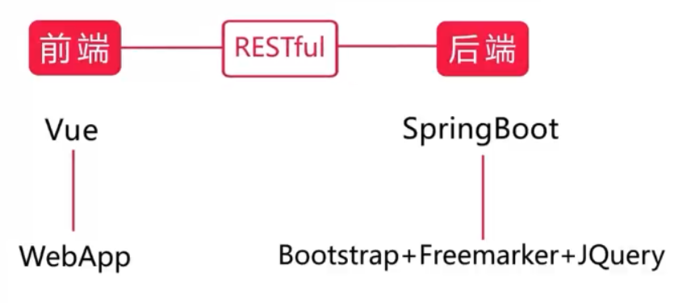

# 企业级微信点餐系统

## 一、需求分析

买家端

- 微信公众号

- 微信支付

卖家端

- 扫码登陆
- 管理订单
- 商品管理
- 类目管理


关键：

卖家和买家的消息互通

- 买家购买，卖家会受到提醒（WebSocket）

- 买家会收到微信的模板消息。

## 二、技术分析与版本选择

**前后端分离**

- 前端VUE
- 后端Springboot



**数据库**

JPA/Mybatis

**缓存**

Redis

**消息推送**

WebSocket


**微信方面**

扫描登录

模板推送

微信支付祥光

**软件版本**


## 三、架构和技术框架

### 架构


架构的演进


微服务架构的门派


## 四、数据库设计

类目表  1

商品表  n

- id：不能是自增（有上限）字符类型

- 名称：varchar
- 单价:  decimal(m,d)   m:指定小数点左边和右边总共可以存储的十进制数字的最大个数,最大精度为38 d:指定小数点右边可以存储的十进制数字的最大个数
- 库存
- 描述
- 图片
- 类目 

订单表  

订单详情表

卖家信息表

## 五、开发环境搭建

1.IDE新建项目

2.日志

日志特点：


3.日志的使用

```java
@Slf4j  //引入lombok插件
class SellApplicationTests {
//    private final Logger logger = LoggerFactory.getLogger(SellApplicationTests.class);

    @Test
    void contextLoads() {
        log.debug("debug...");
        log.info("info...");
        log.error("error...");
    }
}
```


xml配置：

```xml
<?xml version="1.0" encoding="utf-8" ?>
<configuration>
    <appender name="consoleLog" class="ch.qos.logback.core.ConsoleAppender">
        <layout class="ch.qos.logback.classic.PatternLayout">
            <pattern>
                %d - %msg%n
            </pattern>
        </layout>
    </appender>

    <appender name="fileInfoLog" class="ch.qos.logback.core.rolling.RollingFileAppender">
        <filter class="ch.qos.logback.classic.filter.LevelFilter">
            <level>ERROR</level>
            <onMatch>DENY</onMatch>
            <onMismatch>ACCEPT</onMismatch>
        </filter>
        <encoder>
            <pattern>
                %msg%n
            </pattern>
        </encoder>
<!--            滚动策略-->
            <rollingPolicy class="ch.qos.logback.core.rolling.TimeBasedRollingPolicy">
<!--                路径 -->
                <fileNamePattern>
                    log/info.%d.log
                </fileNamePattern>
            </rollingPolicy>
    </appender>

    <appender name="fileErrorLog" class="ch.qos.logback.core.rolling.RollingFileAppender">
        <filter class="ch.qos.logback.classic.filter.ThresholdFilter">
            <level>ERROR</level>
        </filter>
        <encoder>
            <pattern>
                %msg%n
            </pattern>
        </encoder>
        <!--            滚动策略-->
        <rollingPolicy class="ch.qos.logback.core.rolling.TimeBasedRollingPolicy">
            <!--                路径 -->
            <fileNamePattern>
                log/error.%d.log
            </fileNamePattern>
        </rollingPolicy>
    </appender>A
    <root level="info">
        <appender-ref ref="consoleLog"/>
        <appender-ref ref="fileInfoLog"/>
        <appender-ref ref="fileErrorLog"/>
    </root>
</configuration>
```

## 六、问题1

**

[(5条消息) Mybaits执行insert语句，执行一次会插入两次，数据库出现两条一模一样的记录解决办法_cx-young的博客-CSDN博客](https://blog.csdn.net/qq_41490938/article/details/105611990)

### 问题2

#### 前端重定向的地址配置

7-7

cd /opt/code/sell_xxx/config

vim index.js

cd ..

npm run build

cd..   		sell_xxx

cp -r /dist/* /opt/data/wwwroot/sell

#### niginx配置


### 问题3没用过的东西

[springBoot 使用 @NotEmpty，@NotBlank，@NotNull 及@Valid注解校验请求参数 - 香吧香 - 博客园 (cnblogs.com)](https://www.cnblogs.com/zjdxr-up/p/13308717.html)

transactional注解

slfj4注解

@valid  BindingResult

GSON

PageHelper：pageinfo

requestParam怎么自动转换integer?

beanutils

EnumUtils

```
@ControllerAdvice
```

natapp

freemarker为何return 不加/

serviceimpl上加注解

自定义实现wechat的配置

```yml
#微信相关
wechat:
  appID: wx7353a195e913e89f
  appsecret: 08d774d056d015038cbb896d8a8bd8fb
```

### 应该修改的地方

productcount

查询所有订单的detail改成 了null

```java
@JsonSerialize(using = Date2Longserializer.class)
```

```yaml
spring . jackson:
  default-property-inclusion: non_null
```

### 问题4

前端js动态注入

springboot starter freemaker

## 七、分布式系统

三要素

- 不共享内存
- 消息通新
- 多节点（节点可集群）

分布式系统：一句话，一个炒菜的，一个切菜的

集群：多个炒菜的

分布式计算：把炒的菜合起来

### Session


Key

- SessionId,自动的
- Token手动设置字段

#### 水平和垂直扩展的session问题：

水平扩展：

- IP哈希，同一个ip的请求每次装发到后端同一台服务器
  - 一直访问a服务器，a服务器挂了，原来访问a的，就不能访问服务器了

垂直扩展：

- 拆分服务 ，a服务器：类目，b服务器：商品。。。
- 配置nginx，根部不同的url，负载均衡到不同的服务器。
- 但是用户访问a以后，还访问b，sessionid得拿到

解决

- 加一层，redis集群/主从复制 保存session，他们拿就行了

## 八、登录的实现

1.微信扫码（无法搞）

2.账号密码

2次MD5

- 用户端传过去（明文+固定salt）：防止http协议明文传输得到密码
- 服务端（用户输入+随机salt）：防止数据库被盗取，反解密md5

## 九、验证用户AOP

AOP：一种程序设计思想，面向切面编程

水平切割


原来是

```java
@Pointcut("execution(public * com.jing.controller.Sell*.*(..))"+
"&& !execution(public * com.jing.controller.SellerUserController.*(..))")
public void verify(){
}

@Before("verify()")
public void doVerify(){
```

## 十、并发

原始的


synchronized


Redis 分布式锁


