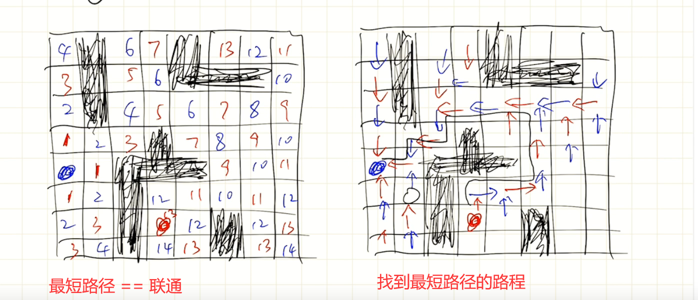

# 蓝桥杯

## 牌型总数（dfs）

小明被劫持到X赌城，被迫与其他3人玩牌。
一副扑克牌（去掉大小王牌，共52张），均匀发给4个人，每个人13张。
这时，小明脑子里突然冒出一个问题：
如果不考虑花色，只考虑点数，也不考虑自己得到的牌的先后顺序
自己手里能拿到的初始牌型组合一共有多少种呢？

### 能想到DFS，但有些套公式了。。。


```java
public class Main {
	static int count = 0;
	static int sum = 0;
	public static void dfs(int type) {
		//这个条件是剪枝了的，当sum大于13就返回，不必等到type到了13才返回。
		if(type > 13 || sum > 13) {
			return;
		}
		//想要的结果
		if(sum == 13) {
			count++;
			return;
		}
		for(int i = 0; i <= 4; i++) {
			sum += i;
			dfs(type + 1);
			//回溯
			sum -= i;
		}
	}
	
	
	public static void main(String[] args) {
		dfs(0);
		System.out.println(count);
	}
}
```

## 饮料换购(while循环)

乐羊羊饮料厂正在举办一次促销优惠活动。
乐羊羊C型饮料，凭3个瓶盖可以再换一瓶C型饮料，并且可以一直循环下去(但不允许暂借或赊账)。
请你计算一下，如果小明不浪费瓶盖，尽量地参加活动。
那么，对于他初始买入的n瓶饮料，最后他一共能喝到多少瓶饮料。 

比如  100  149  | 101   151

### 这题不难，重要的是理解题意，把情况想全

比如， 7  =  7  +  （6个瓶盖换的）2  + （1+2个瓶盖换的）1

那么循环公式就是： res = res + (一个东西/3)

​									这个东西就是7/3 + 7%3

14 = 14 + 14/3 + (14/3+14%3)/3

```java
public class Main {
	public static void main(String[] args) {
		Scanner in = new Scanner(System.in);
		while(in.hasNext()) {
			int n = in.nextInt();
			int res = getRes(n);
			System.out.println(res);
		}
	}
	
	public static int getRes(int n) {
		int mid = n;
		int res = n;
        //循环公式！
		while(mid / 3 > 0 ) {
			res += mid/3;
			mid = mid/3 + mid%3;
		}
		return res;
	}
}
```

## 垒骰子(dp+快速幂)

赌圣atm晚年迷恋上了垒骰子，就是把骰子一个垒在另一个上边，不能歪歪扭扭，要垒成方柱体。
经过长期观察，atm 发现了稳定骰子的奥秘：有些数字的面贴着会互相排斥！
我们先来规范一下骰子：1 的对面是 4，2 的对面是 5，3 的对面是 6。
假设有 m 组互斥现象，每组中的那两个数字的面紧贴在一起，骰子就不能稳定的垒起来。 
atm想计算一下有多少种不同的可能的垒骰子方式。
**两种垒骰子方式相同，当且仅当这两种方式中对应高度的骰子的对应数字的朝向都相同。**
由于方案数可能过多，请输出模 10^9 + 7 的结果。

#### 感觉难，不会。。

注意上面标黑的那句话。。。

#### 1.递归暴力

注解如下：

思路就是先固定好上面的，再选下面的，再选下面的。。。。


```java
public class Main {
	public static final int MOD = 1000000007;
	//冲突数组
	static boolean[][] conflix = new boolean[7][7];
	static long res = 0;
	static int map[] = new int[7];
	
	public static void fillMap() {
		map[1] = 4;
		map[2] = 5;
		map[3] = 6;
		map[4] = 1;
		map[5] = 2;
		map[6] = 3;
	}
	
	public static void main(String[] args) {
		fillMap();
		Scanner in = new Scanner(System.in);
		while(in.hasNext()) {
			int n = in.nextInt();//色子数
			int m = in.nextInt();//有几行
			//定义冲突的色子
			for(int i = 0; i < m; i++) {
				int a = in.nextInt();
				int b = in.nextInt();
				conflix[a][b] = true;
				conflix[b][a] = true;
			}
			for(int i = 1; i <= 6; i ++) {
				//递归传入的参数：下一个色子（n - 1）,当前面是什么，用来判断是否冲突
				res = res + dog(n - 1,i);
			}
			for(int i = 0; i < n; i++) {
				res *= 4;
			}
			System.out.println(res);
		}
	}
	//递归
	public static long dog(int n,int up) {
		long ans = 0;
		if(n == 0) {
			return 1;
		}
		for(int i = 1; i <= 6; i ++) {
			if(conflix[map[up]][i])	continue;
			ans += dog(n - 1,i);
		}
		return ans;
	}
}	
```

#### 2.DP


dp有点懵，看了几小时哎

```java
	//dp[i][j]:在第i层，j朝上合法的方案数目
	//dp[i][j] = ∑dp[i - 1][从1到6朝上]求和
	//ans = 求和
public class Main1 {		
	public static final int MOD = 1000000007;
	//冲突数组
	static boolean[][] conflix = new boolean[7][7];
	static BigInteger[][] dp = new BigInteger[2][7];
	static int map[] = new int[7];
	
	public static void fillMap() {
		map[1] = 4;
		map[2] = 5;
		map[3] = 6;
		map[4] = 1;
		map[5] = 2;
		map[6] = 3;
	}
	
	public static void main(String[] args) {
		fillMap();
		Scanner in = new Scanner(System.in);

		int n = in.nextInt();//色子数
		int m = in.nextInt();//有几行
		//定义冲突的色子
		for(int i = 0; i < m; i++) {
			int a = in.nextInt();
			int b = in.nextInt();
			conflix[a][b] = true;
			conflix[b][a] = true;
		}
		//初始化dp:第一行都是1
		for(int i = 1; i <= 6; i++) {
			dp[0][i] = BigInteger.ONE;
		}
		//cur用于滚动
		int cur = 0;
		//迭代层数
		for(int level = 2; level <= n; level++) {
			cur = 1 - cur;	
			for (int i = 1; i < 7; i++) {
				//先净化一下数，
				dp[cur][i] = BigInteger.ZERO;
				//上一层的每个元素都要循环判断是否冲突
				for (int j = 1; j < 7; j++) {
					//冲突：第一个i是固定的，代表x朝上，然后基于这个x
					//循环6次比较冲突点
					if(conflix[map[i]][j]) continue;
					//add后面加上的是上一层的数哟。
					dp[cur][i] = dp[cur][i].add(dp[1 - cur][j])
							.mod(new BigInteger(MOD+""));
				}
			}
		}
		BigInteger sum = BigInteger.ZERO;
		//求和，加的是最后一层的所有
	    for (int i = 1; i < 7; i++) {
	         sum = sum.add(dp[cur][i]).mod(new BigInteger(MOD + ""));
	    }
	    System.out.println(sum.multiply(quickpow(4, n)).mod(
                new BigInteger(MOD + "")));
	}
	// 快速幂
    static BigInteger quickpow(int n, int m) {
        BigInteger n1 = new BigInteger(n + "");

        BigInteger t = BigInteger.ONE;
        while (m > 0) {
            if ((m & 1) == 1)
                t = t.multiply(n1).mod(new BigInteger(MOD + ""));
            n1 = n1.multiply(n1).mod(new BigInteger(MOD + ""));
            m >>= 1;
        }
        return t;
    }
}
```

## 三羊献瑞（暴力for）

观察下面的加法算式：

其中，相同的汉字代表相同的数字，不同的汉字代表不同的数字。
请你填写“三羊献瑞”所代表的4位数字（答案唯一)，不要填写任何多余内容。

#### 7层for循环即可解决，注意判定他们之间的元素不可相等。

#### 超时也可小技巧

​		A B C D

 -+    E F G B

----------------------

​    E  F C B H 

E = 1  因为假设9999+9999第一个也是1

A = 9  因为进位了

F = 0 - 8 之间选择，只能是0 假设是1的话，B就得是10

.。。。。。。放弃这种解法把。。。

```java
public class Main {
	public static void main(String[] args) {
		for (int a = 1; a <= 9; a++) {
			for (int b = 0; b <= 9; b++) {
				if(a == b) continue;
				for (int c = 0; c <= 9; c++) {
					if(c == a || c == b) continue;
					for (int d = 0; d <= 9; d++) {
						if(d == a || d == b || d == c) continue;
						for (int e = 1; e <= 9; e++) {
							if(e == a || e == b || e == c || e == d) continue;
							for (int f = 0; f <= 9; f++) {
								if(f == a || f == b || f == c || f == d || f == e) continue;
								for (int g = 0; g <= 9; g++) {
									if(g == a || g == b || g == c ||g == d ||g == e||g == f) continue;
									for (int h = 0; h <= 9; h++) {
										if(h == a || h == b || h == c ||h == d ||h== e||h == f || h == g) continue;		
										if(a*1000+b*100+c*10+d+e*1000+f*100+g*10+b==e*10000+f*1000+c*100+b*10+h) {
											System.out.println(e*1000+f*100+g*10+b);
										}
									}
								}
							}
						}
					}
				}
			}
		}
	}
}
```

## 加法变乘法（简单题）

我们都知道：1+2+3+ ... + 49 = 1225
现在要求你把其中两个不相邻的加号变成乘号，使得结果为2015
比如：
1+2+3+...+10*11+12+...+27*28+29+...+49 = 2015 就是符合要求的答案。
请你寻找另外一个可能的答案，并把位置靠前的那个乘号左边的数字提交。
（对于示例，就是提交10）。

```java
public class Main {

	public static void main(String[] args) {
		for(int i = 1; i <= 49; i++) {
			for(int j = i + 2; j <= 49; j++) {
				if(i * i - (i + 1) + j * j - (j + 1) == 2015 -1225 && i != 10)
					System.out.println(i);
			}
		}
	}
}
```

## 生命之树（树形DP）

第一次接触，感觉有点难

#### 思路：要选择最大子集，树可以选择每次根节点最大的情况


递推公式如上。

节点有选和不选两种情况

- 选：就等于自己的权+所有子节点的最大权。
- 不选：也没关系，递归的时候只要一直维护节点最大权就可以了，并不需要找他们的根数。

```java
import java.io.BufferedInputStream;
import java.util.ArrayList;
import java.util.Scanner;

public class Main {
	static long[] nodeVal;    //每个节点的权值
	static ArrayList<Integer>[] edge; //各节点包含邻接边
	static long max; 		//结果的最大值
	static long[] value;   //存放某个节点为根的情况下，最大的和。
	public static void main(String[] args) {
		Scanner in = new Scanner(new BufferedInputStream(System.in));
		int n = in.nextInt();
		nodeVal = new long[n + 1];		//给每个节点赋值
		for(int i = 1; i <= n; i++) {
			long a = in.nextLong();
			nodeVal[i] = a;
		}
		edge = new ArrayList[n + 1];
		for (int i = 1; i <= n; i++) {
			edge[i] = new ArrayList<Integer>();
		}
		for(int i = 1; i <= n - 1; i++) {
			int a = in.nextInt();
			int b = in.nextInt();
			edge[a].add(b);
			edge[b].add(a);
		}
		value = new long[n + 1];
		dfs(1,-1);  //从第一个节点开始dfs，设置父母节点为-1，也就是让1为根节点
		System.out.print(max);
		
	}
	
	public static void dfs(int root, int father) {
		value[root] = nodeVal[root];   //初始的节点的值为本身
		for(int i = 0; i < edge[root].size(); i++) {
			int son = edge[root].get(i);  //遍历根节点的子节点
			if(son == father)
				continue; //如果遍历到根节点时，跳过（因为不知道那个是根节点，所以要这样判断）
			dfs(son,root);	//让儿子递归，争取儿子拿到最大值
			if(value[son] > 0) {	//最大权和大于0，可以添加
				value[root] += value[son];
			}
			max = Math.max(max, value[root]);  //更新最大值
		}
	}
}
```

30分

## 星系炸弹（calendar）

注意1是2月，

set的时候month可以减少1

```java
Calendar calendar = Calendar.getInstance();//创建个实例
int year = 2020;
int month = 1;//1是二月 0是1月
int day = 1;
calendar.set(Calendar.YEAR, year);// 将year的值赋给calender的YEAR字段
calendar.set(Calendar.MONTH, month);//将month的值赋给calender的MONTH字段
calendar.set(Calendar.DAY_OF_MONTH, day);//将day的值赋值给calendder的DAT_OF_MONTH字段
```

## 灾后重建（未作）


## ================

## 生日蜡烛（简单题）


## 方格填数（全排列，一维暴力法、二维智力法=未做=）

### 一维暴力法

全排列模板，交换元素。。

这种全排列的使用前提：数组（资源）里面的元素必须没有重复的。

```java
public class Main {
	static int[] nums = {0,1,2,3,4,5,6,7,8,9};
	static int res;
	public static void main(String[] args) {
		dfs(0);
		System.out.println(res);
	}
	
	public static void dfs(int k) {
		if(k == 10) {
			if(check())
				res++;
			return;
		}
		for(int i = k; i < 10; i++) {
            //把k和i交换位置，以此确定k的位置
			int t = nums[i];
			nums[i] = nums[k];
			nums[k] = t;
            //再次确定下一次k的位置
			dfs(k + 1);
			//回溯
			t = nums[i];
			nums[i] = nums[k];
			nums[k] = t;		
		}
	}

	private static boolean check() {
		if(Math.abs(nums[1] - nums[0]) == 1||
				Math.abs(nums[3] - nums[0] )== 1||
		Math.abs(nums[4] - nums[0] )== 1||
Math.abs(nums[5] - nums[0]) == 1||
Math.abs(nums[5] - nums[1]) == 1||
Math.abs(nums[6] - nums[1]) == 1||
Math.abs(nums[2] - nums[1]) == 1||
Math.abs(nums[4] - nums[1]) == 1||
Math.abs(nums[6] - nums[2]) == 1||
Math.abs(nums[5] - nums[2]) == 1||
Math.abs(nums[4] - nums[3]) == 1||
Math.abs(nums[7] - nums[3]) == 1||
Math.abs(nums[8] - nums[3]) == 1||
Math.abs(nums[5] - nums[4]) == 1||
Math.abs(nums[7] - nums[4]) == 1||
Math.abs(nums[8] - nums[4]) == 1||
Math.abs(nums[9] - nums[4]) == 1||
Math.abs(nums[6] - nums[5]) == 1||
Math.abs(nums[8] - nums[5]) == 1||
Math.abs(nums[9] - nums[5]) == 1||
Math.abs(nums[9] - nums[6]) == 1||
Math.abs(nums[8] - nums[7]) == 1||
Math.abs(nums[8] - nums[9]) == 1)
			return false;
		return true;
	}

}
```


### 二维智力法

给这些格子加点料


## 四阶幻方（全排列+剪枝）

我有点呆，看题目就知道34了，全排列。

剪枝：注意

知道34就没啥难度了。

```java
public class Main {
	static int res;
	static int[] nums = {1,2,3,4,5,6,7,8,9,10,11,12,13,14,15,16};
	static int judge = 34;
	public static void main(String[] args) {
		dfs(1);
		System.out.println(res);
	}
	
	public static void dfs(int k) {
		if(k == 16) {
			if(check()) {
				res ++;
			}
			return;
		}
		for(int i = k; i < nums.length; i++) {
			if(k == 4) {
				if(nums[0]+nums[1]+nums[2]+nums[3] != 34) {
					break;
				}
			}
			if(k == 8) {
				if(nums[4]+nums[5]+nums[6]+nums[7] != 34) {
					break;
				}
			}
			if(k == 12) {
				if(nums[8]+nums[9]+nums[10]+nums[11] != 34) {
					break;
				}
			}
			int t = nums[i];
			nums[i] = nums[k];
			nums[k] = t;
			dfs(k + 1);
			t = nums[i];
			nums[i] = nums[k];
			nums[k] = t;
		}
	}

	private static boolean check() {
		if(
nums[0]+nums[4]+nums[8]+nums[12] != judge ||
nums[1]+nums[5]+nums[9]+nums[13] != judge ||
nums[2]+nums[6]+nums[10]+nums[14] != judge ||
nums[3]+nums[7]+nums[11]+nums[15] != judge ||
nums[0]+nums[5]+nums[10]+nums[15] != judge ||
nums[3]+nums[6]+nums[9]+nums[12] != judge)
			return false;
		return true;
	}
}
```

## 减邮票（全排列II+图的联通检测）

原始思路为何不对？

原来的思路它无法解决T字图的问题


解决方法：从12个中选5个，再判断这5个是否连通。

全排列，定义一个数组{000000011111}这里面有5个1

对这个a进行全排列即可得到（12中选5个1）的各种情况。

这里的全排列是不重复的全排列（参数是k，一个path代表全排列完成的数组）

不重复需要定义一个vis[]数组，每次dfs前都要把vis设置为ture,如果前一个和现在的元素重复了并且前面的还没有访问过，就continue

check函数用来把a[]映射成图，然后去判断图的连通性。

图的联通性：

```java
public class Main {
	static int[] a = {1,1,1,1,1,0,0,0,0,0,0,0};  //
	static int res;
	static boolean[] vis = new boolean[12];
	public static void main(String[] args) {
		int[] path = new int[12];
		f(0,path);
		System.out.println(res);
		
	}
	
	static boolean check(int[] path) {
		int[][] g = new int[3][4];
		//映射g:g上面有5个格子被标记为1
		for (int i = 0; i < 3; i++) {
			for (int j = 0; j < 4; j++) {
				if(path[i*4+j] == 1)
					g[i][j] = 1;
				else
					g[i][j] = 0;
			}
		}
		//连通块的数目
		int count = 0;
		//dfs对g做连通性检测
		for (int i = 0; i < 3; i++) {
			for (int j = 0; j < 4; j++) {
				if(g[i][j] == 1) {
					dfs(g,i,j);
					count ++;
				}
			}
		}
		//连通块的数目必须是1
		return count == 1;
	}
	public static void dfs(int[][] g,int i, int j) {
		g[i][j] = 0;
		if(i - 1 >= 0 && g[i-1][j] == 1)  dfs(g,i-1,j);
		if(i + 1 <= 2 && g[i+1][j] == 1)  dfs(g,i+1,j);
		if(j - 1 >= 0 && g[i][j-1] == 1)  dfs(g,i,j-1);
		if(j + 1 <= 3 && g[i][j+1] == 1)  dfs(g,i,j+1);
		return;
	}
	
	public static void f(int k,int[] path) {
		if(k == 12) {
			if(check(path)) {
				res ++;
			}
			return;
		}
		
		for(int i= 0; i < 12; i++) {
			//如果这个元素重复，并且之前没有抓过。
			if(i > 0 && a[i] == a[i-1] && !vis[i-1]) {
				continue;
			}
			//如果没有被用过可以抓入path
			if(!vis[i]) {
				vis[i] = true;
				path[k] = a[i];
				f(k+1,path);
				//回溯
				vis[i] = false;
			}
		}
	}
}
```

## 四平方和（空间换时间！）

和四数之和一样吗我不知道。

因为N最大是5000000，4层for循环每层2000肯定超时。

那么可以先把c和d缓存起来。

直接for循环ab，判断减去a方和b方在缓存能不能找到值。

```java
import java.util.HashMap;
import java.util.Scanner;

public class Main {
	static HashMap<Integer,Integer> cache = new HashMap<>();
	public static void main(String[] args) {
		//先把c和d缓存起来
		for(int c = 0; c <= 2237; c++) {
			for(int d = c; d <= 2237; d++) {
				if(!cache.containsKey(c*c+d*d))
				cache.put(c*c+d*d,c);
			}
		}
		Scanner in = new Scanner(System.in);
		while(in.hasNext()) {
			int N = in.nextInt();
			boolean flag = false;
			//双重for循环判断
			for(int a = 0; a <= 2237; a++) {
				if(flag)
					break;
				for(int b = 0; b <= 2237; b++) {
					if(cache.containsKey(N-a*a-b*b)) {
						int c = cache.get(N-a*a-b*b);
						int d = (int)Math.sqrt(N-a*a-b*b-c*c);
						System.out.println(a+" "+b+" "+c+" "+d);
						flag = true;
						break;
					}
				}
			}
		}
	}
}
```

## 煤球数目(简单题)

```java
public class Main {

	public static void main(String[] args) {
		int res = 0;
		int count = 1;
		int three = count;
		for(int i = 0; i < 100; i++) {
			res += count;
			three ++;
			count += three;

		}
		System.out.println(res);
	}
}
```

## 凑算式（简单但不简单，可以全排列，也可以9个for）


6+8/3+952/714 是一种解法。

那么，这个8除以三是除不尽的，因此需要考虑通分。

通分了，还要他们之间是可以整除的，也就是求余等于0。

### for循环

```java
	public static void main(String[] args) {
		int count = 0;
//贴上重要的代码把，其他的都是for循环判断加上abc-i不能相等。
        //if判断的是通分相除后为10并且可以是整除的，而不是除不尽的
if(a+(b*(g*100+h*10+i)+c*(d*100+e*10+f))/(c*(g*100+h*10+i)) == 10&&(b*(g*100+h*10+i)+c*(d*100+e*10+f))%(c*(g*100+h*10+i))==0)
}
	}
}

```

### 全排列做法


## 取球博弈（递归+cache）

1.先明确思路

2.把想要的东西封装成函数，会比较好做点

#### 递归

```java
public class Main {
	static int[] nums= new int[5];
	static int[] mov = new int[3];
	public static void main(String[] args) {
		Scanner in = new Scanner(System.in);
		for(int i=0;i<3;i++) {
			int a = in.nextInt();
			mov[i] = a;
		}
		//这个排序要想到
		Arrays.sort(mov);
		for(int i=0;i<5;i++) {
			int num = in.nextInt();
			char res = f(num,0,0);
			System.out.print(res+" ");
		}
		System.out.println();
		
	}
	private static char f(int num, int me, int you) {
		if(num < mov[0]) {
			if(me % 2 != 0 && you % 2 == 0) return '+';
			else if(me % 2 == 0 && you % 2 != 0) return '-';
			else return '0';
		}
		boolean ping = false;
		for(int i = 0; i < 3; i++) {
			//资源数目大于或等于拿取的
			if(num >= mov[i]) {
				//下一次对手
				char res = f(num - mov[i],you,me + mov[i]);
				if(res == '-')
					return '+';
				if(res == '0')
					ping = true;
			}
		}
		//如果对手没输过，看有没有平过
		if(ping)
			return '0';
		else
			return '-';
	}
}
```

#### 记忆化递归

在return处添加到缓存。

在开始查缓存，缓存一般是key,values。

缓存可以用map,数组来存储。

这个题目的缓存是int【】【】【】 表示这种状态下，的结果是win or lose。但是如果存具体的数字，缓存命中率还是蛮低的.而且空间的占用也是极大的。因此，可以忽略它具体的数字，而只在乎它的奇偶性。来记录缓存。。。好难想！

```java
package lanqiao08;

import java.util.Arrays;
import java.util.Scanner;

public class Main {
	static char[][][] cache = new char[1000][2][2];
	static int[] nums= new int[5];
	static int[] mov = new int[3];
	public static void main(String[] args) {
		Scanner in = new Scanner(System.in);
		for(int i=0;i<3;i++) {
			int a = in.nextInt();
			mov[i] = a;
		}
		//这个排序要想到
		Arrays.sort(mov);
		for(int i=0;i<5;i++) {
			int num = in.nextInt();
			char res = f(num,0,0);
			if(i < 4)
			System.out.print(res+" ");
			else
				System.out.print(res);
		}
		
	}
	private static char f(int num, int me, int you) {
		if(num < mov[0]) {
			if(me % 2 != 0 && you % 2 == 0) return '+';
			else if(me % 2 == 0 && you % 2 != 0) return '-';
			else return '0';
		}
		if(cache[num][me][you] != '\0') return cache[num][me][you]; 
		boolean ping = false;
		for(int i = 0; i < 3; i++) {
			//资源数目大于或等于拿取的
			if(num >= mov[i]) {
				//下一次对手
				char res = f(num - mov[i],you,mov[i] % 2==0?me:1-me);  //下一次取的是偶数，那么原来是什么数就是什么数
				if(res == '-') {
					cache[num][me][you] = '+'; 
					return '+';
				}
				if(res == '0')
					ping = true;
			}
		}
		//如果对手没输过，看有没有平过
		if(ping) {
			cache[num][me][you] = '0'; 
			return '0';
		}
		else {
			cache[num][me][you] = '-'; 			
			return '-';
		}
	}
}

```

## 压缩变换（未作）❗❗❗❗

## ================

## 纸牌三角形（全排列+check+去重）


全排列的时候不需要去重，根据镜像2*旋转3 = 6 把最后的结果除以6。

全排列枚举所有情况 ，再判断0，1，3，5 和0，2，4，8是否相等等。。。。。

```java
//纸牌三角形
//特点：等边三角形，
//怎么做呢？全排列check
public class Main {
	static int[] nums = {1,2,3,4,5,6,7,8,9};
	static int res;
	
	public static void main(String[] args) {
		f(0);
		System.out.println(res/6);
	}
	
	
	static void f(int k) {
		if(k == 9) {
			if(nums[0]+nums[1]+nums[3]+nums[5] == nums[0]+nums[2]+nums[4]+nums[8]&&
					nums[0]+nums[2]+nums[4]+nums[8] == nums[5]+nums[6]+nums[7]+nums[8])
				res++;
			return;
		}
		
		
		for(int i = k; i < 9; i++) {
			int t = nums[k];
			nums[k] = nums[i];
			nums[i] = t;
			f(k+1);
			t = nums[k];
			nums[k] = nums[i];
			nums[i] = t;
		}
	}
	
}
```

## 承压计算


```java
//承压计算
public class Main {
	static ArrayList<Double> list=  new ArrayList();
  public static void main(String[] args) {
      Scanner sc=new Scanner(System.in);
      double a[][]=new double[30][30];
      for(int i=0;i<29;i++){
          for(int j=0;j<=i;j++){
              a[i][j]=sc.nextDouble();
          }
      }
      for(int i=1;i<30;i++){
          for(int j=0;j<=i;j++){
              if(j==0){
                  a[i][j]+=a[i-1][j]/2;
              }else{
                  a[i][j]+=a[i-1][j]/2+a[i-1][j-1]/2;
              }
              if(i == 29) {
              	list.add(a[i][j]);
              }
          }
      }
      Collections.sort(list);
      Double min = list.get(0);
      Double max = list.get(list.size()-1);
      double t = 2086458231.0;
      double res = max*(t/min);
      BigDecimal bg=new BigDecimal(res+"");
      System.out.println(bg);
  }
}
```

## 日期问题（去重+排序）可以TreeSet

别忘了去重！

没做出来，也不想做了，不知道哪里错了 得到88%的分

```java
package lanqiao05;

import java.text.SimpleDateFormat;
import java.util.ArrayList;
import java.util.Calendar;
import java.util.Collections;
import java.util.Comparator;
import java.util.Date;
import java.util.HashSet;
import java.util.Scanner;


public class Main {
	static HashSet<Mydate> set = new HashSet();
	static ArrayList<Mydate> list = new ArrayList();
	public static void main(String[] args) {
		Scanner in = new Scanner(System.in);
		String text = in.next();
		String text1 = text.substring(0,2);
		String text2 = text.substring(3,5);
		String text3 = text.substring(6,8);
		getDate(text1,text2,text3);
		getDate(text3,text1,text2);
		getDate(text3,text2,text1);
		Collections.sort(list,new Comparator<Mydate>() {

			@Override
			public int compare(Mydate o1, Mydate o2) {
				if(o1.year != o2.year) return o1.year-o2.year;
				if(o1.month != o2.month) return o1.month-o2.month;
				if(o1.day != o2.day) return o1.day-o2.day;
				return 0;
			}
		});
		for(Mydate date:list)
			set.add(date);
		for(Mydate date:set)
			System.out.println(date.toString());
	}
	

	static void getDate(String year,String month,String day) {
		if(Integer.valueOf(year) >= 60) year = 19+year;
		else year = 20+year;
		if(Integer.valueOf(month) > 12) return;
		if(isTrue(Integer.valueOf(day),Integer.valueOf(month),Integer.valueOf(year))) return;
		Mydate mydate = new Mydate(Integer.valueOf(year), Integer.valueOf(month), Integer.valueOf(day));
		list.add(mydate);
	}

	private static boolean isTrue(Integer day, Integer month, Integer year) {
		if(day > 31 || day == 0||month==0) return true;
		if((month == 4||month == 6||month == 9||month == 11) && day == 31) {
			return true;
		}
		if(month == 2) {
			if(day>29) return true;
			if(!((year%4 == 0 && year%100!=0) || year %400==0) && day == 29) {
				return true;
			}
		}
		return false;
	}
	

}
class Mydate{
	int year;
	int month;
	int day;
	@Override
	public String toString() {
		String month1 = ""+month;
		String day1 = ""+day;
		if(month<10)  month1 = "0"+month; 
		if(day<10)  day1 = "0"+day;
		return  year + "-" + month1 + "-" + day1;
	}
	public Mydate(int year, int month, int day) {
		this.year = year;
		this.month = month;
		this.day = day;
	}
	@Override
	public int hashCode() {
		final int prime = 31;
		int result = 1;
		result = prime * result + day;
		result = prime * result + month;
		result = prime * result + year;
		return result;
	}
	@Override
	public boolean equals(Object obj) {
		if (this == obj)
			return true;
		if (obj == null)
			return false;
		if (getClass() != obj.getClass())
			return false;
		Mydate other = (Mydate) obj;
		if (day != other.day)
			return false;
		if (month != other.month)
			return false;
		if (year != other.year)
			return false;
		return true;
	}
	
}
```

## 包子凑数（多重背包+数论）

证明


ke以推出


所以第一步要**先判断是否互为质数。**

如果不互质的话，那么就凑不出无穷多个。直接输出INF即可。

如果互为质数，那么就要在一个范围内找凑不出的情况。这个范围根据公式ab - a - b是最大不能表示的数，就是100*100 - 200；就是开辟10000的空间吧。

那么，怎么从这个1w的空间中找出凑不出的数目呢？

**多重背包**：一个物品可以取无限次。没有价值最大，容量确定，只需要填满背包就可以啦。

```java
if(dp[i])  dp[i+nums[j]] = true;     //递推公式
```

```java
public class Main {
static int N;
static int[] nums;
static int g; //最大公约数
static int res;
static boolean[] dp = new boolean[10000];

public static void main(String[] args) {
	Scanner in = new Scanner(System.in);
	N = in.nextInt();
	nums = new int[N];
	dp[0] = true;
	for(int i = 0; i < N;i++) {
		nums[i] = in.nextInt();
		if(i == 0) g = nums[0]; //初始化最大公约数
		else g = gcd(nums[i],g);
		//完全背包
		for(int j=0;j<10000-nums[i];j++) {
			if(dp[j]) dp[j+nums[i]] = true;
		}
	}
	if(g!=1) {
		System.out.println("INF");
		return;
	}
	//统计结果
	for(int i=0;i<10000;i++) {
		if(!dp[i]) res++;
	}
	System.out.println(res);
}

static int gcd(int a, int b) {
	if(b == 0) return a;
	return gcd(b,a%b);
}
    }
```

## 分巧克力（二分查找）

>儿童节那天有K位小朋友到小明家做客。小明拿出了珍藏的巧克力招待小朋友们。
>小明一共有N块巧克力，其中第i块是Hi x Wi的方格组成的长方形。
>为了公平起见，小明需要从这 N 块巧克力中切出K块巧克力分给小朋友们。切出的巧克力需要满足：
>\1. 形状是正方形，边长是整数 
>\2. 大小相同 
>例如一块6x5的巧克力可以切出6块2x2的巧克力或者2块3x3的巧克力。
>当然小朋友们都希望得到的巧克力尽可能大，你能帮小Hi计算出最大的边长是多少么？

看下题目的规模有100000个孩子，那么肯定是要优化枚举的。

#### 为什么可以用二分？

- 要求的是最大边长，原来暴力法就是每次枚举最大的边长，再减。但是数据规模大，所以不行。

​		二分法可以更快一些。

枚举就是从高往低算，看看哪个可以达到题目要求。

二分法就是定义l 和 r分别为左右两边。根据mid来计算是否达到题目要求，如果是达到的话，那么继续向右边找最大的，直到l<=r。没达到，就从左边找。

```java
//分巧克力
public class Main {
	static int N,K;
	static int[][] chok;
	static int res;
	
	public static void main(String[] args) {
		Scanner in = new Scanner(System.in);
		N = in.nextInt();
		K = in.nextInt();
		chok = new int[N][2];
		for(int i = 0; i < N; i++) {
			chok[i][0] = in.nextInt();
			chok[i][1] = in.nextInt();
		}
		int l = 1;
		int r = 10000;
		
		while(l <= r) {
			int mid = (l+r)/2;
			int sum = 0;
			for(int i = 0; i < N; i++) {
				int a = chok[i][0]/mid;
				int b = chok[i][1]/mid;
				sum+=a*b;
			}
			if(sum >= K) {
				//ok的情况，更新res
				l = mid+1;
				res = mid;
			}else {
				r = mid-1;
			}
		}	
		System.out.println(res);
	}
}
```

## K倍区间（前缀和+欧几里得）

要求和，想想前缀和把，可以计算区间的和提升到o(1)的复杂度

因此，可以降低到o(n2)的复杂度。

数学知识可知，**如果a,b同余，那么b - a 区间内一定是k的倍数**    7  -  16  对3同余   ，他们减就是3的倍数。因此，可以在前缀和数组里面存放求余后的数，并记录这些余数的数目。在同一余数的里面选取2个，看看有多少种选法，那么这个K倍区间就有多少个。

因此，可以降低到o(n)

```java
import java.util.Scanner;

// k倍区间
public class Main {
	static int N,K;
	static int[] a;
	static int[] s;  //前缀和
	static int res;
	
	public static void main(String[] args) {
		Scanner in = new Scanner(System.in);
		N=in.nextInt();
		K=in.nextInt();
		a=new int[N];
		s=new int[N];
		for(int i = 0; i < a.length; i++) {
			a[i] = in.nextInt();
			if(i == 0) s[i] = a[i]; 
			else s[i] = s[i-1]+a[i];
		}
     
		for(int i = 0; i < N; i++) {
			for(int j = i; j < N; j++) {
				if(i == 0 && s[j] % K ==0) res++;
                   //这里(s[j] - s[i-1])要加括号。。。。
				if(i >= 1 && (s[j] - s[i-1])%K==0) res++;
			}
		}
		System.out.println(res);
	}
}
```

加上数学优化：**如果a,b同余，那么b - a 区间内一定是k的倍数**

```java
import java.util.HashMap;
import java.util.Scanner;

// k倍区间
public class Main {
	static int N,K;
	static int[] a;
	static int[] s;  //前缀和
	static HashMap<Integer,Long> map = new HashMap<>(); 
	static long res;
	
	public static void main(String[] args) {
		Scanner in = new Scanner(System.in);
		N=in.nextInt();
		K=in.nextInt();
		a=new int[N+1];
		s=new int[N+1];
		//initialize
		map.put(0, 1L);
		for(int i = 1; i < a.length; i++) {
			a[i] = in.nextInt();
			s[i] = (s[i-1]+a[i])%K;
			if(map.get(s[i])==null) map.put(s[i], 1L);
			else map.put(s[i], map.get(s[i])+1);
		}
		//map最多有小于k个余数
		for(int i = 0; i < K; i++) {
			res+=map.get(i)*(map.get(i)-1)/2;
		}
		System.out.println(res);
	}
}
```

## ===============

## 星期一（excel）

excel   2022/2/2    = weekday(a1,2)  判断他是星期几

**闰年366天，平年365天。**

```java
//星期一
public class Main {
	
	static boolean isYeap(int year) {
		if(year%400==0||(year%100!=0&&year%4==0)) return true;
		else return false;
	}
	public static void main(String[] args) {
		int cnt = 0;
		for(int i= 1901; i <= 2000; i++) {
			if(isYeap(i)) cnt+=366;
			else cnt+=365;
		}
        //减去不在星期的天数
		cnt-=6;
		System.out.println(cnt/7);
		
	}
}
```

## 方格计数（数学）


**没做出来，看的题解**

把⚪分成4个象限，计算第一象限的，最后×4即可。

怎么算一个象限里面的方块的个数呢，用坐标呀，如果这个坐标在⚪里面，那么就一定是个完整的格子。  **x2+y2 <=   r2**

```java
public class Main {
	
	public static void main(String[] args) {
		long cnt=0;
		long sq = 50000L*50000L;
		for(long i = 1; i < 50000; i++) {
			for(long j = 1; j < 50000; j++) {
				long a = i*i;
				long b = j*j;
				if(a+b <= sq) {
					cnt++;
				}
			}
		}
		long c = 4l;
		cnt = cnt*c;
		System.out.println(cnt);
	}
}
```

## 复数幂（大数类+数学）

**没做出来，看的题解**

i的平方就是-1.

这个题求a和b的时候，只需要a = 什么东西 ， b = 什么东西  ，下一次for再用 2*哪个什么东西。。。。。。就行了，不用预处理。

```java
import java.math.BigInteger;

public class Main {
	public static void main(String[] args) {
		BigInteger a = new BigInteger("2");
		BigInteger b = new BigInteger("3");
		BigInteger a1 = new BigInteger("2");
		BigInteger b1 = new BigInteger("3");
		
		for(int i = 1; i < 123456; i++) {
			BigInteger tmp = b1;
			b1 = b.multiply(a1).add(a.multiply(b1));
			a1 = a.multiply(a1).subtract(b.multiply(tmp));
		}
		if(b1.compareTo(BigInteger.ZERO) > 0)
			System.out.println(a1+"+"+b1+"i");
		else
			System.out.println(a1+""+b1+"i");
	}
}
```

## 递增三元组（cache/二分）

暴力的话，得到的分因该很少。

缓存已经计算过的第一层。下次来直接用就可以。得了3/4的分

```java
import java.util.HashMap;
import java.util.Scanner;
//三元递增数组。
public class Main {
	static int N;
	static int[] a;
	static int[] b;
	static int[] c;
	static int res;
	
	public static void main(String[] args) {
		Scanner in = new Scanner(System.in);
		N=in.nextInt();
		a = new int[N];
		b = new int[N];
		c = new int[N];
		for (int i = 0; i < N; i++) {
			 a[i] = in.nextInt();
		}
		for (int i = 0; i < N; i++) {
			 b[i] = in.nextInt();
		}
		for (int i = 0; i < N; i++) {
			 c[i] = in.nextInt();
		}
		int cnt = 0;
		HashMap<Integer,Integer> map = new HashMap();
		for(int i =0; i < a.length;i++) {
			//缓存种有该元素
			if(map.get(a[i])!=null) {
				res += map.get(a[i]);
				continue;
			}
			cnt = 0;
			for(int j = 0; j < b.length;j++) {
				if(a[i]>=b[j]) continue;
				for(int k = 0; k < c.length; k++) {
					if(k == c.length - 1) {
						if(b[j]>=c[k]) map.put(a[i],cnt);
						else map.put(a[i],cnt+1);
					}
					if(b[j]>=c[k]) continue;
					res++;
					cnt++;
				}
			}
		}
		System.out.println(res);
	}
}
```

### 二分法


如上图，把第一个和第三个排序，然后把b中的元素，在A中寻找小于6的，在c中寻找大于6的。相乘，即可得到res

了解下思路把，没过 75%

```java
//三元递增数组。
public class Main {
	static int N;
	static int[] a;
	static int[] b;
	static int[] c;
	static int res;
	
	public static void main(String[] args) {
		Scanner in = new Scanner(System.in);
		N=in.nextInt();
		a = new int[N];
		b = new int[N];
		c = new int[N];
		for (int i = 0; i < N; i++) {
			 a[i] = in.nextInt();
		}
		for (int i = 0; i < N; i++) {
			 b[i] = in.nextInt();
		}
		for (int i = 0; i < N; i++) {
			 c[i] = in.nextInt();
		}
		Arrays.sort(a);
		Arrays.sort(c);
		 //枚举中间的数B[j]
        for(int j = 0; j < N; j ++){
            //查找A序列中小于B[j]的数的个数
            long a = a_left(b[j]) + 1; 
            //查找C序列中大于B[j]的数的个数
            long c = N - c_right(b[j]);
            res +=  a * c;

        }
		System.out.println(res);
	}

	static long c_right(int target) {
		int re = 0;
		int l = 0, r = N - 1;
        while(l <= r){
            int mid = (l + r)/2;
            //寻找C序列中第一个大于target的元素的位置
            if(c[mid] > target) {
            	r = mid -1;
            	re = mid;
            }
            else l = mid + 1;
        }
        //如果未找到大于target的数 将l标记为n,后续计算时 n-y==0;
        if(c[re] <= target) re = N;
        return re;
	}
	//二分查找a数组中小于b数组某个数的多个数
	static long a_left(int target) {
		int re = 0;
		int l = 0, r = N - 1;
        while(l <= r){
        	int mid = (l + r)/2;
            //寻找A序列中从左到右最后一个小于target的元素位置
            if( a[mid] < target) {
            	l = mid+1;
            	re = mid;
            }
            else r = mid - 1;  //注意是 mid - 1
        }
        //如果未找到小于target的数
        if(a[re] >= target) re = -1;
        return re;
	}
}
```

## 螺旋折现（找规律、没做）

## 日志统计（模拟）

较为简单，但是我不知道为何错了。

就是创建一个对象，排序。数有多少个id即可。

```java
import java.util.ArrayList;
import java.util.Arrays;
import java.util.Collections;
import java.util.Comparator;
import java.util.HashMap;
import java.util.HashSet;
import java.util.Scanner;

public class Main {
	
	static int N,D,K;
	static ArrayList<Tiezi> list = new ArrayList<>();
	static HashSet<Integer> set = new HashSet();
	
	public static void main(String[] args) {
		Scanner in = new Scanner(System.in);
		N = in.nextInt();
		K = in.nextInt();
		D = in.nextInt();
		for(int i = 0; i < N; i++) {
			int time = in.nextInt();
			int id = in.nextInt();
			Tiezi t = new Tiezi(id,time);
			list.add(t);
		}
		Collections.sort(list,new Comparator<Tiezi>() {
			public int compare(Tiezi o1, Tiezi o2) {
				if(o1.id != o2.id) return o1.id - o2.id;
				else return o1.time - o2.time;
			}
		});
		HashMap<Integer,Integer> map = new HashMap();
		int cnt = 1;
//		boolean flag = true;
		for(Tiezi t:list) {
			int id = t.id;
			int time = t.time;
			if(!map.containsKey(id)) {
				cnt = 1;
//				flag = true;
				map.put(id, time);
			}
			else {
				if( time - map.get(id) < K) {
					cnt++;
					if(cnt >= D) {
						set.add(id);
					}
				}
			}
		}
		ArrayList<Integer> a = new ArrayList(set);
		Collections.sort(a);
		for(int res: a) {
			System.out.println(res);
		}
	}
}
class Tiezi{
	int id;
	int time;
	public Tiezi(int id, int time) {
		this.id = id;
		this.time = time;
	}
	
}
```

## 全球变暖(dfs+坑)

这个题有坑啊。不能拿之前有多少岛屿减去全球变暖后的岛屿，如果变暖后的岛屿变多了，那么减去的就是错的。只能一步一步来。坑在下面代码处。

```java
7 
.......
.###...
.##....
.#..#..
######.
.#..#..
.......  
import java.util.Scanner;
//全球变暖
//不能用原来的岛屿数目减淹没后的岛屿数目，可能会称为负数
public class Main {
	static int n;
	static int[][] a;
	static int res;
	static boolean flag;
	static boolean flag2;
	static boolean vis[][];
	
	public static void main(String[] args) {
		Scanner in = new Scanner(System.in);
		n = in.nextInt();
		a = new int[n][n];
		vis = new boolean[n][n];
		for(int k = 0; k < n;k++) {
			String text = in.next();
			for(int i = 0; i < n;i++) {
				if(text.charAt(i) == '.') {
					a[k][i] = 0;
				}else a[k][i] = 1;
			}
		}
		for(int i = 0; i < n;i++) {
			for(int j = 0; j < n; j++) {
				//如果当前是陆地，并且没有访问过，看看它会不会被淹没
				if(a[i][j] == 1 && !vis[i][j]) {
					//深搜，看看会不会被淹没，默认会被淹没
					flag = false;
					dfs(i,j);
                    //搜完发现会被淹没
					if(!flag ) {
						res++;
					}
				}
			}
		}
		System.out.println(res);
	}

	static void dfs(int i, int j) {
        //flag=true,不会被淹没
		if(check(i,j)) flag = true;
		if(vis[i][j]) {
			return;
		}
		vis[i][j] = true;
		if(i - 1 >= 0 && a[i-1][j] == 1) dfs(i-1,j);
		if(j - 1 >= 0 && a[i][j-1] == 1) dfs(i,j-1);
		if(j + 1 < n && a[i][j+1] == 1) dfs(i,j+1);
		if(i+1 < n && a[i+1][j] == 1) dfs(i+1,j);
	}

	static boolean check(int i, int j) {
		if(i - 1 >= 0 && a[i-1][j] == 0) return false;
		if(j - 1 >= 0 && a[i][j-1] == 0) return false;
		if(j + 1 < n && a[i][j+1] == 0) return false;
		if(i+1 < n && a[i+1][j] == 0) return false;
		return true;
	}
}
```

## 快速排序（经典算法）

分治的思想：

pivot 定义一个轴

partition 做分届 ，分成左右两边，左边是小于轴，右边大于轴

```java
public class TestQuickSort {
        private static int partition(int[] arr, int low, int high) {
                //指定左指针i和右指针j
                int i = low;
                int j= high;
                
                //将第一个数作为基准值。挖坑
                int x = arr[low];
                
                //使用循环实现分区操作
                while(i<j){//5  8
                        //1.从右向左移动j，找到第一个小于基准值的值 arr[j]
                        while(arr[j]>=x && i<j){
                                j--;
                        }
                        //2.将右侧找到小于基准数的值加入到左边的（坑）位置， 左指针想中间移动一个位置i++
                        if(i<j){
                                arr[i] = arr[j];
                                i++;
                        }
                        //3.从左向右移动i，找到第一个大于等于基准值的值 arr[i]
                        while(arr[i]<x && i<j){
                                i++;
                        }
                        //4.将左侧找到的打印等于基准值的值加入到右边的坑中，右指针向中间移动一个位置 j--
                        if(i<j){
                                arr[j] = arr[i];
                                j--;
                        }
                }
                
                //使用基准值填坑，这就是基准值的最终位置
                arr[i] = x;//arr[j] = y;
                //返回基准值的位置索引
                return i; //return j;
        }
        private static void quickSort(int[] arr, int low, int high) {//???递归何时结束
                if(low < high){
                        //分区操作，将一个数组分成两个分区，返回分区界限索引
                        int index = partition(arr,low,high);
                        //对左分区进行快排
                        quickSort(arr,low,index-1);
                        //对右分区进行快排
                        quickSort(arr,index+1,high);
                }
        
        }

        public static void quickSort(int[] arr) {
                int low = 0;
                int high = arr.length-1;
                quickSort(arr,low,high);
        }
        
        public static void main(String[] args) {
                //给出无序数组
                int arr[] = {72,6,57,88,60,42,83,73,48,85};

        //输出无序数组
        System.out.println(Arrays.toString(arr));
        //快速排序
        quickSort(arr);
        //partition(arr,0,arr.length-1);
        //输出有序数组
        System.out.println(Arrays.toString(arr));
        }

        
}
```

## 归并排序（经典算法）

分成左右两边。递归到1个元素，代表有序。要不然就把左右两边的列表用双指针添加到一个tmp临时数组中，然后再将临时数组的元素倒到原来的数组中。


## 高楼扔鸡蛋（dp）

[经典逻辑面试题，高楼扔鸡蛋_Coder承志的技术博客_51CTO博客](https://blog.51cto.com/u_15183480/2751319)


```java
package lanqiao04;

import java.util.Arrays;

//测试次数
/**
 * 高楼扔鸡蛋
 * @author 😁
 *	问有k个鸡蛋，n层楼。如何找到鸡蛋摔碎的零界点,每次都采取最佳策略，
 *	最坏的情况下需要找多少次？
 */
public class Main {
	
	//获取最少次数
	public static int getMinTimes(int k,int n) {
		if(k<1||n<1) return 0;
		int[][] dp = new int[k+1][n+1];
		//init:如果鸡蛋个数是1，那么每次最坏尝试n的个数。dp需要初始化每个元素都最大
		for(int i = 1; i <= k; i++) {
			for(int j = 1; j <= n; j++) {
				dp[i][j] = j;
			}
		}
		
		for(int i = 2; i <= k; i++) {
			for(int j = 1; j <= n; j++) {
				
				//从1到m层计算现在的状态，现在的状态和前面选
				for(int m = 1; m < j; m++) {
					dp[i][j] = Math.min(dp[i][j], 1+Math.max(dp[i-1][m-1], dp[i][j-m]));
				}
			}
		}
		return dp[k][n];
	}
	
	public static void main(String[] args) {
		System.out.println(getMinTimes(2,100));
		
	}
}

```


## ===============

## 迷宫（bfs+记录路径）

```java
import java.util.LinkedList;
import java.util.Queue;

//迷宫bfs

public class Main {
	static int[][] nums = {{0,1,0,0,0,0},{0,0,0,1,0,0},
			{0,0,1,0,0,1},{1,1,0,0,0,0}};
	static int n, m;
	static boolean[][] vis = new boolean[4][6];
	static int[] X = { 1, 0, 0, -1 };// 增量数组，方向向量，直接按字典序排列
	static int[] Y = { 0, -1, 1, 0 };
	static String[] d = { "D", "L", "R", "U" };

	public static void main(String[] args){
		n = 4; m = 6;
//		Scanner in = new Scanner(new File("src/JavaA/s10/5.txt"));
//		n = in.nextInt();
//		m = in.nextInt();
//		for (int i = 1; i <= n; ++i) {
//			String temp = in.next();
//			for (int j = 1; j <= m; ++j) {
//				maze[i][j] = temp.charAt(j - 1);
//			}
//		}
		bfs();
	}

	static boolean check(int x, int y) {
		if (x < 0 || x >= n || y < 0 || y >= m)
			return false;
		if (vis[x][y] || nums[x][y] == 1)
			return false;
		return true;
	}

	static void bfs() {
		Queue<Node> q = new LinkedList<Node>();
		q.offer(new Node(0, "", 0, 0));
		vis[0][0] = true;
		while (!q.isEmpty()) {
			Node old = q.poll();	
			if (old.x == n-1 && old.y == m-1) {
				System.out.println(old.step + " " + old.path);
				return;
			}
			for (int i = 0; i < 4; ++i) {
				int newX = old.x + X[i];
				int newY = old.y + Y[i];
				if (check(newX, newY)) {
					Node temp = new Node(old.step + 1, old.path + d[i], newX, newY);
					q.offer(temp);
					vis[newX][newY] = true;
				}
			}
		}
	}
}
class Node {
	int step;
	String path;
	int x, y;

	public Node(int step, String path, int x, int y) {
		this.step = step;
		this.path = path;
		this.x = x;
		this.y = y;
	}
}
```


## 扩散（bfs）


多源bfs

```java

import java.util.LinkedList;
import java.util.Queue;
//扩散
public class Main {
	// 记录是否到达过
	public static boolean[][] vis = new boolean[10000][10000];
	// 记录扩散点的个数
	public static int cnt;
	// 结点class
	
	public static void main(String[] args) {
//		int[][] p = {{0,0},{2020,11},{11,14},{2000,2000}};
		// 方向数组：上下左右
		int[][] dir = {{-1,0},{0,1},{1,0},{0,-1}};
		// 计数初始为4，因为有4个源点
		cnt = 4;
		
		Queue<Node> q = new LinkedList<Node>();
		// 将4个源点加入到队列中
		q.add(new Node(10000/2, 10000/2, 0));
		q.add(new Node(10000/2+2020, 10000/2+11, 0));
		q.add(new Node(10000/2+11, 10000/2+14, 0));
		q.add(new Node(10000/2+2000, 10000/2+2000, 0));
		// 标记4个源点已访问
		vis[10000/2][10000/2] = true;vis[10000/2+2020][10000/2+11] = true;
		vis[10000/2+11][10000/2+14] = true;vis[10000/2+2000][10000/2+2000] = true;
		
		// 开始BFS
		while(!q.isEmpty()) {
			Node head = q.poll();
			for(int i=0;i<4;i++) {
				// 遍历下一个可能的点
				Node next = new Node();
				next.x = head.x + dir[i][0];
				next.y = head.y + dir[i][1];
				next.t = head.t + 1;	// 距离加一
				// 判断是否没有走过 并且 距离小于2020
				if(!vis[next.x][next.y] && next.t <= 2020) {
					vis[next.x][next.y] = true;		// 标记走过
					cnt++;							// 计数器加一
					q.add(next);					// 加入队列
				}
			}
		}
		System.out.println(cnt);					// 完美输出
	}
    public static class Node {
		int x,y,t;
		public Node() {}
		public Node(int x, int y, int t) {
			this.x = x;
			this.y = y;
			this.t = t;
		}
	}
}
```

## 后缀表达式（后缀表达式的性质）

**这种题应该是看规律把，还有你脑子的灵活度**。

后缀表达式（隐括号）

由于它是隐藏括号的，那么在转成中缀表达式的时候可以加上括号，把负数都放到括号右边，正数放到括号左边。

那么括号肯定是被减的，那么怎么样才能使被减后最大呢？

最大的减最小的就可以啦。

如果没有减号，那么全加起来就是res了。


```java
import java.util.Arrays;
import java.util.Scanner;
//后缀表达式
public class Main {
	//n: add   m:sub
	static int n,m;
	static int[] nums;
	
	public static void main(String[] args) {
		Scanner in = new Scanner(System.in);
		n = in.nextInt();
		m = in.nextInt();
		nums = new int[n+m+1];
		for(int i = 0; i < n+m+1;i++)
			nums[i] = in.nextInt();
		Arrays.sort(nums);
		int cnt = 0;
		for(int i = n+m; i >=0 ;i--) {
			//没有减号
			if(n == 0) {
				cnt+=nums[i];
			}else {
				cnt = nums[i] - nums[0];
				for(int j = 1; j <= n+m-1;j++) {
					cnt+=Math.abs(nums[j]);
				}
				System.out.println(cnt);
				return;
			}
		}
		System.out.println(cnt);
	}
}
```

## 本质上升子序列（dp）

### 回顾最长递增子序列

dp【i】含义：以i为结尾的最长递增子序列。

```java
for(int i = 0; i < nums.length; i++){
	for(int j = 0; j < o; j++){
		if(nums[i] > nums[j]) dp[i] = max(dp[i],dp[j]+1);
	}
}
//最终结果是dp[0：i]的最大值
```

### 这道题

[(4条消息) 第十一届蓝桥杯 本质上升序列_羊欣欣的博客-CSDN博客_蓝桥杯本质上升序列](https://blog.csdn.net/u013098139/article/details/117150847?spm=1001.2101.3001.6650.2&utm_medium=distribute.pc_relevant.none-task-blog-2~default~CTRLIST~Rate-2.pc_relevant_default&depth_1-utm_source=distribute.pc_relevant.none-task-blog-2~default~CTRLIST~Rate-2.pc_relevant_default&utm_relevant_index=5)

例如，对于字符串 lanqiao，本质不同的递增子序列有 21 个。

它们分别是 l、a、n、q、i、o、ln、an、lq、aq、nq、ai、lo、ao、no、io、lnq、anq、lno、ano、aio。

和最长递增子序列很像。

dp【i】表示以i为结尾的本质不同的递增子序列的数量。

和前面状态的关系：

如果前面（0：i-1） 有小于dp 【i】的char，那么dp【i】要加上dp【char_index】

上面的链接介绍的不错。我

```java
//本质上升子序列
public class Main {

	public static void main(String[] args) {
		Scanner in = new Scanner(System.in);
		String str = in.nextLine();
		str += in.nextLine();str += in.nextLine();str += in.nextLine();
		System.out.println(str);
		int[] dp = new int[str.length()];
		Arrays.fill(dp, 1);
		int sum = 0;
		for(int i = 0; i < str.length();i++) {
			for(int j = 0; j < i; j++) {
				if(str.charAt(j) < str.charAt(i))
					dp[i] += dp[j];
				if(str.charAt(j) == str.charAt(i)) {
					dp[i] -= dp[j];
				}
			}
			sum += dp[i];
		}
		System.out.println(sum);
	}
}
```

## String.format("%.2f",double)

## 时间显示


毫秒：要除以1000表示秒。

要求当前的时间，所以对一天求余，就能得到最后一天了。

然后就是算h:s:m了

## 如何求一个数的所有因数。

sqrt这个数内，就可以求。

如果2*2 = 4  2会添加2次，所以要特判一下

# 模拟赛

[(1条未读私信) 牛客竞赛_ACM/NOI/CSP/CCPC/ICPC算法编程高难度练习赛_牛客竞赛OJ (nowcoder.com)](https://ac.nowcoder.com/acm/contest/31305?&headNav=www#question)

## [ 斐波那契](https://ac.nowcoder.com/acm/contest/31305/C)（最大公约数求法）

这个题目不难。

重要的是化简的方法： 求最大公约数，然后除以最大公约数就得到了最简的分数。

- java BigInteger 的 gcd
- 取两个数中最小，循环递减，都满足整除则为最大公倍数

方法1：a.gcd(b)方法求a和b的最大公约数

```java
BigInteger gcd = x.gcd(y);	//BigInteger自带的求最大公约数的方法
```

方法2：

### 取两个数中最小，循环递减，都满足整除则为最大公倍数

```java
public static int gcd(int a,int b){
	int min = a>b?b:a;
	int gcd = 1;
	for(int i = min;i >= 1;i--){
		 if (a%i == 0 && b%i == 0) {
	            gcd = i;
	            break;
	        }
	}
	return gcd;
}
```

## [三角形个数](https://ac.nowcoder.com/acm/contest/31305/E)(要把三角形找全)未作❗❗❗❗

## [字符串](https://ac.nowcoder.com/acm/contest/31305/F)（处理输入带空格字符串的正确姿势）


```
in.nextLine() 从缓冲区接收字符，并且接收空格，遇到换行才停止，并且会自动舍弃换行。
String s1 = in.readLine(); // 读入一行 可读入空格可读入回车 但会将回车抛弃
```


```java
/**
不用buffered也可，主要是10后面那个回车符号的影响，先in.nextLine()也是可以的
*/

public static void main(String[] args) throws Exception {
		BufferedReader in = new BufferedReader(new InputStreamReader(System.in));
		BufferedWriter out = new BufferedWriter(new OutputStreamWriter(System.out));
		int n = Integer.parseInt(in.readLine());
		int cnt=0;
		for(int i = 0; i < n; i++) {
			String a = in.readLine();
			if(a.indexOf("@wyk")!=-1) cnt++;
		}
		System.out.println(cnt);
		out.flush();
        in.close();
	}
```

## [数列重组](https://ac.nowcoder.com/acm/contest/31305/D)（全排列III+check）

第三种方法去重：在swap的基础上！hashset存储数组为字符串，每次check前都检查是否重复即可。

如何判断三个地方单调性？

定义 i   0-8，j i+1-9

（0，i）(i+1,j)（j+1,len）

如果这三段 都单调，就单调。

如何判断一段单调：定义两个值为0，如果后面大于前面，让1个值+1

```java
import java.util.ArrayList;
import java.util.Arrays;
import java.util.HashSet;
import java.util.Set;
//数组重组
public class Main {
	static ArrayList<ArrayList<Integer>> pat = new ArrayList<>();
	static Set<String> set = new HashSet<>();
	static boolean vis[] = new boolean[10];
	static int[] nums = {2,5,3,6,3,6,7,3,7,8};
	static int cnt = 0;
	public static void main(String[] args) {
		for(int i =1; i<10;i++) {
			for(int j = 1; j<10;j++) {
				if(10-i-j>0) {
					ArrayList<Integer> mid = new ArrayList();
					mid.add(i);
					mid.add(j);
					mid.add(10-i-j);
					pat.add(mid);
				}
			}
		}

		dfs(0);

		System.out.println(cnt);
	}
	
	static void dfs(int k) {
		if(k == 10) {
			String s = Arrays.toString(nums);
            if(!set.contains(s)) {
                set.add(s);
                check(nums);
            }
			return;
		}
		
		for(int i = k; i < 10;i++) {
			int t = nums[i];
			nums[i] = nums[k];
			nums[k] = t;
			dfs(k + 1);
			t = nums[i];
			nums[i] = nums[k];
			nums[k] = t;
		}
	}

	private static void check(int[] nums) {
		 for(int i=0;i<8;i++) {
            for(int j=i+1;j<9;j++) {
                if(check1(0,i)&&check1(i+1,j)&&check1(j+1,9)) {
                    cnt++;
                    return;
                }
            }
	     }	
	}
	 static boolean check1(int i,int j) {
	        int ans1 = 0;
	        int ans2 = 0;
	        for(int k=i+1;k<=j;k++) {
	            if(nums[k]-nums[k-1]>0)
	                ans1++;
	            if(nums[k]-nums[k-1]<0)
	                ans2++;
	        }
	        //如果有一个不为0，说明这一段肯定不是单调的
	        if(ans1==0||ans2==0)
	            return true;
	        return false;
	    }
}
```

## 🤦‍♂️学习：前缀和与差分

### 一维前缀和


### 二维前缀和

#### 求在初始点的矩阵的和


#### 求分离初始点的矩阵的和


### 差分

有什么用呢？


使用场景：多次修改，单词询问。

### 前缀和的性质与其类似的操作：

#### 异或操作


#### 乘操作


#### 数据结构操作


树上的前缀和


## 最强矩阵和（最大子矩阵，前缀和暴力超时，dp）

### 前缀和做法

判断的时候一定要把情况想全。

```java
package test7;

import java.util.Scanner;

//最强对手矩阵
public class Main {
	static int[][] nums = null;
	static int m = 0;
	static int n = 0;
	static int[][] prefix = null;
	static int max;
	static void init(int m,int n) {
		//初始化二位前缀和数组
		prefix = new int[m][n];
		prefix[0][0] = nums[0][0];
		for(int i = 0; i < m; i++) {
			for(int j = 0; j < n; j++) {
				if(i == 0 && j ==0) continue;
				else if(i == 0)  prefix[0][j] = nums[0][j] + prefix[0][j-1];
				else if(j == 0)  prefix[i][0] = nums[i][0] + prefix[i-1][0];
				else {
					prefix[i][j] = prefix[i-1][j]+prefix[i][j-1]-prefix[i-1][j-1]+nums[i][j];
				}
				if(max < prefix[i][j])
					max = prefix[i][j];
			}
		}
	}
	public static void main(String[] args) {
		Scanner in = new Scanner(System.in);
		int m = in.nextInt();
		int n = in.nextInt();
		nums = new int[m][n];
		for(int i = 0; i < m;i++) {
			for(int j = 0; j < n;j++) {
				nums[i][j] = in.nextInt();
			}
		}
		init(m,n);
		//对每个点都做前缀和计算 更新最大值
		for(int i = 0; i < m; i++) {
			for(int j =0; j < n; j++) {
				for(int k = i; k < m;k++) {
					for(int h = j; h < n;h++) {
						if(i==0&&j==0) continue;
						max = Math.max(max,getPrefix(i,j,k,h));
					}
				}
			}
		}
		System.out.println(max);
	}
	private static int getPrefix(int i, int j, int k, int h) {
		int ret = 0;
        //这里要把情况考虑全呀
		if(i-1>=0 && j-1>=0)
			ret = prefix[k][h] - prefix[i-1][h] -prefix[k][j-1]+prefix[i-1][j-1]; 
		else if(i -1 <0 && j-1>=0)
			ret = prefix[k][h] - prefix[k][j-1];
		else if(j -1 <0&& i-1>=0)
			ret = prefix[k][h] - prefix[i-1][h];
		return ret;
	}
}

```

### DP做法

想到这样的做法已经很diao了，动态规划


```java
public class Main {
	static int[][] nums = null;
	static int m = 0;
	static int n = 0;
	static int[][] prefix = null;
	static int max;
	static void init(int m,int n) {
		//初始化dp数组，这里作为prefix
		prefix = new int[m+1][n];
		for(int i = 1; i <= m; i++) {
			for(int j = 0; j < n; j++) {
				if(i==1) prefix[1][j] = nums[0][j];
				else prefix[i][j] = nums[i-1][j]+prefix[i-1][j];
			}
		}
		//降维变成一维数组
				for(int top = 0; top <= m; top++) {
					//固定第一行
					for(int bottom = top+1; bottom <= m;bottom++) {
						//维护数组的最大连续子数组
						int tmp=0;
						for(int k = 0; k < n;k++) {
							tmp+=prefix[bottom][k] - prefix[top][k];
							if(tmp<=0) {
								 tmp = 0;
			        		 }else if(tmp > max) {
			        			 max = tmp;
			        		 }
						}
						 
					}
				}
	}
	static void init2(int m,int n) {
		int [][]b=new int[m][n];
        for (int i = 0; i < m; i++) {
            for (int j = 0; j < n; j++) {
                b[i][j]=nums[j][i];
            }
        }
		//初始化dp数组，这里作为prefix
		prefix = new int[m+1][n];
		for(int i = 1; i <= m; i++) {
			for(int j = 0; j < n; j++) {
				if(i==1) prefix[1][j] = b[0][j];
				else prefix[i][j] = b[i-1][j]+prefix[i-1][j];
			}
		}
		//降维变成一维数组
				for(int top = 0; top <= m; top++) {
					//固定第一行
					for(int bottom = top+1; bottom <= m;bottom++) {
						//维护数组的最大连续子数组
						int tmp=0;
						for(int k = 0; k < n;k++) {
							tmp+=prefix[bottom][k] - prefix[top][k];
							if(tmp<=0) {
								 tmp = 0;
			        		 }else if(tmp > max) {
			        			 max = tmp;
			        		 }
						}
						 
					}
				}
	}
	public static void main(String[] args) {
		Scanner in = new Scanner(System.in);
		int m = in.nextInt();
		int n = in.nextInt();
		nums = new int[m][n];
		
		for(int i = 0; i < m;i++) {
			for(int j = 0; j < n;j++) {
				nums[i][j] = in.nextInt();
			}
		}
		//压缩数组！让判断的数组变少！
		if(n > m)
			init(m,n);
		else
			init2(n,m);
		System.out.println(max);
		
	}
}
```

## 🤦‍♂️学习：并查集

Union&Find

Disjoint set 不相交集合有意义。

- find  		x∈？
- union           AUB

代表元：


时间复杂度：

- find   o(H)树的高度
- union    知道父节点 o(1),知道孩子节点o[H]

因此，可以路径压缩----》find

按枝合并----》union

[[Python/C++/Java\] 多图详解并查集 - 省份数量 - 力扣（LeetCode） (leetcode-cn.com)](https://leetcode-cn.com/problems/number-of-provinces/solution/python-duo-tu-xiang-jie-bing-cha-ji-by-m-vjdr/)

### lc 547 省份数量


求联通点的数目：

- 在并操作中减去维护的联通点的数目
- 在add操作中加上维护的联通点的数目

并查集的并操作：如果两个点的根不一样，可并

添加操作：如果set没有此元素，添加。

查操作（路径压缩：从底部遍历到根，让根指向遍历过的元素）


```java
class Solution {
    //父节点
    Map<Integer,Integer> father = new HashMap();
    //集合的数量
    int numofSets = 0;
    //路径压缩寻找
    public int find(int x){
        int root = x;
        //先找到根节点
        while(father.get(root)!=null){
            root = father.get(root);
        }
        //路径压缩
        while(x!=root){
            int original_father = father.get(x);
            father.put(x,root);
            x = original_father;
        }
        return root;
    }
    public void add(int x){
        //如果当前元素没，添加进去
        if(!father.containsKey(x)){
            father.put(x,null);
            numofSets++;
        }

    }
    public void merge(int x,int y){
        int rootX = find(x);
        int rootY = find(y);
        //合并，如果没有合并过才合并
        if(rootX != rootY){
            father.put(rootX,rootY);
            numofSets--;
        }
    }

    public int findCircleNum(int[][] isConnected) {
        //并查集求联通点的个数

        for(int i = 0;i < isConnected.length;i++){
            add(i);
            for(int j = 0;j < i;j++){
                //如果联通的话，合并
                if(isConnected[i][j] == 1){
                    merge(i,j);
                }
            }
        }
        return numofSets;
    }


}
```

## 传送门（最小生成树，并查集，三个元素比较大小）

并查集**判断联通性**，最小生成树算法，**对所有权值升序排序，每次取最小的**，**如果两个点不连通，则合并，直到取出n-1条边**，则说明是联通的，找出最小生成树的最大权值边即是答案。

```java
package test8;

import java.util.Arrays;
import java.util.Comparator;
import java.util.HashMap;
import java.util.Scanner;

public class Main {
	static int M,N;
	static HashMap<Integer,Integer> father = new HashMap();
	static Edges [] edges ;
	static int res;
	static boolean flag;
	static void init(int x) {
		if(!father.containsKey(x)) {
			father.put(x, null);
		}
	}
	static void merge(int x,int y) {
		int rootX = find(x);
		int rootY = find(y);
		if(rootX!=rootY) {
			father.put(rootX, rootY);
		}
	}
	static boolean isConnected(int x,int y) {
		return find(x) == find(y);
	}
	static int find(int x) {
		int root = x;
		while(father.get(root)!=null) {
			root = father.get(root);
		}
		//压缩
		while(x!=root) {
			int original_father = father.get(x);
			father.put(x, root);
			x = original_father;	
		}	
		return root;
	}
	public static void main(String[] args) {
		Scanner in = new Scanner(System.in);
		N = in.nextInt();
		M = in.nextInt();
        edges = new Edges [M] ;
		//有多少个顶点，就有有多少个fa
		for(int i = 1;i <= N;i++) {
			init(i);
		}
		for(int i = 0; i < M; i++) {
			int u = in.nextInt();
			int v = in.nextInt();
			int w = in.nextInt();
			edges[i] = new Edges(u,v,w);	
		}
		Arrays.sort(edges,new Comparator<Edges>() {

			@Override
			public int compare(Edges o1, Edges o2) {
				// TODO Auto-generated method stub
				return o1.w - o2.w;
			}
		});
		int num = 1 ;
        for(Edges edge : edges){
            int u = edge.u, v = edge.v, w = edge.w ;
            //不连通的话，merge
            if(!isConnected(u, v)){
                merge(u, v) ;
                num ++ ;
                res = Math.max(res, w) ;

                if(num == N){
                    flag = true ;
                    break ;
                }
            }
        }
        res = flag?res:-1;
        System.out.println(res);
	}
}

class Edges{
    int u, v, w;
    public Edges (int u, int v, int w){
        this.u = u ;
        this.v = v ;
        this.w = w ;
    }
}

```

## 🤦‍♂️学习：BFS

应用场景：

1.迷宫图		（最短，连通性）

2.图论

- 树				（层序）
- 图                  （最短，连通性）

3.隐式图搜索	（最短）

### 1.迷宫图



实现：

特点，一个点被更新过，再也不会被更新了

vis【i】【j】  表示该点被更新过了

queen  表示每一层经过的点	


## 友谊纽带（BFS）

纯准的bfs

几个注意点：bfs的时候要遍历该点周围的点，那么for循环，但是提前拿好size，因为里面会poll，size会动态改变。

这个图的数据结构用 List【】 数组来表示。

vis数组记录点走没走过。

```java

import java.util.List;
import java.util.ArrayList;
import java.util.Arrays;
import java.util.HashMap;
import java.util.LinkedList;
import java.util.Scanner;
import java.util.Set;

public class Main {
	static List<Integer>[] v ;
	static int n,m;
	static int res;
	static boolean[] vis;
	
	public static void main(String[] args) {
		Scanner in = new Scanner(System.in);
		n = in.nextInt();
		m = in.nextInt();
		vis = new boolean[n];
		v = new List[n];
		for(int i = 0; i < n; i++)
			v[i] = new ArrayList();
		for(int i = 0; i < m;i++) {
			int a = in.nextInt();
			int b  = in.nextInt();
			v[a-1].add(b-1);
			v[b-1].add(a-1);
		}
		for(int i = 0; i < n;i++) {
			//对每个顶点bfs
			vis[i] = true;
			bfs(i);
			//bfs完成后，看看有没有顶点没有被遍历
			if(!check_connect()) {
	            System.out.println(-1);
	            return;
	        }
			//恢复vis数组
	        Arrays.fill(vis, false);
		}
		System.out.println(res);
	}
	static boolean check_connect() {
		for(int j=0; j<n; j++){
            if(!vis[j]){
                return false;
            }
        }
		return true;
	}
	
	static void bfs(int i) {
		LinkedList<Integer> queue = new LinkedList<>();
		queue.add(i);
		int num = -1;
		while(!queue.isEmpty()) {
			//num代表你可以通过几层联系到。。
			num++;
            int size = queue.size();
			for(int j = 0; j < size;j++) {
				
				int x = queue.poll();
				//在图中寻找下一批没有访问过的节点
				for(int y:v[x]) {
					if(!vis[y]) {
						queue.add(y);
						vis[y] = true;
					}
				}
			}
			res = Math.max(res, num);
		}
	}
}

```

# 总结

## 全排列的k和回溯的startIndex

全排列的k的要交换到正确的位置，所以它需要k+1。

回溯的startindex是需要找到下一次循环的开始坐标。

```java
//七段码
public class Main {
	
	static boolean[][] vis = new boolean[5][3];
	static int res;
	static char[] nums = {'a','b','c','d','e','f','g'};
	static String mid = "";
	static HashSet<String> l = new HashSet();
	public static void main(String[] args) {
		dfs(0);
		System.out.println(l.size());
	}
	
	public static void dfs(int startIndex) {
		System.out.println(startIndex);
		if(startIndex == 7) {
			l.add(mid);
//			System.out.println(mid);
			return;
		}
		if(!mid.isEmpty()) {
//			System.out.println(mid);
			l.add(mid);
		}
		
		for(int i = startIndex; i < 7; i++) {
			mid += nums[i];
			//这里为什么下一个是i+1呢，你递归给下一个的时候，下标是从i+1开始的
			//如果是startindex+1的话，那么它一定是要遍历到底部的，也就是会出现abcdeff这样的情况
			//如果是i+1它的起点会变高，遍历到底部，不会出现那种情况
			dfs(startIndex+1);
			mid = mid.substring(0,mid.length()-1);
		}
	}
}
```

## 题目带坐标

必有函数公式x2+y2<r什么的  y= kx+b

